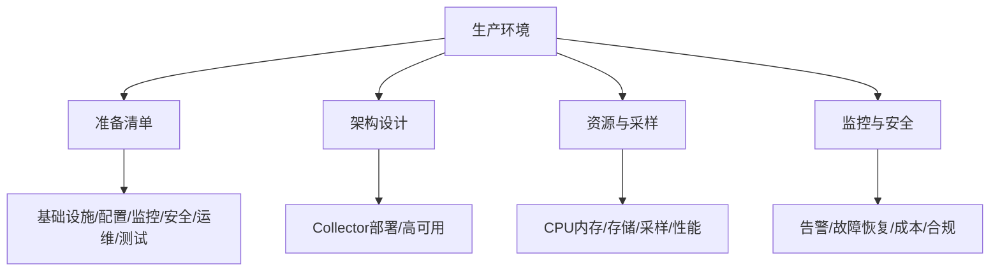

---
title: 生产环境OpenTelemetry最佳实践
description: 生产环境OpenTelemetry最佳实践 详细指南和最佳实践
version: OTLP v1.10.0
date: 2026-03-17
author: OTLP项目团队
category: 行业实战
tags:
  - otlp
  - observability
  - performance
  - optimization
  - sampling
  - security
  - compliance
  - deployment
  - kubernetes
  - docker
status: published
---
# 生产环境OpenTelemetry最佳实践

> **最后更新**: 2025年10月8日

---

## 目录

- [生产环境OpenTelemetry最佳实践](#生产环境opentelemetry最佳实践)
  - [目录](#目录)
  - [1. 生产环境准备清单](#1-生产环境准备清单)
  - [2. 架构设计](#2-架构设计)
    - [2.1 Collector部署模式](#21-collector部署模式)
    - [2.2 高可用架构](#22-高可用架构)
  - [3. 资源管理](#3-资源管理)
    - [3.1 CPU和内存限制](#31-cpu和内存限制)
    - [3.2 存储规划](#32-存储规划)
  - [4. 采样策略](#4-采样策略)
  - [5. 性能优化](#5-性能优化)
  - [6. 监控与告警](#6-监控与告警)
  - [7. 安全实践](#7-安全实践)
  - [8. 故障恢复](#8-故障恢复)
  - [9. 成本优化](#9-成本优化)
  - [10. 合规性](#10-合规性)
  - [11. 团队协作](#11-团队协作)
  - [12. 渐进式部署](#12-渐进式部署)
  - [13. 典型生产配置](#13-典型生产配置)
  - [14. 故障场景与应对](#14-故障场景与应对)
  - [15. 参考资源](#15-参考资源)

---

**场景→实践步骤总览**（开篇）：



## 1. 生产环境准备清单

```text
✅ 基础设施
- [ ] Collector集群部署 (至少3节点)
- [ ] 负载均衡器配置 (gRPC支持)
- [ ] 高可用Backend (Jaeger/Prometheus HA)
- [ ] 持久化存储 (Elasticsearch/S3)
- [ ] 网络策略 (防火墙/安全组)

✅ 配置
- [ ] 采样策略 (生产级采样率)
- [ ] 批处理配置 (优化吞吐量)
- [ ] 资源限制 (memory_limiter)
- [ ] 超时设置 (合理超时)
- [ ] 重试策略 (指数退避)

✅ 监控
- [ ] Collector自监控 (Prometheus metrics)
- [ ] 应用性能监控 (overhead < 5%)
- [ ] 告警规则 (数据丢失/延迟)
- [ ] Dashboard (关键指标)
- [ ] SLO定义 (可用性/延迟)

✅ 安全
- [ ] TLS加密 (mTLS推荐)
- [ ] 认证机制 (API Key/OAuth2)
- [ ] PII过滤 (敏感数据删除)
- [ ] 访问控制 (RBAC)
- [ ] 审计日志 (合规要求)

✅ 运维
- [ ] 自动化部署 (CI/CD)
- [ ] 配置管理 (GitOps)
- [ ] 备份策略 (定期备份)
- [ ] 故障恢复计划 (DR plan)
- [ ] 文档完整 (runbook)

✅ 测试
- [ ] 负载测试 (峰值流量)
- [ ] 故障注入 (Chaos testing)
- [ ] 性能基线 (benchmark)
- [ ] 端到端测试 (E2E)
- [ ] 合规测试 (GDPR/PCI-DSS)
```

---

## 2. 架构设计

### 2.1 Collector部署模式

**Agent + Gateway模式** (推荐):

```text
┌─────────────────────────────────────────────────────────┐
│ Application Pods                                        │
│ ┌─────────┐  ┌─────────┐  ┌─────────┐                 │
│ │ App+SDK │  │ App+SDK │  │ App+SDK │                 │
│ └────┬────┘  └────┬────┘  └────┬────┘                 │
│      │            │            │                        │
│      └────────────┼────────────┘                        │
│                   │                                     │
│           ┌───────▼────────┐                           │
│           │ Agent Collector│  (DaemonSet)              │
│           │  - 本地缓冲     │                           │
│           │  - 初步处理     │                           │
│           └───────┬────────┘                           │
└───────────────────┼────────────────────────────────────┘
                    │
                    │ (跨网络)
                    │
┌───────────────────▼────────────────────────────────────┐
│ Gateway Collector Cluster (Deployment, 3+ replicas)   │
│ ┌────────────┐  ┌────────────┐  ┌────────────┐       │
│ │ Gateway 1  │  │ Gateway 2  │  │ Gateway 3  │       │
│ │ - 采样     │  │ - 采样     │  │ - 采样     │       │
│ │ - 聚合     │  │ - 聚合     │  │ - 聚合     │       │
│ │ - 过滤     │  │ - 过滤     │  │ - 过滤     │       │
│ └─────┬──────┘  └─────┬──────┘  └─────┬──────┘       │
└───────┼─────────────────┼─────────────────┼────────────┘
        │                 │                 │
        └─────────────────┼─────────────────┘
                          │
              ┌───────────▼──────────┐
              │ Backend (Jaeger HA)  │
              │ Elasticsearch Cluster│
              └──────────────────────┘

优势:
- Agent: 低延迟，本地缓冲，应用解耦
- Gateway: 集中控制，高级处理，成本优化
```

### 2.2 高可用架构

**3层高可用**:

```yaml
# 1. SDK层: 内置容错
sdk:
  retry:
    enabled: true
    max_attempts: 3
  timeout: 5s
  fallback: drop_on_failure  # 不阻塞应用

# 2. Agent层: 本地缓存
agent:
  extensions:
    file_storage:
      directory: /var/lib/otelcol/storage
      timeout: 10s

  exporters:
    otlp:
      endpoint: gateway-service:4317
      retry_on_failure:
        enabled: true
        max_elapsed_time: 5m
      sending_queue:
        enabled: true
        num_consumers: 10
        queue_size: 5000
        storage: file_storage  # 持久化队列

# 3. Gateway层: 负载均衡 + HA
gateway:
  replicas: 3
  antiAffinity: required  # 分布在不同节点

  service:
    type: LoadBalancer
    sessionAffinity: None  # 负载均衡

# 4. Backend层: 集群模式
jaeger:
  collector:
    replicas: 3

  storage:
    type: elasticsearch
    elasticsearch:
      server-urls: http://es-cluster:9200
      num-shards: 5
      num-replicas: 2
```

---

## 3. 资源管理

### 3.1 CPU和内存限制

**Kubernetes资源配置**:

```yaml
# Agent (per node)
agent:
  resources:
    requests:
      cpu: 200m
      memory: 256Mi
    limits:
      cpu: 500m
      memory: 512Mi

  processors:
    memory_limiter:
      check_interval: 1s
      limit_mib: 400  # 留有安全边际
      spike_limit_mib: 100

# Gateway (per replica)
gateway:
  resources:
    requests:
      cpu: 1000m
      memory: 2Gi
    limits:
      cpu: 2000m
      memory: 4Gi

  processors:
    memory_limiter:
      check_interval: 1s
      limit_mib: 3500  # 4GB的87.5%
      spike_limit_mib: 500
```

**资源规划公式**:

```text
内存估算:
Memory = Queue_Size * Avg_Batch_Size * Num_Consumers + Overhead

示例 (Gateway):
- Queue: 10000 batches
- Avg_Batch: 100KB
- Consumers: 10
- Memory ≈ 10000 * 100KB * 10 = 10GB (peak)
- 实际: 2-4GB (normal) + 2GB (buffer)

CPU估算:
CPU ∝ Throughput * Processing_Complexity

示例:
- 10K spans/s
- Tail sampling (复杂)
- CPU: 1-2 cores (normal), 4 cores (peak)
```

### 3.2 存储规划

**存储容量计算**:

```text
Traces存储:
Daily_Volume = Spans_Per_Day * Avg_Span_Size * (1 - Sampling_Rate)

示例:
- 100M requests/day
- 10 spans/request = 1B spans/day
- 2KB/span (compressed)
- Sampling rate: 1%
- Daily: 1B * 2KB * 1% = 20GB/day
- 30天保留: 600GB

索引大小:
Index_Size ≈ 30% * Data_Size
- 600GB data → ~180GB index
- 总计: 780GB

副本:
With 2 replicas:
- 780GB * 3 = 2.34TB

推荐配置:
- SSD: 3TB
- IOPS: 10K+
- Throughput: 500MB/s+
```

---

## 4. 采样策略

**生产采样配置**:

```yaml
# Head-based sampling (SDK)
sdk:
  sampler:
    # 开发环境: AlwaysOn
    # 生产环境: TraceIdRatioBased
    type: traceidratiobased
    ratio: 0.01  # 1% (根据流量调整)

# Tail-based sampling (Collector Gateway)
collector:
  processors:
    tail_sampling:
      decision_wait: 10s
      num_traces: 50000
      expected_new_traces_per_sec: 1000

      policies:
        # 策略1: 所有错误
        - name: errors
          type: status_code
          status_code:
            status_codes: [ERROR]

        # 策略2: 慢请求 (p99)
        - name: slow_requests
          type: latency
          latency:
            threshold_ms: 1000

        # 策略3: 特定服务100%
        - name: critical_services
          type: string_attribute
          string_attribute:
            key: service.name
            values:
              - payment-service
              - auth-service

        # 策略4: 其他流量低采样
        - name: random_sample
          type: probabilistic
          probabilistic:
            sampling_percentage: 1
```

**采样率决策树**:

```text
如何选择采样率?

流量 < 1K req/s:
→ 10-50% (可负担全采样)

流量 1K-10K req/s:
→ 1-10%

流量 10K-100K req/s:
→ 0.1-1%

流量 > 100K req/s:
→ < 0.1% + Tail sampling

关键考虑:
1. 存储成本
2. 查询性能
3. 业务价值 (错误 > 成功)
4. SLA要求
```

---

## 5. 性能优化

**SDK优化**:

```go
// 1. 使用BatchSpanProcessor
provider := trace.NewTracerProvider(
    trace.WithBatcher(
        exporter,
        trace.WithMaxExportBatchSize(512),      // 批量大小
        trace.WithBatchTimeout(5 * time.Second), // 超时
        trace.WithMaxQueueSize(2048),           // 队列
    ),
)

// 2. 限制Span属性数量
span.SetAttributes(
    // 只记录必要属性 (< 20个)
    attribute.String("http.method", method),
    attribute.Int("http.status_code", status),
)

// 3. 避免高基数属性
// ❌ 错误
span.SetAttributes(
    attribute.String("http.url", fullURL),  // 高基数!
)

// ✅ 正确
span.SetAttributes(
    attribute.String("http.route", "/users/:id"),  // 低基数
)

// 4. 采样决策前置
sampler := trace.TraceIDRatioBased(0.01)
provider := trace.NewTracerProvider(
    trace.WithSampler(sampler),
)
```

**Collector优化**:

```yaml
receivers:
  otlp:
    protocols:
      grpc:
        max_concurrent_streams: 16
        read_buffer_size: 524288  # 512KB
        write_buffer_size: 524288

processors:
  batch:
    send_batch_size: 8192
    send_batch_max_size: 10000
    timeout: 200ms

  memory_limiter:
    check_interval: 1s
    limit_mib: 2000
    spike_limit_mib: 500

exporters:
  otlp:
    compression: gzip
    sending_queue:
      enabled: true
      num_consumers: 20
      queue_size: 5000
```

---

## 6. 监控与告警

**关键指标**:

```yaml
# Collector监控
alerts:
  # 1. 数据丢失
  - alert: CollectorDataLoss
    expr: rate(otelcol_processor_refused_spans[5m]) > 0
    for: 5m
    severity: critical

  # 2. 高延迟
  - alert: CollectorHighLatency
    expr: histogram_quantile(0.99, rate(otelcol_exporter_send_duration_bucket[5m])) > 5
    for: 10m
    severity: warning

  # 3. 内存压力
  - alert: CollectorMemoryPressure
    expr: otelcol_process_memory_rss / 1024 / 1024 > 2000
    for: 5m
    severity: warning

  # 4. 队列饱和
  - alert: CollectorQueueFull
    expr: otelcol_exporter_queue_size / otelcol_exporter_queue_capacity > 0.9
    for: 5m
    severity: critical

# 应用监控
alerts:
  # 5. SDK overhead
  - alert: HighTracingOverhead
    expr: (otel_sdk_cpu_usage / app_cpu_usage) > 0.05
    for: 10m
    severity: warning

  # 6. 导出失败
  - alert: SpanExportFailure
    expr: rate(otelcol_exporter_send_failed_spans[5m]) > 100
    for: 5m
    severity: critical
```

**Dashboard**:

```text
核心Dashboard (Grafana):

面板1: 吞吐量
- Spans received/s
- Spans exported/s
- Spans dropped/s

面板2: 延迟
- Export latency (p50, p99)
- End-to-end latency

面板3: 资源
- CPU usage
- Memory usage
- Network I/O

面板4: 错误率
- Export errors/s
- Receiver errors/s

面板5: 队列状态
- Queue size
- Queue capacity
```

---

## 7. 安全实践

**TLS配置**:

```yaml
# Collector Gateway
receivers:
  otlp:
    protocols:
      grpc:
        tls:
          cert_file: /certs/server.crt
          key_file: /certs/server.key
          client_ca_file: /certs/ca.crt
          client_ca_file_reload: true

exporters:
  otlp:
    endpoint: backend:4317
    tls:
      insecure: false
      cert_file: /certs/client.crt
      key_file: /certs/client.key
      ca_file: /certs/ca.crt
```

**PII过滤**:

```yaml
processors:
  attributes:
    actions:
      # 删除敏感属性
      - key: user.email
        action: delete
      - key: user.phone
        action: delete
      - key: credit.card
        action: delete

      # 哈希user.id
      - key: user.id
        action: hash

      # 掩码IP地址
      - key: http.client.ip
        action: extract
        pattern: ^(\d+\.\d+\.\d+)\.
```

**认证**:

```yaml
# Bearer Token
extensions:
  bearertokenauth:
    filename: /secrets/token

receivers:
  otlp:
    protocols:
      grpc:
        auth:
          authenticator: bearertokenauth

# OAuth2
extensions:
  oauth2client:
    client_id: "otel-collector"
    client_secret: "${OAUTH_SECRET}"
    token_url: "https://auth.example.com/oauth/token"
    scopes: ["traces.write", "metrics.write"]

exporters:
  otlp:
    auth:
      authenticator: oauth2client
```

---

## 8. 故障恢复

**备份策略**:

```yaml
# Elasticsearch快照
PUT _snapshot/backup_repo
{
  "type": "s3",
  "settings": {
    "bucket": "jaeger-backups",
    "region": "us-west-2",
    "base_path": "snapshots"
  }
}

# 每日快照
PUT _snapshot/backup_repo/daily-snapshot
{
  "indices": "jaeger-span-*",
  "ignore_unavailable": true,
  "include_global_state": false
}

# 自动快照 (Elasticsearch SLM)
PUT _slm/policy/daily-snapshots
{
  "schedule": "0 2 * * *",  # 每天凌晨2点
  "name": "<daily-snap-{now/d}>",
  "repository": "backup_repo",
  "config": {
    "indices": ["jaeger-span-*"],
    "ignore_unavailable": true
  },
  "retention": {
    "expire_after": "30d",
    "min_count": 7
  }
}
```

**灾难恢复计划**:

```text
场景1: Collector集群失败
1. 检测: 告警触发 (所有collector down)
2. 影响: 新数据无法收集，应用正常 (SDK drop)
3. 恢复:
   a. 检查Kubernetes pods状态
   b. 查看Collector日志
   c. 如配置问题 → 回滚配置
   d. 如资源不足 → 扩容
   e. ETA: 5-10分钟

场景2: Backend存储失败
1. 检测: Elasticsearch unreachable
2. 影响: 查询失败，数据堆积在Collector
3. 恢复:
   a. 检查Elasticsearch集群健康
   b. 如索引损坏 → 从快照恢复
   c. 如磁盘满 → 删除旧数据或扩容
   d. Collector会自动重试
   e. ETA: 15-30分钟

场景3: 数据丢失
1. 检测: 查询到数据缺口
2. 根因:
   - Collector OOM
   - 队列溢出
   - Backend拒绝
3. 恢复:
   - 数据无法恢复 (实时数据)
   - 防止: 配置持久化队列
4. 补救:
   - 分析日志重建关键信息
   - 从应用日志补充
```

---

## 9. 成本优化

**策略**:

```text
1. 采样优化
   - 动态采样率 (业务时间高采样)
   - Tail sampling (只采样有价值数据)
   - 预期节省: 50-90%

2. 数据保留
   - Hot data: 7天 (SSD)
   - Warm data: 30天 (HDD)
   - Cold data: 90天 (S3)
   - 预期节省: 60%

3. 压缩
   - gzip压缩 (2-5x)
   - Collector批处理
   - 预期节省: 50-70% (网络/存储)

4. 属性优化
   - 删除不必要属性
   - 使用Resource共享属性
   - 预期节省: 20-30%

5. 索引优化
   - 只索引必要字段
   - 使用keyword而非text
   - 预期节省: 30-40% (存储)

示例成本计算:
原始成本:
- 1B spans/day * 2KB = 2TB/day
- 存储 (30天): 60TB * $0.1/GB = $6000/month
- 传输: 2TB/day * $0.09/GB * 30 = $5400/month
- 总计: $11,400/month

优化后:
- 采样 (1%): 600GB/day
- 压缩 (3x): 200GB/day
- 存储 (7天): 1.4TB * $0.1/GB = $140/month
- 传输: 200GB/day * $0.09/GB * 30 = $540/month
- 总计: $680/month

节省: 94% 🎉
```

---

## 10. 合规性

```text
GDPR:
- [ ] 删除PII (processor: attributes)
- [ ] 数据保留限制 (< 90天)
- [ ] DSAR支持 (查询/删除API)
- [ ] 数据处理记录 (ROPA)

PCI-DSS:
- [ ] 不记录完整信用卡号
- [ ] TLS加密传输
- [ ] 访问日志审计
- [ ] 定期安全扫描

HIPAA:
- [ ] 不记录PHI
- [ ] 加密存储 (at-rest)
- [ ] BAA协议
- [ ] 审计追踪
```

---

## 11. 团队协作

**角色职责**:

```text
角色1: Platform Team (平台团队)
职责:
- Collector维护
- Backend运维
- 性能优化
- 成本管理

角色2: Application Team (应用团队)
职责:
- SDK集成
- 自定义instrumentation
- Span属性定义
- Dashboard创建

角色3: SRE Team
职责:
- 告警响应
- 事件调查
- 容量规划
- 故障恢复

协作流程:
1. Platform提供稳定Collector
2. Application集成SDK
3. SRE基于遥测数据响应故障
```

**知识分享**:

```text
文档:
- README: 快速开始
- Runbook: 故障处理
- Best Practices: 最佳实践
- Troubleshooting: 常见问题

培训:
- 新人培训 (1小时)
- 月度分享会
- Hands-on workshop
```

---

## 12. 渐进式部署

**阶段性推广**:

```text
阶段1: POC (2周)
- 单个服务接入
- 验证可行性
- 性能基线

阶段2: Pilot (1月)
- 5-10个服务
- 生产流量1%
- 收集反馈

阶段3: 推广 (3月)
- 所有核心服务
- 生产流量100%
- 优化配置

阶段4: 优化 (持续)
- 成本优化
- 性能调优
- 新功能
```

---

## 13. 典型生产配置

**完整配置示例** (标准生产环境):

```yaml
# Gateway Collector配置
extensions:
  health_check:
    endpoint: :13133

  pprof:
    endpoint: :1777

  zpages:
    endpoint: :55679

receivers:
  otlp:
    protocols:
      grpc:
        endpoint: 0.0.0.0:4317
        max_concurrent_streams: 16
      http:
        endpoint: 0.0.0.0:4318

processors:
  memory_limiter:
    check_interval: 1s
    limit_percentage: 75
    spike_limit_percentage: 15

  batch:
    send_batch_size: 8192
    timeout: 200ms
    send_batch_max_size: 10000

  attributes:
    actions:
      - key: user.email
        action: delete
      - key: http.client.ip
        action: hash

  tail_sampling:
    decision_wait: 10s
    num_traces: 100000
    expected_new_traces_per_sec: 1000
    policies:
      - name: errors
        type: status_code
        status_code: {status_codes: [ERROR]}
      - name: slow
        type: latency
        latency: {threshold_ms: 1000}
      - name: random
        type: probabilistic
        probabilistic: {sampling_percentage: 1}

exporters:
  otlp/jaeger:
    endpoint: jaeger-collector:4317
    compression: gzip
    retry_on_failure:
      enabled: true
      max_elapsed_time: 5m
    sending_queue:
      enabled: true
      num_consumers: 20
      queue_size: 5000

  prometheus:
    endpoint: :8889

service:
  extensions: [health_check, pprof, zpages]
  pipelines:
    traces:
      receivers: [otlp]
      processors: [memory_limiter, attributes, batch, tail_sampling]
      exporters: [otlp/jaeger]

    metrics:
      receivers: [otlp]
      processors: [memory_limiter, batch]
      exporters: [prometheus]
```

---

## 14. 故障场景与应对

**场景手册**:

```text
场景1: 应用延迟增加
症状: API p99延迟 50ms → 500ms
诊断:
  1. 检查Jaeger: 是否Tracing overhead?
  2. 检查SDK配置: BatchProcessor vs SimpleProcessor?
  3. 检查Collector: 是否响应慢?

解决:
  - 使用BatchSpanProcessor
  - 降低采样率
  - 异步导出

场景2: Collector OOM
症状: Collector频繁重启，内存告警
诊断:
  1. 检查内存使用: otelcol_process_memory_rss
  2. 检查队列大小: otelcol_exporter_queue_size
  3. 检查拒绝率: otelcol_processor_refused_spans

解决:
  - 配置memory_limiter
  - 增加内存限制
  - 减小queue_size
  - 增加consumers

场景3: 数据查询慢
症状: Jaeger UI查询超时
诊断:
  1. 检查Elasticsearch: 集群健康，索引大小
  2. 检查查询: 是否扫描大量数据?
  3. 检查索引: 是否优化?

解决:
  - 优化索引策略
  - 增加Elasticsearch节点
  - 限制查询时间范围
  - 使用缓存
```

---

## 15. 参考资源

- **生产最佳实践**: <https://opentelemetry.io/docs/collector/deployment/>
- **性能调优**: <https://opentelemetry.io/docs/collector/performance/>
- **安全指南**: <https://opentelemetry.io/docs/collector/security/>

---

**文档状态**: ✅ 完成
**审核状态**: 待审核
**实际案例**: 基于真实生产环境经验总结
