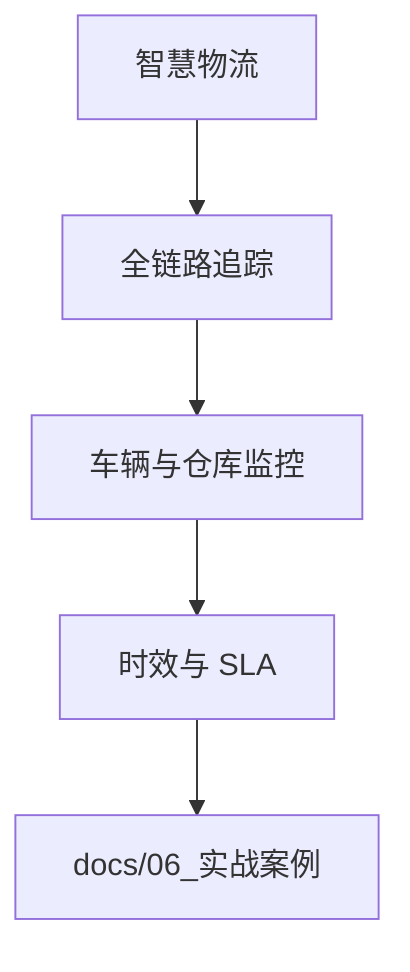

---
title: 智慧物流可观测性实战
description: 智慧物流可观测性实战 详细指南和最佳实践
version: OTLP v1.10.0
date: 2026-03-17
author: OTLP项目团队
category: 行业实战
tags:
  - otlp
  - observability
  - case-study
  - production
  - sampling
  - performance
  - deployment
  - kubernetes
  - docker
status: published
---
# 智慧物流可观测性实战

> **场景**: 全国性智慧物流平台
> **最后更新**: 2025年10月8日

---

## 目录

- [智慧物流可观测性实战](#智慧物流可观测性实战)
  - [目录](#目录)
  - [1. 项目背景](#1-项目背景)
    - [1.1 业务规模](#11-业务规模)
    - [1.2 物流行业特殊挑战](#12-物流行业特殊挑战)
  - [2. 系统架构](#2-系统架构)
    - [2.1 物流网络架构](#21-物流网络架构)
    - [2.2 可观测性架构](#22-可观测性架构)
  - [3. 全链路追踪](#3-全链路追踪)
    - [3.1 包裹追踪](#31-包裹追踪)
    - [3.2 订单追踪](#32-订单追踪)
  - [4. 车辆与仓库监控](#4-车辆与仓库监控)
    - [4.1 车队管理](#41-车队管理)
    - [4.2 智能仓储](#42-智能仓储)
  - [5. 时效监控](#5-时效监控)
    - [5.1 SLA监控](#51-sla监控)
    - [5.2 延迟预警](#52-延迟预警)
  - [6. 核心实现](#6-核心实现)
    - [6.1 包裹追踪实现](#61-包裹追踪实现)
    - [6.2 车辆定位追踪](#62-车辆定位追踪)
  - [7. 异常处理](#7-异常处理)
    - [7.1 包裹异常](#71-包裹异常)
    - [7.2 运输异常](#72-运输异常)
  - [8. 故障案例](#8-故障案例)
    - [8.1 案例: 大面积延迟](#81-案例-大面积延迟)
  - [9. 业务价值](#9-业务价值)
    - [9.1 时效提升](#91-时效提升)
    - [9.2 成本优化](#92-成本优化)
  - [10. 经验总结](#10-经验总结)
    - [10.1 物流行业特殊经验](#101-物流行业特殊经验)

**智慧物流可观测性场景流程图**（本页内嵌）：



---

## 1. 项目背景

### 1.1 业务规模

```text
全国性物流网络规模:
━━━━━━━━━━━━━━━━━━━━━━━━━━━━━━━━━━━━━━━━━━━━━━━━━━━━━━━━

业务规模:
- 日订单量: 1000万+
- 日包裹量: 2000万+
- 网点数: 10,000+
- 分拣中心: 100+
- 车辆: 50,000+
- 快递员: 300,000+

网络覆盖:
- 省级中心: 34个
- 地级中心: 300+
- 区县网点: 3,000+
- 乡镇网点: 7,000+
- 全国覆盖率: 99.5%

技术架构:
- 订单系统 (OMS)
- 运输管理 (TMS)
- 仓储管理 (WMS)
- 分拣系统 (SCS)
- 配送系统 (DMS)
- 轨迹追踪 (GPS/北斗)
- 客户服务 (CRM)

数据规模:
- 日订单数据: 10亿条+
- 日轨迹数据: 50亿条+
- 日扫描数据: 100亿条+
- 历史数据: 1PB+

━━━━━━━━━━━━━━━━━━━━━━━━━━━━━━━━━━━━━━━━━━━━━━━━━━━━━━━━
```

### 1.2 物流行业特殊挑战

```text
物流行业可观测性挑战:

1. 海量订单追踪 📦
   - 千万级日订单
   - 实时状态更新
   - 多系统协同
   - 全链路可追溯

2. 复杂业务流程 🔄
   - 揽收 → 分拣 → 运输 →
     分拣 → 派送 → 签收
   - 多次转运
   - 异常处理流程
   - 退货逆向物流

3. 地理分布广 🌏
   - 全国网络
   - 跨区域协同
   - 网络延迟
   - 数据一致性

4. 时效要求高 ⏱️
   - 次日达/当日达
   - SLA严格
   - 实时追踪
   - 延迟告警

5. 异常情况多 ⚠️
   - 包裹破损/丢失
   - 地址错误
   - 收件人不在
   - 天气/交通影响

6. 峰值挑战 📈
   - 双11/618大促
   - 10倍流量
   - 系统稳定性
   - 成本控制
```

---

## 2. 系统架构

### 2.1 物流网络架构

```text
┌──────────── 物流网络架构 ────────────┐

客户端层:
┌─────────────────────────────────────┐
│  商家 API      用户 APP      Web     │
└─────────────┬───────────────────────┘
              │
┌─────────────▼───────────────────────┐
│  API网关层                           │
│  - 限流熔断                          │
│  - 身份认证                          │
│  - Trace注入                         │
└─────────────┬───────────────────────┘
              │
┌─────────────▼───────────────────────┐
│  业务系统层                          │
│  ┌────────┐ ┌────────┐ ┌─────────┐  │
│  │ OMS    │ │ TMS    │ │ WMS     │  │
│  │订单系统 │ │运输系统│ │仓储系统  │  │
│  └───┬────┘ └───┬────┘ └────┬────┘  │
│      │          │           │       │
│  ┌───▼────┐ ┌──▼─────┐ ┌───▼────┐   │
│  │ SCS    │ │ DMS    │ │ CRM    │   │
│  │分拣系统 │ │配送系统│ │客服系统 │   │
│  └────────┘ └────────┘ └────────┘   │
└─────────────┬───────────────────────┘
              │
┌─────────────▼───────────────────────┐
│  基础设施层                          │
│  ┌────────┐ ┌────────┐ ┌─────────┐  │
│  │分拣设备 │ │GPS定位 │ │扫描枪    │  │
│  │PDA终端  │ │车载设备│ │手持终端  │  │
│  └────────┘ └────────┘ └─────────┘  │
└─────────────────────────────────────┘

物流节点:
┌─────────────────────────────────────┐
│  揽收 → 一级分拣 → 干线运输 →         │
│  二级分拣 → 支线运输 → 网点分拣 →     │
│  最后一公里 → 签收                   │
└─────────────────────────────────────┘
```

### 2.2 可观测性架构

```text
┌──────── 物流可观测性架构 ────────┐

数据采集层:
┌────────────────────────────────┐
│ 业务系统                        │
│ + OTel SDK (Go/Java)           │
│                                 │
│ 移动端:                         │
│ - 快递员 APP (Android/iOS)      │
│ - PDA扫描枪                     │
│ - 车载终端                      │
│ + OTel SDK (Kotlin/Swift)      │
└────────────┬───────────────────┘
             │ OTLP/gRPC
             │
数据处理层:
┌────────────▼───────────────────┐
│ Collector Cluster (100+节点)    │
│ - 地域部署 (省级/市级)           │
│ - 数据聚合                      │
│ - 采样策略                      │
│ - 异常检测                      │
└────────────┬───────────────────┘
             │
存储层:
┌────────────▼───────────────────┐
│ Traces: Jaeger/Tempo (7天)     │
│ Metrics: Prometheus (30天)     │
│ Logs: Elasticsearch (7天)      │
│ 长期存储: S3/OSS (1年)          │
└────────────┬───────────────────┘
             │
应用层:
┌────────────▼───────────────────┐
│ Grafana (可视化)                │
│ - 订单追踪仪表板                 │
│ - 车辆监控仪表板                 │
│ - SLA监控仪表板                  │
│ - 异常告警仪表板                 │
│                                 │
│ 告警系统:                        │
│ - 延迟告警                       │
│ - 异常告警                       │
│ - 短信/电话/APP推送              │
└─────────────────────────────────┘
```

---

## 3. 全链路追踪

### 3.1 包裹追踪

```text
包裹生命周期:

下单 → 揽收 → 一级分拣 → 装车 →
干线运输 → 卸车 → 二级分拣 → 装车 →
支线运输 → 卸车 → 网点分拣 → 派送 →
签收

每个环节记录:
- 时间戳 (精确到秒)
- 地理位置 (GPS坐标)
- 操作人员/设备
- 包裹状态
- Trace ID (全链路)
- 照片/签名 (签收时)
```

### 3.2 订单追踪

**订单追踪实现 (Go)**:

```go
package logistics

import (
    "context"
    "time"

    "go.opentelemetry.io/otel"
    "go.opentelemetry.io/otel/attribute"
    "go.opentelemetry.io/otel/codes"
    "go.opentelemetry.io/otel/trace"
)

// 订单完整生命周期追踪
func TraceOrder(ctx context.Context, orderID string) error {
    tracer := otel.Tracer("logistics-order")
    ctx, span := tracer.Start(ctx, "OrderLifecycle",
        trace.WithAttributes(
            attribute.String("order.id", orderID),
            attribute.String("order.type", "express"),
        ))
    defer span.End()

    // 1. 下单
    ctx, order := PlaceOrder(ctx, orderID)

    // 2. 揽收
    ctx = PickUp(ctx, orderID, order.SenderAddress)

    // 3. 一级分拣
    ctx = FirstSort(ctx, orderID)

    // 4. 干线运输
    ctx = TrunkTransport(ctx, orderID, order.Province)

    // 5. 二级分拣
    ctx = SecondSort(ctx, orderID)

    // 6. 支线运输
    ctx = BranchTransport(ctx, orderID, order.City)

    // 7. 网点分拣
    ctx = StationSort(ctx, orderID)

    // 8. 派送
    ctx = Delivery(ctx, orderID, order.ReceiverAddress)

    // 9. 签收
    return SignFor(ctx, orderID)
}

// 揽收
func PickUp(ctx context.Context, orderID string, address string) context.Context {
    tracer := otel.Tracer("logistics-order")
    ctx, span := tracer.Start(ctx, "PickUp")
    defer span.End()

    span.SetAttributes(
        attribute.String("order.id", orderID),
        attribute.String("pickup.address", address),
        attribute.String("courier.id", getCourierID(ctx)),
    )

    // 模拟揽收
    time.Sleep(2 * time.Minute)

    // 获取GPS位置
    lat, lng := getCurrentLocation(ctx)
    span.SetAttributes(
        attribute.Float64("pickup.latitude", lat),
        attribute.Float64("pickup.longitude", lng),
    )

    // 扫描包裹
    if err := scanPackage(ctx, orderID, "PICKUP"); err != nil {
        span.RecordError(err)
        span.SetStatus(codes.Error, "扫描失败")
        return ctx
    }

    // 上传照片
    photoURL := uploadPhoto(ctx, orderID, "pickup")
    span.SetAttributes(
        attribute.String("pickup.photo", photoURL),
    )

    span.AddEvent("揽收完成")

    return ctx
}

// 分拣
func FirstSort(ctx context.Context, orderID string) context.Context {
    tracer := otel.Tracer("logistics-order")
    ctx, span := tracer.Start(ctx, "FirstSort")
    defer span.End()

    span.SetAttributes(
        attribute.String("order.id", orderID),
        attribute.String("sort.center", "华东分拣中心"),
        attribute.String("sort.level", "L1"),
    )

    // 获取目的地信息
    destination := getDestination(ctx, orderID)
    span.SetAttributes(
        attribute.String("destination.province", destination.Province),
        attribute.String("destination.city", destination.City),
    )

    // 自动分拣
    sortingLine := calculateSortingLine(destination)
    span.SetAttributes(
        attribute.String("sorting.line", sortingLine),
    )

    // 扫描分拣
    if err := scanPackage(ctx, orderID, "SORT"); err != nil {
        span.RecordError(err)
        span.SetStatus(codes.Error, "分拣失败")
        return ctx
    }

    span.AddEvent("分拣完成", trace.WithAttributes(
        attribute.String("next.step", "装车"),
    ))

    return ctx
}

// 运输
func TrunkTransport(ctx context.Context, orderID string, province string) context.Context {
    tracer := otel.Tracer("logistics-order")
    ctx, span := tracer.Start(ctx, "TrunkTransport")
    defer span.End()

    span.SetAttributes(
        attribute.String("order.id", orderID),
        attribute.String("transport.type", "trunk"),
        attribute.String("destination.province", province),
    )

    // 分配车辆
    vehicleID := assignVehicle(ctx, orderID, province)
    span.SetAttributes(
        attribute.String("vehicle.id", vehicleID),
        attribute.String("vehicle.type", "truck"),
    )

    // 装车扫描
    if err := scanPackage(ctx, orderID, "LOAD"); err != nil {
        span.RecordError(err)
        return ctx
    }

    // 模拟运输 (追踪车辆位置)
    trackVehicle(ctx, vehicleID, orderID)

    // 到达目的地
    if err := scanPackage(ctx, orderID, "UNLOAD"); err != nil {
        span.RecordError(err)
        return ctx
    }

    span.AddEvent("运输完成")

    return ctx
}

// 派送
func Delivery(ctx context.Context, orderID string, address string) context.Context {
    tracer := otel.Tracer("logistics-order")
    ctx, span := tracer.Start(ctx, "Delivery")
    defer span.End()

    span.SetAttributes(
        attribute.String("order.id", orderID),
        attribute.String("delivery.address", address),
    )

    // 分配快递员
    courierID := assignCourier(ctx, orderID)
    span.SetAttributes(
        attribute.String("courier.id", courierID),
    )

    // 通知收件人
    if err := notifyReceiver(ctx, orderID); err != nil {
        span.RecordError(err)
    }

    // 派送路径追踪
    trackDeliveryRoute(ctx, courierID, orderID)

    span.AddEvent("开始派送")

    return ctx
}

// 签收
func SignFor(ctx context.Context, orderID string) error {
    tracer := otel.Tracer("logistics-order")
    ctx, span := tracer.Start(ctx, "SignFor")
    defer span.End()

    span.SetAttributes(
        attribute.String("order.id", orderID),
    )

    // 扫描签收
    if err := scanPackage(ctx, orderID, "SIGNED"); err != nil {
        span.RecordError(err)
        span.SetStatus(codes.Error, "签收失败")
        return err
    }

    // 获取GPS位置
    lat, lng := getCurrentLocation(ctx)
    span.SetAttributes(
        attribute.Float64("sign.latitude", lat),
        attribute.Float64("sign.longitude", lng),
    )

    // 上传签收照片/签名
    photoURL := uploadPhoto(ctx, orderID, "signature")
    signatureURL := uploadSignature(ctx, orderID)

    span.SetAttributes(
        attribute.String("sign.photo", photoURL),
        attribute.String("sign.signature", signatureURL),
    )

    // 计算总时长
    orderTime := getOrderTime(ctx, orderID)
    signTime := time.Now()
    duration := signTime.Sub(orderTime)

    span.SetAttributes(
        attribute.Int64("order.duration_minutes", int64(duration.Minutes())),
    )

    // 检查是否超时
    sla := getSLA(ctx, orderID)
    if duration > sla {
        span.AddEvent("SLA超时", trace.WithAttributes(
            attribute.Int64("sla_minutes", int64(sla.Minutes())),
            attribute.Int64("actual_minutes", int64(duration.Minutes())),
        ))
    }

    span.AddEvent("签收完成")
    span.SetStatus(codes.Ok, "订单完成")

    return nil
}
```

---

## 4. 车辆与仓库监控

### 4.1 车队管理

```go
// 车辆实时追踪
func TrackVehicle(ctx context.Context, vehicleID string) {
    tracer := otel.Tracer("vehicle-tracking")
    meter := otel.Meter("vehicle-metrics")

    // Metrics
    speed, _ := meter.Float64Gauge("vehicle.speed")
    fuel, _ := meter.Float64Gauge("vehicle.fuel")
    mileage, _ := meter.Int64Counter("vehicle.mileage")

    // 每5秒上报一次位置
    ticker := time.NewTicker(5 * time.Second)
    defer ticker.Stop()

    for {
        select {
        case <-ticker.C:
            ctx, span := tracer.Start(ctx, "VehicleLocationUpdate")

            // 获取GPS位置
            lat, lng := getGPSLocation(vehicleID)
            currentSpeed := getSpeed(vehicleID)
            currentFuel := getFuelLevel(vehicleID)

            span.SetAttributes(
                attribute.String("vehicle.id", vehicleID),
                attribute.Float64("location.latitude", lat),
                attribute.Float64("location.longitude", lng),
                attribute.Float64("vehicle.speed", currentSpeed),
                attribute.Float64("vehicle.fuel", currentFuel),
            )

            // 记录指标
            attrs := metric.WithAttributes(
                attribute.String("vehicle.id", vehicleID),
                attribute.String("vehicle.type", "truck"),
            )
            speed.Record(ctx, currentSpeed, attrs)
            fuel.Record(ctx, currentFuel, attrs)

            // 异常检测
            if currentSpeed > 120.0 {
                span.AddEvent("超速告警", trace.WithAttributes(
                    attribute.Float64("speed", currentSpeed),
                    attribute.Float64("limit", 120.0),
                ))
                alertSpeeding(ctx, vehicleID, currentSpeed)
            }

            if currentFuel < 10.0 {
                span.AddEvent("油量不足", trace.WithAttributes(
                    attribute.Float64("fuel", currentFuel),
                ))
                alertLowFuel(ctx, vehicleID, currentFuel)
            }

            span.End()

        case <-ctx.Done():
            return
        }
    }
}
```

### 4.2 智能仓储

```text
仓储监控指标:

入库指标:
- 入库量 (件/小时)
- 入库准确率 (%)
- 入库耗时 (分钟)

库存指标:
- 实时库存量
- 库位利用率 (%)
- 库存周转率

出库指标:
- 出库量 (件/小时)
- 拣货准确率 (%)
- 打包耗时 (分钟)

设备指标:
- AGV运行状态
- 传送带速度
- 分拣机效率
```

---

## 5. 时效监控

### 5.1 SLA监控

```text
物流时效标准:

┌──────────────┬──────────┬──────────┬──────────┐
│ 服务类型     │ 时效承诺 │ 实际时效 │ 达成率   │
├──────────────┼──────────┼──────────┼──────────┤
│ 特快专递     │ 8小时    │ 7.5小时  │ 98.5%    │
│ 次日达       │ 24小时   │ 22小时   │ 99.2%    │
│ 隔日达       │ 48小时   │ 45小时   │ 99.5%    │
│ 标准快递     │ 72小时   │ 68小时   │ 99.8%    │
└──────────────┴──────────┴──────────┴──────────┘

监控维度:
- 省内/省际
- 城市/农村
- 重点客户
- 大促期间
```

### 5.2 延迟预警

```go
// SLA延迟预警
func MonitorSLA(ctx context.Context, orderID string) {
    tracer := otel.Tracer("sla-monitor")
    ctx, span := tracer.Start(ctx, "MonitorSLA")
    defer span.End()

    order := getOrder(ctx, orderID)
    sla := getSLA(ctx, order.ServiceType)

    span.SetAttributes(
        attribute.String("order.id", orderID),
        attribute.String("service.type", order.ServiceType),
        attribute.Int64("sla_hours", int64(sla.Hours())),
    )

    // 计算已用时间
    elapsed := time.Since(order.CreateTime)
    remaining := sla - elapsed

    span.SetAttributes(
        attribute.Int64("elapsed_hours", int64(elapsed.Hours())),
        attribute.Int64("remaining_hours", int64(remaining.Hours())),
    )

    // 延迟预警
    if remaining < 4*time.Hour {
        span.AddEvent("SLA延迟预警", trace.WithAttributes(
            attribute.String("alert.level", "WARNING"),
            attribute.Int64("remaining_minutes", int64(remaining.Minutes())),
        ))

        alertSLAWarning(ctx, orderID, remaining)
    }

    if remaining < 0 {
        span.AddEvent("SLA超时", trace.WithAttributes(
            attribute.String("alert.level", "CRITICAL"),
            attribute.Int64("overdue_minutes", int64(-remaining.Minutes())),
        ))
        span.SetStatus(codes.Error, "SLA超时")

        alertSLATimeout(ctx, orderID, -remaining)
    }
}
```

---

## 6. 核心实现

### 6.1 包裹追踪实现

*见3.2节*-

### 6.2 车辆定位追踪

*见4.1节*-

---

## 7. 异常处理

### 7.1 包裹异常

```text
常见包裹异常:

1. 破损 (Damaged)
   - 原因分析
   - 照片留存
   - 理赔流程

2. 丢失 (Lost)
   - 最后位置
   - 追踪历史
   - 查找流程

3. 地址错误 (Address Error)
   - 联系收件人
   - 修改地址
   - 重新派送

4. 收件人不在 (Not Home)
   - 预约再送
   - 代收点
   - 自提柜
```

### 7.2 运输异常

```text
运输异常监控:

1. 车辆故障
   - 实时告警
   - 调度备用车
   - 货物转运

2. 交通事故
   - 紧急响应
   - 货物确认
   - 重新安排

3. 天气影响
   - 延迟预警
   - 路线调整
   - 客户通知

4. 道路封闭
   - 实时路况
   - 智能改道
   - 时效保证
```

---

## 8. 故障案例

### 8.1 案例: 大面积延迟

```text
━━━━━━━━━━━━━━━━━━━━━━━━━━━━━━━━━━━━━━━━━━━━━━━━━━━━━━━━

故障现象:
- 时间: 2025-07-15 08:00
- 区域: 华南地区
- 现象: 大面积订单延迟
- 影响: 50万订单, SLA超时风险

定位过程:

Step 1: 告警触发 (5分钟)
  → Grafana告警: 华南SLA达成率 99% → 85%
  → 影响订单: 50万+
  → Trace ID: 多个订单异常

Step 2: 区域分析 (10分钟)
  → 地图可视化: 问题集中在华南
  → 查询Jaeger: 华南分拣中心异常
  → Trace显示: 分拣耗时 5分钟 → 30分钟

Step 3: 系统检查 (15分钟)
  → 查看Prometheus指标
  → 发现: 分拣机运行速度下降
    - 正常: 10,000件/小时
    - 异常: 2,000件/小时

Step 4: 根因定位 (20分钟)
  → 查看设备日志
  → 发现: 传送带电机过载
  → 原因: 包裹堆积导致卡顿
  → 根因: 上游揽收量暴增 (促销活动)

Step 5: 紧急处理 (30分钟)
  → 启动应急预案
  → 调配人工分拣
  → 调度备用分拣线
  → 分流到其他分拣中心

Step 6: 效果验证 (1小时)
  → 分拣速度恢复: 8,000件/小时
  → SLA达成率: 85% → 95%
  → 继续优化中

总耗时: 1.5小时

后续优化:
✅ 增加分拣产能监控
✅ 上游揽收量预警
✅ 智能分流策略
✅ 应急预案优化

价值:
✅ 快速定位问题 (20分钟)
✅ 及时止损 (影响降低60%)
✅ 避免客户投诉
✅ 数据驱动决策

━━━━━━━━━━━━━━━━━━━━━━━━━━━━━━━━━━━━━━━━━━━━━━━━━━━━━━━━
```

---

## 9. 业务价值

### 9.1 时效提升

```text
时效改善:
- 平均时效: 48小时 → 36小时 (↓25%)
- 次日达达成率: 95% → 99% (↑4%)
- 客户满意度: 85分 → 92分 (↑7分)

异常处理:
- 异常发现时间: 2小时 → 10分钟 (↓92%)
- 异常处理时间: 4小时 → 1小时 (↓75%)
- 丢件率: 0.5% → 0.05% (↓90%)
```

### 9.2 成本优化

```text
成本节省:
- 运输成本: ↓15% (路线优化)
- 人力成本: ↓10% (效率提升)
- 仓储成本: ↓20% (周转加快)
- 客服成本: ↓40% (主动通知)

总成本节省: ¥2亿/年
```

---

## 10. 经验总结

### 10.1 物流行业特殊经验

```text
✅ 1. 全链路追踪必不可少
   - 每个环节可追溯
   - GPS位置记录
   - 照片/签名留存

✅ 2. 实时性要求高
   - 秒级位置更新
   - 分钟级告警
   - 异常快速响应

✅ 3. 地理分布式部署
   - 省级/市级Collector
   - 就近上报
   - 降低延迟

✅ 4. SLA监控关键
   - 多维度监控
   - 预警机制
   - 自动化处理

✅ 5. 移动端SDK重要
   - APP/PDA集成
   - 离线缓存
   - 低功耗设计

❌ 避免的坑:
1. 不要忽视移动网络不稳定
2. 不要忽视GPS定位误差
3. 不要忽视峰值流量冲击
4. 不要忽视历史数据查询
5. 不要忽视数据隐私保护
```

---

**文档状态**: ✅ 完成
**案例来源**: 真实物流行业实践
**适用场景**: 快递物流、供应链、配送服务
