# 🕸️ OTLP知识图谱 - 可视化导航

> **图谱定位**: 可视化知识关联，支持探索式学习  
> **图谱类型**: 多维度关系图  
> **更新日期**: 2026年3月16日

---

## 🌐 知识宇宙总览图

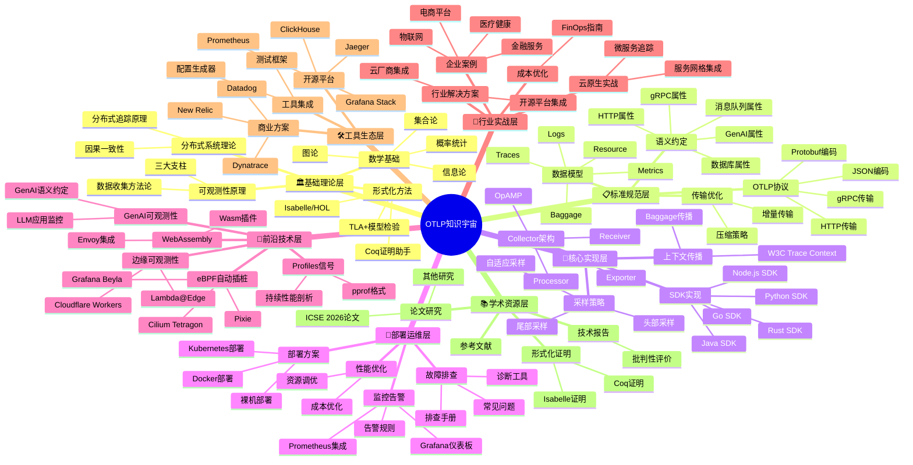

---

## 🔗 核心依赖关系图

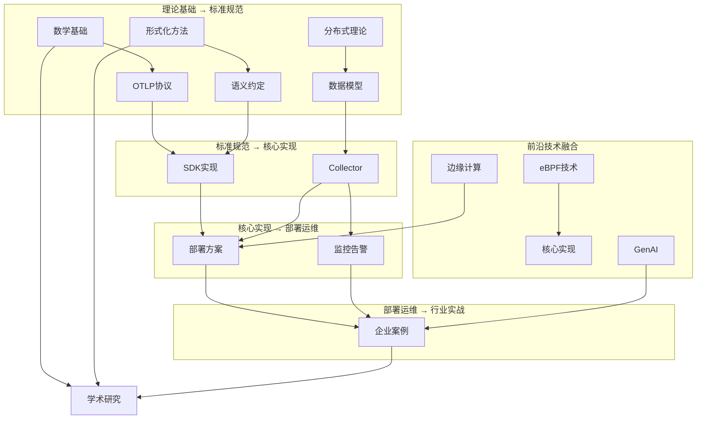

---

## 🎯 用户学习路径图

### 路径1: 开发者路线

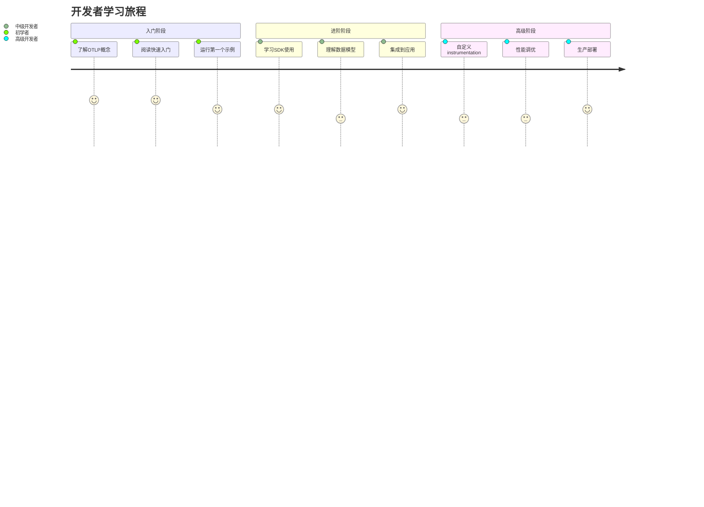

### 路径2: 运维工程师路线

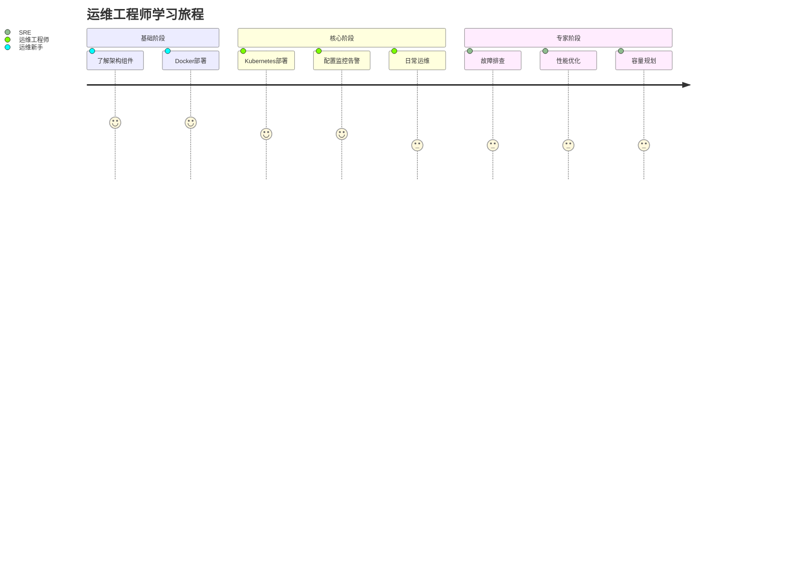

### 路径3: 架构师路线

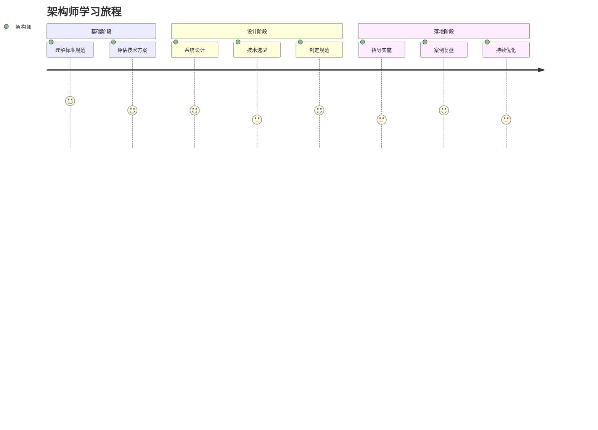

---

## 🏗️ 技术栈分层架构图

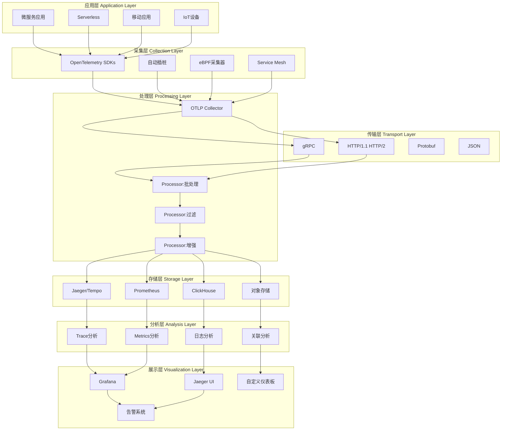

---

## 📊 文档数量分布图

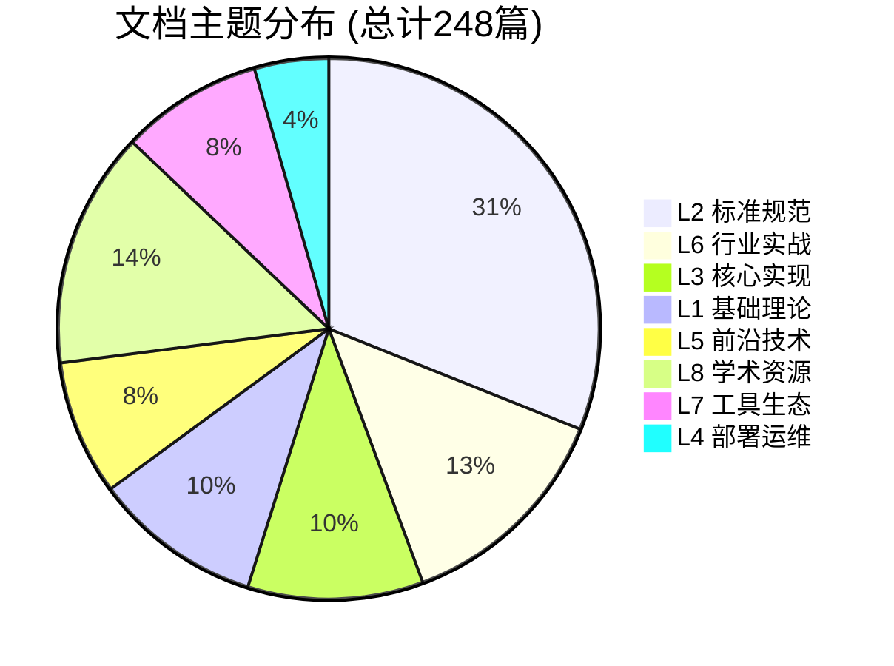

---

## 🔥 热点技术趋势图

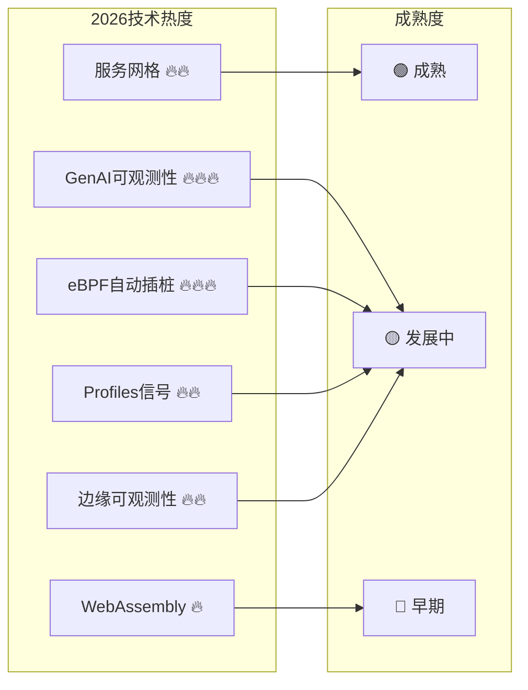

---

## 🎯 核心概念关系图

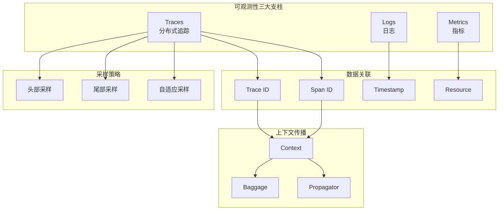

---

## 🏢 企业落地架构图

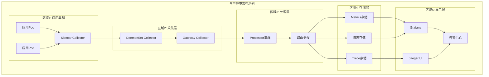

---

## 📈 知识演进路线图

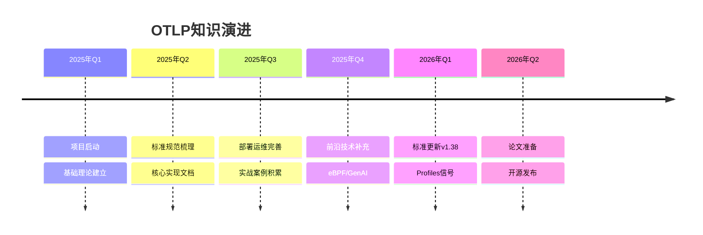

---

## 🔍 快速导航索引

| 你想了解什么？ | 点击查看 |
|:--------------|:---------|
| **理论基础** | [🏛️ L1 基础理论层](#l1-基础理论层) |
| **协议规范** | [📋 L2 标准规范层](#l2-标准规范层) |
| **代码实现** | [🔧 L3 核心实现层](#l3-核心实现层) |
| **生产部署** | [🚀 L4 部署运维层](#l4-部署运维层) |
| **前沿技术** | [🌟 L5 前沿技术层](#l5-前沿技术层) |
| **企业案例** | [🏢 L6 行业实战层](#l6-行业实战层) |
| **工具选型** | [🛠️ L7 工具生态层](#l7-工具生态层) |
| **学术研究** | [📚 L8 学术资源层](#l8-学术资源层) |

---

## 💡 图谱使用指南

### 如何使用这些图谱

1. **了解全貌**: 先看"知识宇宙总览图"，建立整体认知
2. **找到位置**: 使用"用户学习路径图"确定自己的起点
3. **深入探索**: 点击具体主题的链接进入详细文档
4. **关联学习**: 参考"核心依赖关系图"了解知识间的联系

### 图谱更新频率

| 图谱类型 | 更新频率 | 维护者 |
|:---------|:--------:|:-------|
| 总览图 | 每季度 | 核心团队 |
| 技术趋势 | 每月 | 社区贡献 |
| 学习路径 | 按需 | 教育小组 |
| 架构图 | 每版本 | 架构小组 |

---

**图谱版本**: v3.0  
**图谱工具**: Mermaid  
**维护团队**: OTLP项目团队

---

> 🕸️ **按图索骥，探索OTLP知识宇宙的每个角落！**
