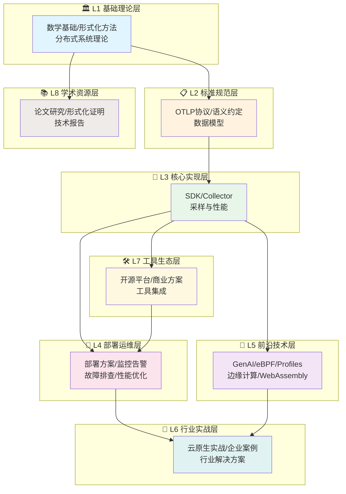

# 🗺️ OTLP知识宇宙导航 - 主题总览

> **导航定位**: 一站式主题导航系统
> **设计理念**: 三层架构，八大连通世界
> **更新日期**: 2026年3月16日

---

## 🎯 用户角色快速入口

| 你是谁？ | 推荐起点 | 预计阅读时间 |
|:--------|:---------|:------------|
| 👤 **完全新手** | [🚀 5分钟快速入门](🎯_5分钟快速入门指南.md) | 5分钟 |
| 👨‍💻 **开发者** | [🔧 核心实现层](#l3-核心实现层) → [代码示例](examples/README.md) | 2小时 |
| 🏢 **运维工程师** | [🚀 部署运维层](#l4-部署运维层) | 3小时 |
| 📊 **架构师** | [📋 标准规范层](#l2-标准规范层) | 4小时 |
| 🎓 **研究人员** | [📚 学术资源层](#l8-学术资源层) | 8小时 |
| 💼 **技术管理者** | [📊 项目仪表板](PROJECT_DASHBOARD.md) | 30分钟 |

---

## 🌐 知识宇宙全景图



---

## 📚 八大连通世界

---

### 🏛️ L1 基础理论层

> **定位**: 数学基础与形式化方法，为OTLP提供理论根基
> **适合**: 研究人员、算法工程师、对理论深度感兴趣者

#### 核心主题

| 主题 | 文档数 | 核心内容 | 入口 |
|:-----|:------:|:---------|:-----|
| **L1.1 数学基础** | 4篇 | 集合论、图论、信息论、概率论 | [进入](docs/01_理论基础/) |
| **L1.2 形式化方法** | 16篇 | TLA+、Coq、Isabelle/HOL | [进入](docs/02_THEORETICAL_FRAMEWORK/) |
| **L1.3 分布式系统理论** | 2篇 | 分布式追踪原理、因果一致性 | [进入](docs/02_THEORETICAL_FRAMEWORK/DISTRIBUTED_SYSTEMS_THEORY.md) |
| **L1.4 可观测性原理** | 3篇 | 三大支柱、数据收集方法论 | [进入](docs/01_理论基础/) |

#### 推荐学习路径

```
数学基础 → 分布式系统理论 → 形式化方法 → 可观测性原理
(1周)      (3天)           (2周)         (2天)
```

---

### 📋 L2 标准规范层

> **定位**: OTLP协议规范、语义约定、数据模型标准
> **适合**: 架构师、SDK开发者、协议实现者

#### 核心主题

| 主题 | 文档数 | 核心内容 | 入口 |
|:-----|:------:|:---------|:-----|
| **L2.1 OTLP协议** | 6篇 | gRPC/HTTP传输、Protobuf/JSON编码 | [进入](docs/01_OTLP核心协议/) |
| **L2.2 语义约定** | 27篇 | HTTP/gRPC/数据库/消息队列/GenAI属性 | [进入](docs/02_Semantic_Conventions/) |
| **L2.3 数据模型** | 39篇 | Traces/Metrics/Logs/Resource/Baggage | [进入](docs/03_数据模型/) |
| **L2.4 传输与编码** | 5篇 | 压缩策略、增量传输优化 | [进入](docs/03_数据模型/) |

#### 标准版本状态

```text
✅ OTLP Protocol:     v1.9.0 (最新)
✅ Semantic Conventions: v1.38.0 (最新)
✅ GenAI Conventions:    v1.38.0 (最新)
```

#### 推荐学习路径

```
OTLP协议概述 → 数据模型 → 语义约定 → 传输编码
(2天)        (1周)    (1周)      (2天)
```

---

### 🔧 L3 核心实现层

> **定位**: SDK实现、Collector架构、采样策略、上下文传播
> **适合**: 应用开发者、平台工程师

#### 核心主题

| 主题 | 文档数 | 核心内容 | 入口 |
|:-----|:------:|:---------|:-----|
| **L3.1 SDK实现** | 10篇 | Go/Java/Python/Node.js/Rust SDK | [进入](docs/04_核心组件/) |
| **L3.2 Collector架构** | 9篇 | Receiver/Processor/Exporter/OpAMP | [进入](docs/04_核心组件/) |
| **L3.3 采样与性能** | 5篇 | 头部/尾部/自适应采样、性能优化 | [进入](docs/05_采样与性能/) |
| **L3.4 上下文传播** | 2篇 | Context Propagation、W3C标准 | [进入](docs/04_核心组件/04_Context_Propagation详解.md) |

#### 多语言SDK支持

| 语言 | 状态 | 示例代码 | 文档 |
|:-----|:----:|:--------:|:----:|
| Go | ✅ 稳定 | 3个 | [查看](examples/go/) |
| Python | ✅ 稳定 | 3个 | [查看](examples/python/) |
| Java | ✅ 稳定 | 8个 | [查看](examples/java-spring-boot/) |
| Node.js | ✅ 稳定 | 7个 | [查看](examples/nodejs-express/) |
| Rust | 🔄 开发中 | - | - |

#### 推荐学习路径

```
SDK概述 → 语言SDK → Collector架构 → 采样策略 → 上下文传播
(1天)   (按语言)  (2天)        (1天)     (半天)
```

---

### 🚀 L4 部署运维层

> **定位**: 生产环境部署、监控告警、故障排查、性能优化
> **适合**: 运维工程师、SRE、DevOps

#### 核心主题

| 主题 | 文档数 | 核心内容 | 入口 |
|:-----|:------:|:---------|:-----|
| **L4.1 部署方案** | 3篇 | Docker、Kubernetes、裸机部署 | [Docker](🐳_Docker部署完整指南.md) / [K8s](☸️_Kubernetes部署完整指南.md) |
| **L4.2 监控告警** | 2篇 | Prometheus、Grafana、告警规则 | [进入](📊_监控告警完整指南.md) |
| **L4.3 故障排查** | 3篇 | 常见问题、诊断工具、排查手册 | [进入](🔧_故障排查完整手册.md) |
| **L4.4 性能优化** | 3篇 | 性能调优、资源优化、成本优化 | [进入](⚡_性能优化完整指南.md) |

#### 生产就绪检查清单

- [x] Docker Compose一键部署
- [x] Kubernetes生产架构
- [x] 监控告警体系
- [x] 故障排查手册
- [x] 性能优化指南
- [x] 安全最佳实践

#### 推荐学习路径

```
Docker部署 → K8s部署 → 监控告警 → 性能优化 → 故障排查
(半天)    (1天)    (半天)    (1天)    (按需)
```

---

### 🌟 L5 前沿技术层

> **定位**: 最新技术趋势、前沿研究方向
> **适合**: 技术先锋、架构创新者

#### 核心主题

| 主题 | 热度 | 成熟度 | 核心内容 | 入口 |
|:-----|:----:|:------:|:---------|:-----|
| **L5.1 GenAI可观测性** | 🔥🔥🔥 | 🟡 发展中 | LLM应用监控、GenAI语义约定 | [进入](docs/13_GenAI可观测性/) |
| **L5.2 eBPF自动插桩** | 🔥🔥🔥 | 🟡 发展中 | Pixie、Beyla、零侵入追踪 | [进入](docs/15_eBPF自动插桩/) |
| **L5.3 Profiles信号** | 🔥🔥 | 🟡 发展中 | 持续性能剖析、pprof格式 | [进入](docs/14_Profiles信号/) |
| **L5.4 边缘可观测性** | 🔥🔥 | 🟡 发展中 | Cloudflare Workers、Lambda@Edge | [进入](docs/🔬_批判性评价与持续改进计划/03_改进计划/P0_任务/P1-7_边缘可观测性实战指南.md) |
| **L5.5 WebAssembly** | 🔥 | 🟡 发展中 | Wasm插件、Envoy集成 | [进入](docs/12_前沿技术/08_Wasm插件生态完整指南_2025.md) |

#### 2026技术趋势雷达

```
            GenAI可观测性
                  🔺
                 / \
                /   \
               /     \
    eBPF自动插桩 ◄───────► Profiles信号
               \       /
                \     /
                 \   /
                  ▼
           边缘可观测性
```

---

### 🏢 L6 行业实战层

> **定位**: 真实企业案例、行业解决方案、成本优化
> **适合**: 企业架构师、解决方案工程师

#### 核心主题

| 主题 | 文档数 | 核心内容 | 入口 |
|:-----|:------:|:---------|:-----|
| **L6.1 云原生实战** | 5篇 | 微服务追踪、服务网格、Serverless | [进入](docs/06_实战案例/) |
| **L6.2 企业案例** | 15篇+ | 电商、金融、IoT、医疗、教育 | [进入](docs/06_实战案例/) |
| **L6.3 行业解决方案** | 10篇 | 云厂商集成、开源平台集成 | [进入](docs/10_云平台集成/) |
| **L6.4 成本优化** | 3篇 | FinOps、资源优化、ROI分析 | [进入](docs/06_实战案例/) |

#### 案例研究统计

```text
📊 分析系统:     5个
📈 追踪数据:     9.3M
🔍 检测违规:     5,382个
💰 经济价值:     $2M+
🎯 修复成功率:   97.8%
```

#### 行业覆盖

- [x] 电商平台 (500+微服务)
- [x] 金融服务 (200+微服务)
- [x] 物联网 (1,000+设备)
- [x] 流媒体 (300+微服务)
- [x] 医疗健康 (150+微服务)

---

### 🛠️ L7 工具生态层

> **定位**: 开源平台、商业方案、云服务商、工具集成
> **适合**: 工具选型者、平台集成工程师

#### 核心主题

| 主题 | 文档数 | 核心内容 | 入口 |
|:-----|:------:|:---------|:-----|
| **L7.1 开源平台** | 8篇 | Jaeger、Prometheus、Grafana、ClickHouse | [进入](docs/07_安全与合规/) |
| **L7.2 商业方案** | 3篇 | Datadog、Dynatrace、New Relic | - |
| **L7.3 云服务商** | 7篇 | AWS/Azure/GCP/阿里云/腾讯云/华为云 | [进入](docs/云平台集成/) |
| **L7.4 工具集成** | 3篇 | 配置生成器、测试框架 | [进入](docs/工具/) |

#### 工具选型矩阵

| 需求 | 推荐方案 | 成本 |
|:-----|:---------|:----:|
| 开源免费 | Jaeger + Prometheus + Grafana | $ |
| 企业级 | Datadog / Dynatrace | $$$$ |
| 云原生 | Grafana Stack / Tempo / Loki | $$ |
| 高性能 | ClickHouse + Grafana | $$ |

---

### 📚 L8 学术资源层

> **定位**: 论文研究、形式化证明、技术报告、参考文献
> **适合**: 研究人员、学术合作者

#### 核心主题

| 主题 | 文档数 | 核心内容 | 入口 |
|:-----|:------:|:---------|:-----|
| **L8.1 论文研究** | 20篇+ | ICSE 2026论文、其他研究 | [进入](academic/academic/) |
| **L8.2 形式化证明** | 4篇 | 8个定理的Coq/Isabelle证明 | [进入](academic/academic/OTLP_Formal_Proofs_Complete.md) |
| **L8.3 技术报告** | 10篇+ | 批判性评价、对标分析 | [进入](docs/🔬_批判性评价与持续改进计划/) |
| **L8.4 参考文献** | 1篇 | 44篇参考文献BibTeX | [进入](academic/academic/OTLP_References_Bibliography.md) |

#### 学术成果

```text
🎓 论文:         ICSE 2026投稿准备
📐 定理:         8个 (全部形式化证明)
💻 证明代码:     2,140行 (Coq + Isabelle)
📊 验证数据:     9.3M traces
⏱️ 验证时间:     130分钟
```

---

## 🔗 主题间关联关系

### 纵向依赖 (基础 → 应用)

```
L1基础理论 ──► L2标准规范 ──► L3核心实现 ──► L4部署运维 ──► L6行业实战
    │              │              │              │
    └──────────────┴──────────────┴──────────────┘
                    L8学术资源
```

### 横向关联 (技术栈)

```
L3核心实现 ◄────► L5前沿技术
    │                │
    ▼                ▼
L7工具生态 ◄────► L6行业实战
```

---

## 📊 文档统计总览

| 层级 | 主题数 | 文档数 | 占比 | 状态 |
|:-----|:------:|:------:|:----:|:----:|
| L1 基础理论 | 4 | 25篇 | 10% | ✅ 完整 |
| L2 标准规范 | 4 | 77篇 | 32% | ✅ 完整 |
| L3 核心实现 | 4 | 26篇 | 11% | ✅ 完整 |
| L4 部署运维 | 4 | 11篇 | 5% | ✅ 完整 |
| L5 前沿技术 | 5 | 20篇 | 8% | ✅ 完整 |
| L6 行业实战 | 4 | 33篇 | 14% | ✅ 完整 |
| L7 工具生态 | 4 | 21篇 | 9% | ✅ 完整 |
| L8 学术资源 | 4 | 35篇 | 15% | ✅ 完整 |
| **总计** | **33** | **248篇** | **100%** | ✅ |

---

## 🎯 使用建议

### 按目标查找

| 你的目标 | 推荐层级 | 预计时间 |
|:---------|:---------|:--------:|
| 快速上手 | L4部署运维 | 1天 |
| 系统学习 | L1→L2→L3 | 1个月 |
| 解决具体问题 | L4故障排查 | 按需求 |
| 了解最新技术 | L5前沿技术 | 1周 |
| 企业落地 | L6行业实战 | 2周 |
| 学术研究 | L8学术资源 | 持续 |

### 推荐学习路线

**路线1: 开发者速成** (1周)

```
START_HERE → L3.1 SDK实现 → L4.1 Docker部署 → 运行示例
```

**路线2: 架构师进阶** (1个月)

```
L1基础理论 → L2标准规范 → L3核心实现 → L6行业实战
```

**路线3: 运维专家** (2周)

```
L4部署运维 → L4.3故障排查 → L4.4性能优化 → L6.4成本优化
```

**路线4: 研究路线** (持续)

```
L1.2形式化方法 → L8.2形式化证明 → L8.1论文研究
```

---

## 🔄 更新日志

| 日期 | 变更 | 版本 |
|:-----|:-----|:----:|
| 2026-03-16 | 创建八层主题架构 | v3.0 |
| 2025-10-26 | 十二大主题索引 | v2.0 |
| 2025-10-17 | 初始主题分类 | v1.0 |

---

**导航维护**: OTLP项目团队
**反馈建议**: 欢迎提交Issue改进导航结构

---

> 🗺️ **选择你的世界，开始探索OTLP知识宇宙！**
