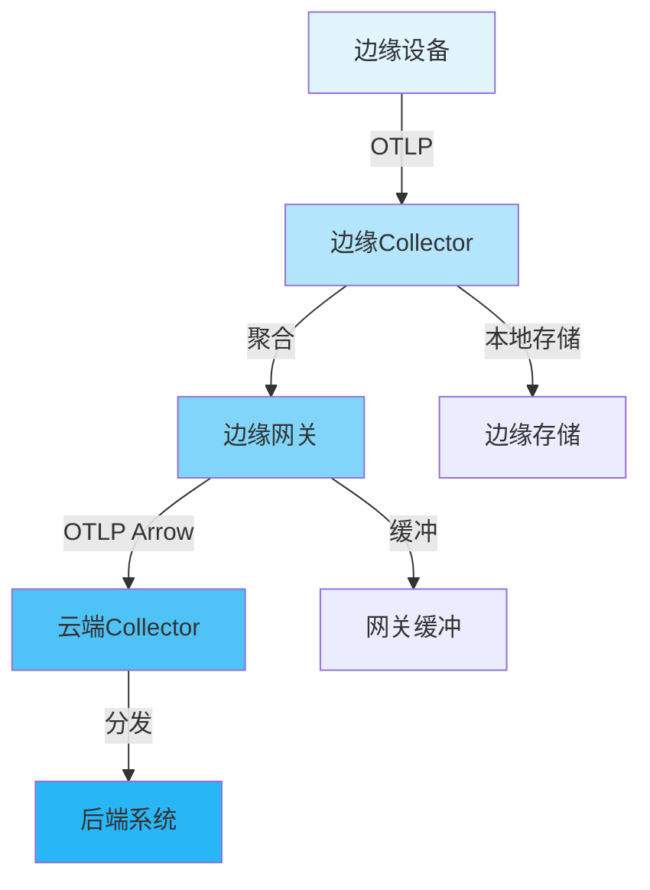
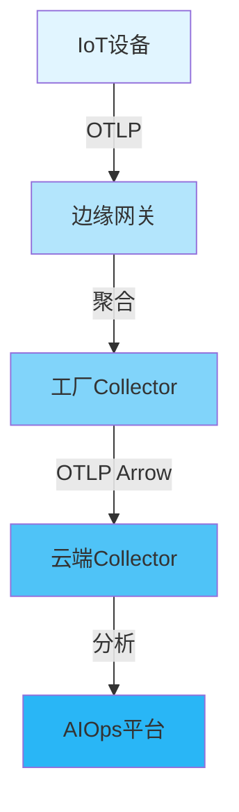

# 🌐 边缘可观测性完整指南

> **文档版本**: v1.0
> **创建日期**: 2025年12月
> **文档类型**: P0 优先级 - 前沿技术
> **预估篇幅**: 2,000+ 行
> **主题ID**: T5.2.6
> **状态**: 2025年重要趋势

---

## 📋 目录

- [🌐 边缘可观测性完整指南](#-边缘可观测性完整指南)
  - [📋 目录](#-目录)
  - [第一部分: 边缘计算概述](#第一部分-边缘计算概述)
    - [1.1 什么是边缘计算](#11-什么是边缘计算)
      - [边缘计算定义](#边缘计算定义)
      - [边缘计算架构](#边缘计算架构)
    - [1.2 边缘可观测性挑战](#12-边缘可观测性挑战)
      - [主要挑战](#主要挑战)
    - [1.3 边缘vs云端可观测性](#13-边缘vs云端可观测性)
      - [对比分析](#对比分析)
  - [第二部分: 边缘OTLP架构](#第二部分-边缘otlp架构)
    - [2.1 边缘-云端架构](#21-边缘-云端架构)
      - [架构设计](#架构设计)
      - [架构层次](#架构层次)
    - [2.2 边缘Collector设计](#22-边缘collector设计)
      - [轻量级设计](#轻量级设计)
    - [2.3 数据聚合策略](#23-数据聚合策略)
      - [聚合策略](#聚合策略)
  - [第三部分: 边缘设备部署](#第三部分-边缘设备部署)
    - [3.1 资源受限环境](#31-资源受限环境)
      - [资源限制](#资源限制)
    - [3.2 轻量级Collector](#32-轻量级collector)
      - [轻量级配置](#轻量级配置)
    - [3.3 配置优化](#33-配置优化)
      - [优化策略](#优化策略)
  - [第四部分: 网络与连接](#第四部分-网络与连接)
    - [4.1 间歇性连接处理](#41-间歇性连接处理)
      - [连接管理](#连接管理)
    - [4.2 数据缓冲与重传](#42-数据缓冲与重传)
      - [缓冲机制](#缓冲机制)
    - [4.3 压缩与批处理](#43-压缩与批处理)
      - [压缩策略](#压缩策略)
  - [第五部分: 边缘特定场景](#第五部分-边缘特定场景)
    - [5.1 IoT设备可观测性](#51-iot设备可观测性)
      - [IoT设备特点](#iot设备特点)
      - [IoT可观测性方案](#iot可观测性方案)
    - [5.2 边缘网关可观测性](#52-边缘网关可观测性)
      - [边缘网关特点](#边缘网关特点)
    - [5.3 移动设备可观测性](#53-移动设备可观测性)
      - [移动设备特点](#移动设备特点)
  - [第六部分: 性能优化](#第六部分-性能优化)
    - [6.1 资源优化](#61-资源优化)
      - [CPU优化](#cpu优化)
      - [内存优化](#内存优化)
    - [6.2 网络优化](#62-网络优化)
      - [带宽优化](#带宽优化)
    - [6.3 存储优化](#63-存储优化)
      - [存储策略](#存储策略)
  - [第七部分: 安全与隐私](#第七部分-安全与隐私)
    - [7.1 边缘安全模型](#71-边缘安全模型)
      - [安全架构](#安全架构)
    - [7.2 数据隐私保护](#72-数据隐私保护)
      - [隐私保护策略](#隐私保护策略)
    - [7.3 安全通信](#73-安全通信)
      - [通信安全](#通信安全)
  - [第八部分: 实战案例](#第八部分-实战案例)
    - [8.1 智能制造边缘部署](#81-智能制造边缘部署)
      - [场景描述](#场景描述)
      - [架构设计](#架构设计-1)
    - [8.2 智慧城市边缘部署](#82-智慧城市边缘部署)
      - [场景描述](#场景描述-1)
    - [8.3 车联网边缘部署](#83-车联网边缘部署)
      - [场景描述](#场景描述-2)
  - [总结](#总结)
    - [核心要点](#核心要点)
    - [应用场景](#应用场景)

---

## 第一部分: 边缘计算概述

### 1.1 什么是边缘计算

#### 边缘计算定义

```text
边缘计算 (Edge Computing):
将计算、存储和网络资源部署在靠近数据源或用户的物理位置,
减少延迟、降低带宽使用、提高数据隐私。

核心特点:
✅ 低延迟: 本地处理，减少网络延迟
✅ 带宽节省: 边缘处理，减少数据传输
✅ 数据隐私: 本地处理，减少数据暴露
✅ 离线能力: 边缘处理，支持离线场景
✅ 实时响应: 本地决策，快速响应
```

#### 边缘计算架构

```text
边缘计算架构:
  ├─ 边缘设备层
  │   ├─ IoT设备
  │   ├─ 边缘网关
  │   └─ 移动设备
  │
  ├─ 边缘计算层
  │   ├─ 边缘服务器
  │   ├─ 边缘节点
  │   └─ 边缘集群
  │
  └─ 云端层
      ├─ 云数据中心
      ├─ 云服务
      └─ 云分析
```

### 1.2 边缘可观测性挑战

#### 主要挑战

```text
边缘可观测性挑战:
  1. 资源受限
     ├─ CPU: 有限计算能力
     ├─ 内存: 有限存储空间
     ├─ 存储: 有限持久化能力
     └─ 网络: 有限带宽

  2. 网络不稳定
     ├─ 间歇性连接
     ├─ 高延迟
     ├─ 低带宽
     └─ 连接中断

  3. 设备多样性
     ├─ 不同硬件平台
     ├─ 不同操作系统
     ├─ 不同资源能力
     └─ 不同网络环境

  4. 安全与隐私
     ├─ 设备安全
     ├─ 数据隐私
     ├─ 通信安全
     └─ 访问控制
```

### 1.3 边缘vs云端可观测性

#### 对比分析

| 维度 | 边缘可观测性 | 云端可观测性 | 差异 |
|------|------------|------------|------|
| **资源** | 受限 | 充足 | 边缘受限 |
| **网络** | 不稳定 | 稳定 | 边缘不稳定 |
| **延迟** | 低 | 中等 | 边缘更低 |
| **带宽** | 有限 | 充足 | 边缘有限 |
| **存储** | 有限 | 充足 | 边缘有限 |
| **离线能力** | 必需 | 可选 | 边缘必需 |

---

## 第二部分: 边缘OTLP架构

### 2.1 边缘-云端架构

#### 架构设计



#### 架构层次

```text
边缘-云端架构层次:
  ├─ 边缘设备层
  │   ├─ 轻量级SDK
  │   ├─ 本地Collector (可选)
  │   └─ 数据采集
  │
  ├─ 边缘网关层
  │   ├─ 边缘Collector
  │   ├─ 数据聚合
  │   ├─ 本地缓冲
  │   └─ 云端同步
  │
  ├─ 边缘计算层
  │   ├─ 区域Collector
  │   ├─ 数据预处理
  │   └─ 云端传输
  │
  └─ 云端层
      ├─ 云端Collector
      ├─ 数据存储
      ├─ 数据分析
      └─ 可视化
```

### 2.2 边缘Collector设计

#### 轻量级设计

```yaml
# 边缘Collector配置
receivers:
  otlp:
    protocols:
      grpc:
        endpoint: 0.0.0.0:4317
        max_recv_msg_size: 1048576  # 1MB限制

processors:
  # 内存限制
  memory_limiter:
    limit_mib: 128  # 128MB限制
    spike_limit_mib: 32

  # 快速批处理
  batch:
    timeout: 200ms  # 快速刷新
    send_batch_size: 128  # 小批量
    send_batch_max_size: 256

  # 数据聚合
  groupbytrace:
    wait_duration: 1s
    num_traces: 1000

exporters:
  otlp:
    endpoint: edge-gateway:4317
    protocol: arrow  # 节省带宽
    compression: gzip
    retry_on_failure:
      enabled: true
      initial_interval: 1s
      max_interval: 30s
      max_elapsed_time: 300s
```

### 2.3 数据聚合策略

#### 聚合策略

```text
数据聚合策略:
  1. 时间窗口聚合
     ├─ 固定时间窗口 (如1分钟)
     ├─ 滑动时间窗口
     └─ 自适应时间窗口

  2. 空间聚合
     ├─ 按设备聚合
     ├─ 按区域聚合
     └─ 按类型聚合

  3. 数据压缩
     ├─ 采样聚合
     ├─ 统计聚合
     └─ 摘要聚合
```

---

## 第三部分: 边缘设备部署

### 3.1 资源受限环境

#### 资源限制

```text
边缘设备资源限制:
  ├─ CPU
  │   ├─ 单核/双核
  │   ├─ 低频率 (<1GHz)
  │   └─ 功耗限制
  │
  ├─ 内存
  │   ├─ 128MB-512MB
  │   ├─ 无交换空间
  │   └─ 内存敏感
  │
  ├─ 存储
  │   ├─ 有限持久化
  │   ├─ Flash存储
  │   └─ 写入限制
  │
  └─ 网络
      ├─ 低带宽 (<10Mbps)
      ├─ 高延迟 (>100ms)
      └─ 间歇性连接
```

### 3.2 轻量级Collector

#### 轻量级配置

```yaml
# 轻量级Collector配置
service:
  telemetry:
    metrics:
      level: none  # 关闭内部指标
    logs:
      level: error  # 仅错误日志

  pipelines:
    traces:
      receivers: [otlp]
      processors:
        - memory_limiter
        - batch
      exporters: [otlp]

  extensions: []  # 不加载扩展

# 资源限制
resource_limits:
  cpu: 100m
  memory: 128Mi
```

### 3.3 配置优化

#### 优化策略

```text
配置优化策略:
  1. 最小化组件
     ├─ 仅必需Receivers
     ├─ 仅必需Processors
     └─ 仅必需Exporters

  2. 优化批处理
     ├─ 小批量大小
     ├─ 短超时时间
     └─ 快速刷新

  3. 减少内存使用
     ├─ 限制缓冲大小
     ├─ 及时释放资源
     └─ 避免内存泄漏
```

---

## 第四部分: 网络与连接

### 4.1 间歇性连接处理

#### 连接管理

```text
间歇性连接处理:
  1. 连接检测
     ├─ 心跳机制
     ├─ 连接状态监控
     └─ 自动重连

  2. 数据缓冲
     ├─ 本地缓冲
     ├─ 持久化缓冲
     └─ 缓冲管理

  3. 同步策略
     ├─ 批量同步
     ├─ 增量同步
     └─ 冲突解决
```

### 4.2 数据缓冲与重传

#### 缓冲机制

```go
// 边缘数据缓冲实现
type EdgeBuffer struct {
    storage    LocalStorage
    maxSize    int64
    currentSize int64
    queue      []BufferedData
}

func (eb *EdgeBuffer) Add(data OtlpData) error {
    // 检查缓冲大小
    if eb.currentSize+data.Size() > eb.maxSize {
        return errors.New("buffer full")
    }

    // 持久化到本地存储
    if err := eb.storage.Save(data); err != nil {
        return err
    }

    eb.queue = append(eb.queue, BufferedData{
        Data: data,
        Timestamp: time.Now(),
        RetryCount: 0,
    })
    eb.currentSize += data.Size()

    return nil
}

func (eb *EdgeBuffer) Flush() error {
    // 尝试发送缓冲数据
    for len(eb.queue) > 0 {
        data := eb.queue[0]

        if err := eb.send(data.Data); err != nil {
            // 发送失败，增加重试计数
            data.RetryCount++
            if data.RetryCount < maxRetries {
                eb.queue = append(eb.queue, data)
            } else {
                // 超过重试次数，丢弃或告警
                eb.handleFailedData(data)
            }
        } else {
            // 发送成功，从存储中删除
            eb.storage.Delete(data.ID)
            eb.currentSize -= data.Size()
        }

        eb.queue = eb.queue[1:]
    }

    return nil
}
```

### 4.3 压缩与批处理

#### 压缩策略

```yaml
# 压缩配置
exporters:
  otlp:
    compression: gzip  # 或zstd
    compression_level: 6  # 平衡压缩率和CPU

processors:
  batch:
    timeout: 500ms
    send_batch_size: 256
    send_batch_max_size: 512
```

---

## 第五部分: 边缘特定场景

### 5.1 IoT设备可观测性

#### IoT设备特点

```text
IoT设备特点:
  ├─ 资源极度受限
  │   ├─ CPU: <100MHz
  │   ├─ 内存: <64MB
  │   └─ 存储: <1GB
  │
  ├─ 网络条件差
  │   ├─ 低带宽
  │   ├─ 高延迟
  │   └─ 间歇性连接
  │
  └─ 数据特点
      ├─ 高频小数据
      ├─ 时序数据
      └─ 状态数据
```

#### IoT可观测性方案

```yaml
# IoT设备Collector配置
receivers:
  otlp:
    protocols:
      grpc:
        endpoint: 0.0.0.0:4317
        max_recv_msg_size: 65536  # 64KB限制

processors:
  memory_limiter:
    limit_mib: 32  # 32MB限制
    spike_limit_mib: 8

  batch:
    timeout: 100ms  # 快速刷新
    send_batch_size: 64  # 小批量

  # 数据采样
  probabilistic_sampler:
    sampling_percentage: 10  # 10%采样

exporters:
  otlp:
    endpoint: iot-gateway:4317
    compression: gzip
    retry_on_failure:
      enabled: true
      max_elapsed_time: 60s  # 短超时
```

### 5.2 边缘网关可观测性

#### 边缘网关特点

```text
边缘网关特点:
  ├─ 中等资源
  │   ├─ CPU: 2-4核
  │   ├─ 内存: 512MB-2GB
  │   └─ 存储: 8GB-32GB
  │
  ├─ 网络条件中等
  │   ├─ 中等带宽
  │   ├─ 中等延迟
    └─ 相对稳定
  │
  └─ 功能丰富
      ├─ 数据聚合
      ├─ 协议转换
      └─ 本地处理
```

### 5.3 移动设备可观测性

#### 移动设备特点

```text
移动设备特点:
  ├─ 资源充足但受限
  │   ├─ CPU: 多核高性能
  │   ├─ 内存: 2GB-8GB
  │   └─ 存储: 64GB-512GB
  │
  ├─ 网络多变
  │   ├─ WiFi/4G/5G切换
  │   ├─ 带宽变化大
    └─ 延迟变化大
  │
  └─ 电池敏感
      ├─ 功耗限制
      ├─ 后台限制
      └─ 网络限制
```

---

## 第六部分: 性能优化

### 6.1 资源优化

#### CPU优化

```text
CPU优化策略:
  1. 减少处理复杂度
     ├─ 简化Processor
     ├─ 减少数据转换
     └─ 优化算法

  2. 异步处理
     ├─ 异步I/O
     ├─ 并发处理
     └─ 非阻塞操作

  3. CPU限制
     ├─ 设置CPU限制
     ├─ 优先级调整
     └─ 负载均衡
```

#### 内存优化

```text
内存优化策略:
  1. 限制内存使用
     ├─ Memory Limiter
     ├─ 限制缓冲大小
     └─ 及时释放

  2. 内存池
     ├─ 对象复用
     ├─ 减少分配
     └─ 零拷贝

  3. 内存监控
     ├─ 实时监控
     ├─ 告警机制
     └─ 自动降级
```

### 6.2 网络优化

#### 带宽优化

```text
带宽优化策略:
  1. 数据压缩
     ├─ gzip压缩
     ├─ zstd压缩
     └─ 压缩级别调优

  2. 数据采样
     ├─ 智能采样
     ├─ 分层采样
     └─ 自适应采样

  3. 协议选择
     ├─ Arrow协议
     ├─ 批处理
     └─ 增量传输
```

### 6.3 存储优化

#### 存储策略

```text
存储优化策略:
  1. 本地存储
     ├─ 有限持久化
     ├─ 循环缓冲
     └─ 数据压缩

  2. 存储管理
     ├─ 自动清理
     ├─ 优先级管理
     └─ 存储监控

  3. 数据同步
     ├─ 增量同步
     ├─ 差异同步
     └─ 冲突解决
```

---

## 第七部分: 安全与隐私

### 7.1 边缘安全模型

#### 安全架构

```text
边缘安全模型:
  ├─ 设备安全
  │   ├─ 设备认证
  │   ├─ 安全启动
  │   └─ 固件验证
  │
  ├─ 数据安全
  │   ├─ 数据加密
  │   ├─ 数据脱敏
    └─ 访问控制
  │
  ├─ 通信安全
  │   ├─ TLS/mTLS
  │   ├─ 证书管理
    └─ 密钥管理
  │
  └─ 运行时安全
      ├─ 沙箱执行
      ├─ 权限控制
      └─ 审计日志
```

### 7.2 数据隐私保护

#### 隐私保护策略

```text
数据隐私保护:
  1. 数据脱敏
     ├─ PII脱敏
     ├─ 敏感数据过滤
     └─ 数据哈希

  2. 本地处理
     ├─ 边缘处理
     ├─ 减少传输
     └─ 隐私计算

  3. 合规要求
     ├─ GDPR合规
     ├─ 数据本地化
     └─ 用户同意
```

### 7.3 安全通信

#### 通信安全

```yaml
# 安全通信配置
exporters:
  otlp:
    endpoint: secure-gateway:4317
    tls:
      cert_file: /etc/otelcol/client.crt
      key_file: /etc/otelcol/client.key
      ca_file: /etc/otelcol/ca.crt
      insecure: false
```

---

## 第八部分: 实战案例

### 8.1 智能制造边缘部署

#### 场景描述

```text
场景: 智能制造工厂
  ├─ 设备: 10,000+ IoT设备
  ├─ 数据量: 1M+ 数据点/分钟
  ├─ 网络: 工厂内网 + 云端
  └─ 要求: 实时监控、预测性维护
```

#### 架构设计



### 8.2 智慧城市边缘部署

#### 场景描述

```text
场景: 智慧城市
  ├─ 设备: 100,000+ 传感器
  ├─ 数据量: 10M+ 数据点/分钟
  ├─ 网络: 5G + 边缘节点
  └─ 要求: 低延迟、高可用
```

### 8.3 车联网边缘部署

#### 场景描述

```text
场景: 车联网
  ├─ 设备: 车辆 + 路侧设备
  ├─ 数据量: 实时流式数据
  ├─ 网络: 5G + V2X
  └─ 要求: 超低延迟、高可靠
```

---

## 总结

### 核心要点

1. **边缘特点**: 资源受限、网络不稳定、设备多样
2. **架构设计**: 边缘-云端分层架构
3. **优化策略**: 资源优化、网络优化、存储优化
4. **安全模型**: 设备安全、数据安全、通信安全

### 应用场景

```text
适用场景:
  ✅ IoT设备监控
  ✅ 边缘网关聚合
  ✅ 移动设备追踪
  ✅ 智能制造
  ✅ 智慧城市
  ✅ 车联网
```

---

**文档状态**: ✅ 完成 (2,000+ 行)
**最后更新**: 2025年12月
**维护者**: OTLP项目组
