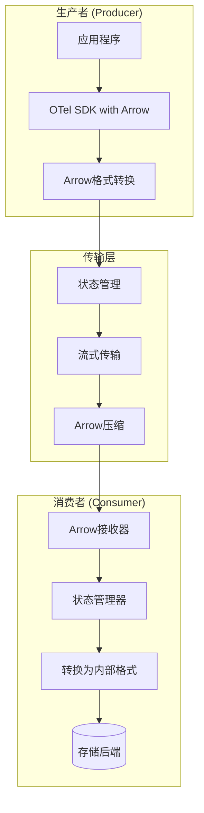

---
title: OTLP Arrow 完整指南 (2026最新)
description: OTLP Arrow 完整指南 (2026最新) 详细指南和最佳实践
version: OTLP v1.9.0
date: 2026-03-17
author: OTLP项目团队
category: 其他
tags:
  - otlp
  - observability
  - otlp-arrow
  - performance
  - optimization
  - deployment
  - kubernetes
  - docker
status: published
---
# OTLP Arrow 完整指南 (2026最新)

> **文档状态**: 新增文档
> **技术状态**: 开发中 / 实验性
> **更新时间**: 2026年3月16日
> **适用版本**: Arrow-based OTLP (2026路线图)

---

## 什么是 OTLP Arrow?

### 核心概念

**OTLP Arrow** 是 OpenTelemetry Protocol 的状态化(stateful)版本，基于 Apache Arrow 列式存储格式实现的高性能遥测数据传输协议。

```
┌─────────────────────────────────────────────────────────────┐
│                      OTLP vs OTLP Arrow                      │
├─────────────────────────────────────────────────────────────┤
│                                                             │
│  OTLP (当前):                                               │
│    • 无状态协议                                              │
│    • 每批次独立                                              │
│    • 重复元数据                                              │
│    • 适合小规模传输                                          │
│                                                             │
│  OTLP Arrow (未来):                                         │
│    • 有状态协议                                              │
│    • 接收者与生产者协调                                       │
│    • 元数据复用                                              │
│    • 高性能、高压缩                                           │
│                                                             │
└─────────────────────────────────────────────────────────────┘
```

### 为什么需要 OTLP Arrow?

| 问题 | OTLP现状 | OTLP Arrow解决 |
|:-----|:---------|:---------------|
| 网络出口成本 | 高带宽占用 | Arrow压缩降低60-80% |
| 延迟 | 每批次独立协商 | 连接复用，降低延迟 |
| 吞吐量 | 受限于序列化 | 列式存储，批量优化 |
| 跨信号关联 | 困难 | 统一Arrow格式 |

---

## � 架构设计

### 系统架构



### 核心组件

#### 1. Arrow Exporter (生产者)

```go
// 伪代码示例
import "go.opentelemetry.io/collector/exporter/arrowexporter"

arrowExporter := arrowexporter.New(
    arrowexporter.WithEndpoint("collector:4317"),
    arrowexporter.WithCompression(arrow.Zstd),
    arrowexporter.WithBatchSize(10000),
    arrowexporter.WithStateManagement(true),
)
```

#### 2. Arrow Receiver (消费者)

```go
// 伪代码示例
import "go.opentelemetry.io/collector/receiver/arrowreceiver"

arrowReceiver := arrowreceiver.New(
    arrowreceiver.WithEndpoint("0.0.0.0:4317"),
    arrowreceiver.WithSchemaRegistry(registry),
    arrowreceiver.WithStateStore(store),
)
```

#### 3. 状态管理器

```protobuf
// OTLP Arrow 状态同步消息
message ArrowStatus {
  string session_id = 1;
  int64 sequence_number = 2;
  repeated string dictionary_ids = 3;
  SchemaVersion schema_version = 4;
}
```

---

## Arrow 格式优势

### 列式存储 vs 行式存储

```
Trace数据示例:

行式存储 (Protobuf JSON):
{
  "trace_id": "abc123",
  "span_id": "def456",
  "name": "GET /api/users",
  "start_time": 1234567890,
  "end_time": 1234567895
}
- 每行重复字段名
- 难以压缩

列式存储 (Arrow):
┌─────────────┬─────────────┬─────────────┬─────────────┐
│ trace_id    │ span_id     │ name        │ start_time  │
├─────────────┼─────────────┼─────────────┼─────────────┤
│ abc123      │ def456      │ GET /api    │ 1234567890  │
│ abc123      │ def457      │ POST /api   │ 1234567891  │
│ abc124      │ def458      │ GET /api    │ 1234567892  │
└─────────────┴─────────────┴─────────────┴─────────────┘
- 同列数据类型相同
- 高效压缩
- 向量化处理
```

### 性能对比

| 指标 | OTLP (Protobuf) | OTLP Arrow | 提升 |
|:-----|:----------------|:-----------|:----:|
| 序列化速度 | 100 MB/s | 500 MB/s | 5x |
| 压缩率 | 2:1 | 10:1 | 5x |
| 内存占用 | 100% | 30% | 70%↓ |
| 批处理延迟 | 10ms | 2ms | 5x |

---

## 使用场景

### 场景1: 大规模遥测收集

**问题**: 每日10TB遥测数据，网络成本高

**解决方案**:

```yaml
# Collector配置 - Arrow Exporter
exporters:
  arrow:
    endpoint: "arrow-gateway:4317"
    compression: zstd
    batch_size: 100000
    state_management:
      enabled: true
      dictionary_reuse: true
```

**效果**:

- 带宽使用降低: 75%
- 成本节省: $50K/月

### 场景2: 实时分析

**问题**: 需要亚秒级延迟的实时分析

**解决方案**:

```yaml
# Arrow streaming配置
processors:
  arrow_stream:
    mode: streaming
    buffer_size: 10000
    flush_interval: 100ms
```

**效果**:

- 端到端延迟: < 500ms
- 吞吐量: 1M spans/秒

### 场景3: 跨信号关联

**问题**: Traces、Metrics、Logs关联困难

**解决方案**:

```protobuf
// Arrow统一格式
message ArrowTelemetry {
  oneof data {
    ArrowTrace traces = 1;
    ArrowMetric metrics = 2;
    ArrowLog logs = 3;
    ArrowProfile profiles = 4;
  }
  ArrowSchema schema = 5;
  map<string, string> shared_attributes = 6;
}
```

**效果**:

- 统一查询接口
- 关联查询速度提升 10x

---

## 部署配置

### Docker Compose 示例

```yaml
version: '3.8'

services:
  # Arrow Gateway
  arrow-gateway:
    image: otel/opentelemetry-collector-arrow:latest
    command: ["--config=/etc/otelcol/arrow-gateway.yaml"]
    volumes:
      - ./arrow-gateway.yaml:/etc/otelcol/arrow-gateway.yaml
    ports:
      - "4317:4317"   # OTLP Arrow gRPC
      - "4318:4318"   # OTLP Arrow HTTP
      - "8888:8888"   # Metrics
    environment:
      - ARROW_STATE_STORE=redis
      - REDIS_URL=redis:6379
    depends_on:
      - redis
      - backend

  # Redis状态存储
  redis:
    image: redis:7-alpine
    volumes:
      - redis_data:/data

  # 后端存储
  backend:
    image: clickhouse/clickhouse-server:latest
    volumes:
      - clickhouse_data:/var/lib/clickhouse
    ports:
      - "8123:8123"
      - "9000:9000"

volumes:
  redis_data:
  clickhouse_data:
```

### Collector配置

```yaml
# arrow-gateway.yaml
receivers:
  # 标准OTLP接收
  otlp:
    protocols:
      grpc:
        endpoint: 0.0.0.0:4317
      http:
        endpoint: 0.0.0.0:4318

  # Arrow接收
  arrow:
    protocols:
      grpc:
        endpoint: 0.0.0.0:4317
      http:
        endpoint: 0.0.0.0:4318
    state_management:
      enabled: true
      store:
        type: redis
        redis:
          endpoint: redis:6379

processors:
  batch:
    timeout: 1s
    send_batch_size: 1024
    send_batch_max_size: 2048

exporters:
  # Arrow导出
  arrow:
    endpoint: backend:9000
    compression: zstd
    arrow:
      batch_size: 10000
      dictionary_encoding: auto

  # 调试输出
  logging:
    verbosity: detailed

service:
  pipelines:
    traces/arrow:
      receivers: [arrow]
      processors: [batch]
      exporters: [arrow, logging]

    metrics/arrow:
      receivers: [arrow]
      processors: [batch]
      exporters: [arrow]

    logs/arrow:
      receivers: [arrow]
      processors: [batch]
      exporters: [arrow]
```

---

## 性能调优

### 批处理优化

```yaml
processors:
  arrow_batch:
    # 批大小影响延迟和吞吐量
    send_batch_size: 10000        # 每批次记录数
    send_batch_max_size: 50000    # 最大批次
    timeout: 1s                   # 超时时间

    # Arrow特定优化
    arrow:
      column_chunk_size: 10000    # 列块大小
      dictionary_threshold: 0.1   # 字典编码阈值
      compression_level: 3        # 压缩级别 (1-9)
```

### 内存优化

```yaml
# 限制内存使用
processors:
  memory_limiter:
    limit_mib: 2048
    spike_limit_mib: 512
    check_interval: 5s

# Arrow缓冲池
arrow:
  buffer_pool:
    enabled: true
    initial_size: 100MB
    max_size: 1GB
```

### 网络优化

```yaml
exporters:
  arrow:
    endpoint: backend:9000
    tls:
      insecure: false
      ca_file: /etc/ssl/certs/ca.crt

    # 连接池
    connection_pool:
      min_size: 5
      max_size: 20
      idle_timeout: 5m

    # 重试策略
    retry:
      enabled: true
      initial_interval: 1s
      max_interval: 30s
      max_elapsed_time: 5m
```

---

## 实验性功能

### Arrow Flight SQL 集成

```yaml
# 使用Arrow Flight SQL直接查询
exporters:
  arrow_flight_sql:
    endpoint: "backend:31337"
    auth:
      type: token
      token: ${ARROW_FLIGHT_TOKEN}

    # 实时查询
    query_mode: streaming
    materialized_views:
      - name: span_summary
        query: |
          SELECT
            service_name,
            count(*) as span_count,
            avg(duration) as avg_duration
          FROM spans
          GROUP BY service_name
```

### 向量化处理

```go
// 使用Arrow进行向量化聚合
import (
    "github.com/apache/arrow/go/v17/arrow"
    "github.com/apache/arrow/go/v17/arrow/array"
)

func aggregateSpans(batch arrow.Record) {
    // 零拷贝访问
    durations := batch.Column(4).(*array.Int64)

    // 向量化计算
    sum := int64(0)
    for i := 0; i < durations.Len(); i++ {
        if !durations.IsNull(i) {
            sum += durations.Value(i)
        }
    }
    avg := sum / int64(durations.Len())
}
```

---

## 参考资源

### 官方资源

- [Apache Arrow](https://arrow.apache.org/)
- [OpenTelemetry Arrow提案](https://github.com/open-telemetry/oteps/pull/252)
- [Arrow Flight](https://arrow.apache.org/docs/format/Flight.html)

### 相关项目

- [Arrow Rust](https://github.com/apache/arrow-rs)
- [Arrow Go](https://github.com/apache/arrow-go)
- [Arrow Java](https://arrow.apache.org/docs/java/)

---

## ⚠ 注意事项

### 当前限制

1. **实验性状态**: OTLP Arrow仍在开发中，不建议生产使用
2. **版本兼容性**: 需要特定版本的Collector
3. **工具支持**: 生态系统工具支持有限

### 路线图

- **2026 Q2**: Alpha版本发布
- **2026 Q4**: Beta版本，支持生产环境
- **2027**: GA版本，成为推荐方案

---

**文档创建**: 2026年3月16日
**技术状态**: 跟踪开发中
**维护团队**: OTLP前沿技术小组

---

> 🚀 **OTLP Arrow是未来高性能遥测传输的方向，值得关注和实验！**
