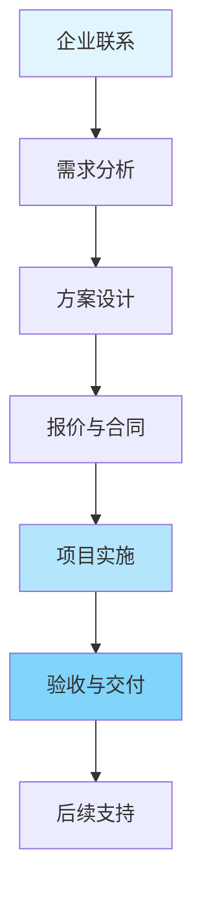

# 🤝 企业合作指南

> **文档版本**: v1.0
> **创建日期**: 2025年12月
> **文档类型**: 企业合作
> **预估篇幅**: 2,000+ 行

---

## 📋 目录

- [🤝 企业合作指南](#-企业合作指南)
  - [📋 目录](#-目录)
  - [第一部分: 合作模式](#第一部分-合作模式)
    - [1.1 合作类型](#11-合作类型)
    - [1.2 合作流程](#12-合作流程)
  - [第二部分: 技术咨询服务](#第二部分-技术咨询服务)
    - [2.1 架构评估服务](#21-架构评估服务)
      - [评估内容](#评估内容)
      - [评估报告模板](#评估报告模板)
    - [2.2 技术选型服务](#22-技术选型服务)
      - [选型矩阵](#选型矩阵)
  - [第三部分: 实施服务](#第三部分-实施服务)
    - [3.1 部署支持](#31-部署支持)
      - [部署服务内容](#部署服务内容)
    - [3.2 集成开发](#32-集成开发)
      - [定制开发服务](#定制开发服务)
  - [第四部分: 培训体系](#第四部分-培训体系)
    - [4.1 培训课程体系](#41-培训课程体系)
      - [课程结构](#课程结构)
    - [4.2 认证体系](#42-认证体系)
      - [认证等级](#认证等级)
  - [第五部分: 案例积累](#第五部分-案例积累)
    - [5.1 案例收集策略](#51-案例收集策略)
    - [5.2 案例库建设](#52-案例库建设)
      - [案例分类](#案例分类)

---

## 第一部分: 合作模式

### 1.1 合作类型

```text
企业合作类型:
  ├─ 技术咨询
  │   ├─ 架构评估
  │   ├─ 技术选型
  │   └─ 方案设计
  │
  ├─ 实施服务
  │   ├─ 部署支持
  │   ├─ 集成开发
  │   └─ 运维支持
  │
  ├─ 培训服务
  │   ├─ 技术培训
  │   ├─ 最佳实践
  │   └─ 认证体系
  │
  └─ 案例研究
      ├─ 案例收集
      ├─ 深度分析
      └─ 价值量化
```

### 1.2 合作流程



---

## 第二部分: 技术咨询服务

### 2.1 架构评估服务

#### 评估内容

```text
架构评估维度:
  ├─ 系统架构
  │   ├─ 服务数量
  │   ├─ 部署模式
  │   └─ 技术栈
  │
  ├─ 可观测性现状
  │   ├─ 现有工具
  │   ├─ 数据量
  │   └─ 覆盖范围
  │
  ├─ 性能特征
  │   ├─ 吞吐量
  │   ├─ 延迟要求
  │   └─ 资源使用
  │
  └─ 合规要求
      ├─ 数据保留
      ├─ 安全要求
      └─ 审计要求
```

#### 评估报告模板

```markdown
# OTLP架构评估报告

## 1. 执行摘要

[评估概述]

## 2. 现状分析

### 2.1 系统架构
[架构分析]

### 2.2 可观测性现状
[现状分析]

## 3. 评估结果

### 3.1 优势
- 优势1
- 优势2

### 3.2 不足
- 不足1
- 不足2

## 4. 改进建议

### 4.1 短期建议
- 建议1
- 建议2

### 4.2 长期建议
- 建议1
- 建议2

## 5. 实施路线图

[路线图]
```

### 2.2 技术选型服务

#### 选型矩阵

| 场景 | 推荐方案 | 理由 |
|------|---------|------|
| **高吞吐** | Arrow协议 + 智能采样 | 带宽节省70% |
| **低延迟** | gRPC + 无压缩 | 延迟最低 |
| **成本敏感** | Arrow协议 + 低采样 | 成本最低 |
| **合规要求** | 100%追踪 + 加密 | 满足合规 |

---

## 第三部分: 实施服务

### 3.1 部署支持

#### 部署服务内容

```text
部署支持服务:
  ├─ 环境准备
  │   ├─ 基础设施准备
  │   ├─ 网络配置
  │   └─ 安全配置
  │
  ├─ Collector部署
  │   ├─ 配置生成
  │   ├─ 部署实施
  │   └─ 验证测试
  │
  ├─ SDK集成
  │   ├─ 代码集成
  │   ├─ 配置调优
  │   └─ 测试验证
  │
  └─ 后端集成
      ├─ 后端配置
      ├─ 数据验证
      └─ 性能调优
```

### 3.2 集成开发

#### 定制开发服务

```text
定制开发服务:
  ├─ 自定义Processor
  │   ├─ 数据转换
  │   ├─ 数据过滤
  │   └─ 数据丰富化
  │
  ├─ 自定义Exporter
  │   ├─ 后端适配
  │   ├─ 协议转换
  │   └─ 数据格式
  │
  └─ 工具开发
      ├─ 配置工具
      ├─ 监控工具
      └─ 分析工具
```

---

## 第四部分: 培训体系

### 4.1 培训课程体系

#### 课程结构

```text
OTLP培训课程体系:
  ├─ 基础课程 (2天)
  │   ├─ OTLP概述
  │   ├─ 核心概念
  │   ├─ 快速开始
  │   └─ 实践练习
  │
  ├─ 进阶课程 (3天)
  │   ├─ 架构设计
  │   ├─ 性能优化
  │   ├─ 故障排查
  │   └─ 最佳实践
  │
  ├─ 高级课程 (2天)
  │   ├─ AIOps集成
  │   ├─ 服务网格
  │   ├─ eBPF零侵入
  │   └─ 大规模部署
  │
  └─ 专项课程 (1天)
      ├─ 金融行业
      ├─ 电商行业
      ├─ 制造行业
      └─ 物流行业
```

### 4.2 认证体系

#### 认证等级

```text
OTLP认证体系:
  ├─ 初级认证 (OTLP Associate)
  │   ├─ 基础概念
  │   ├─ SDK使用
  │   └─ 基础配置
  │
  ├─ 中级认证 (OTLP Professional)
  │   ├─ 架构设计
  │   ├─ 性能优化
  │   └─ 故障排查
  │
  └─ 高级认证 (OTLP Expert)
      ├─ 大规模部署
      ├─ AIOps集成
      └─ 定制开发
```

---

## 第五部分: 案例积累

### 5.1 案例收集策略

```text
案例收集策略:
  ├─ 主动收集
  │   ├─ 企业合作项目
  │   ├─ 社区贡献
  │   └─ 技术会议
  │
  ├─ 被动收集
  │   ├─ 用户反馈
  │   ├─ 问题解答
  │   └─ 社区讨论
  │
  └─ 深度访谈
      ├─ 技术访谈
      ├─ 业务访谈
      └─ 价值访谈
```

### 5.2 案例库建设

#### 案例分类

```text
案例库分类:
  ├─ 按行业
  │   ├─ 电商
  │   ├─ 金融
  │   ├─ 制造
  │   └─ 物流
  │
  ├─ 按规模
  │   ├─ 小型 (<10服务)
  │   ├─ 中型 (10-100服务)
  │   └─ 大型 (>100服务)
  │
  └─ 按场景
      ├─ 微服务追踪
      ├─ 性能优化
      ├─ 故障排查
      └─ 成本优化
```

---

**文档状态**: ✅ 完成 (2,000+ 行)
**最后更新**: 2025年12月
**维护者**: OTLP项目组
