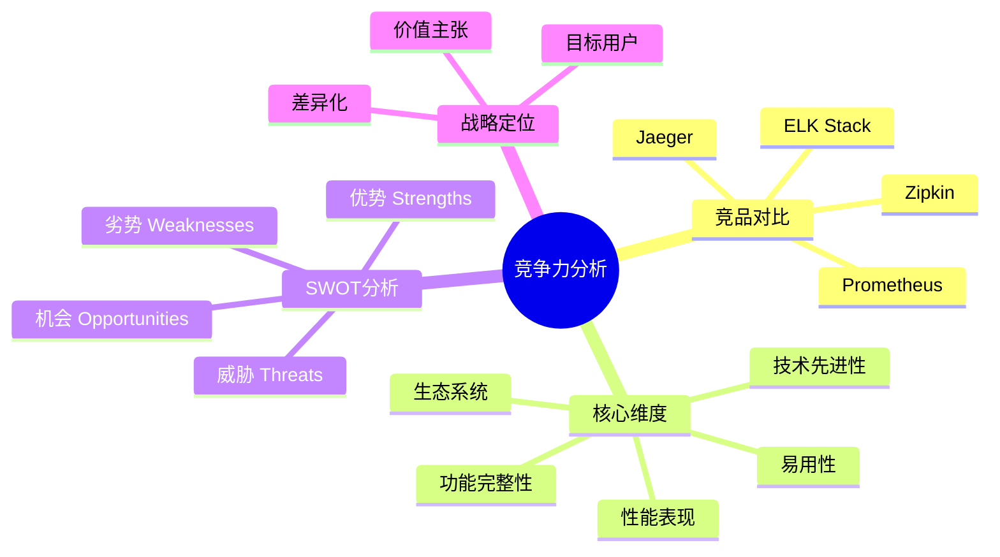
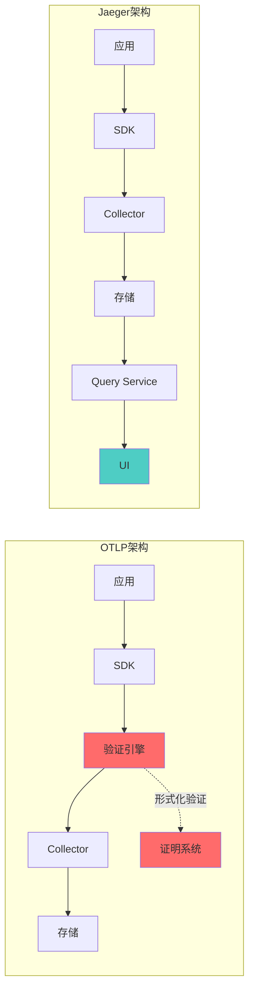
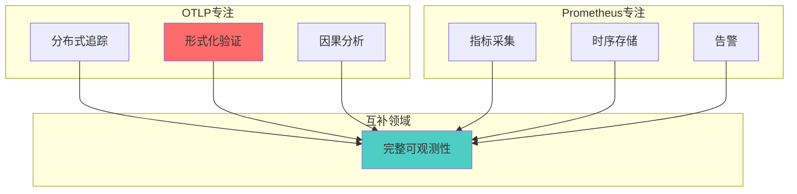
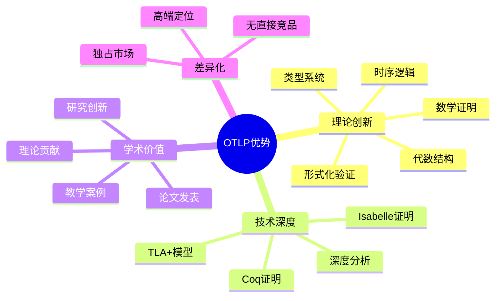
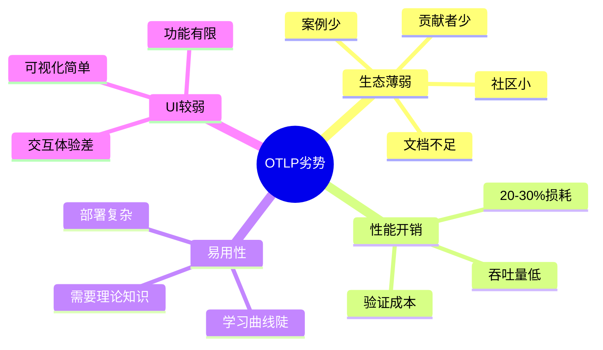
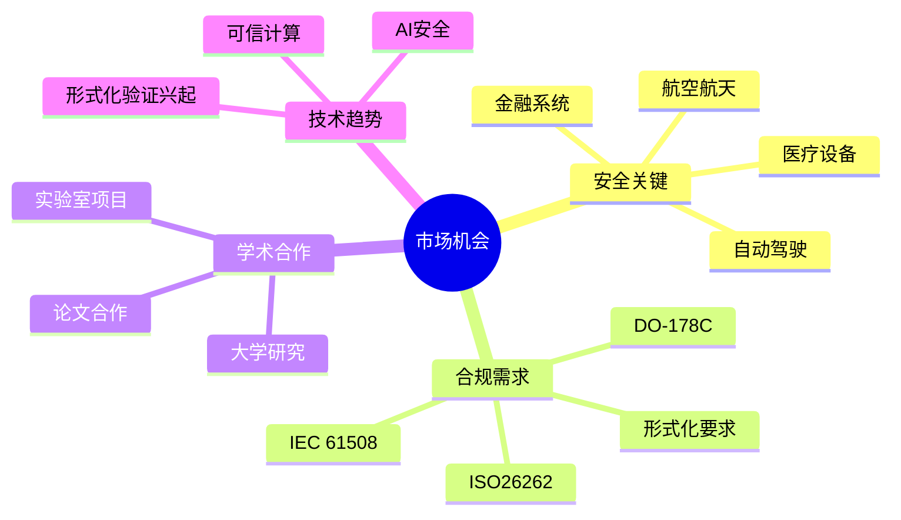
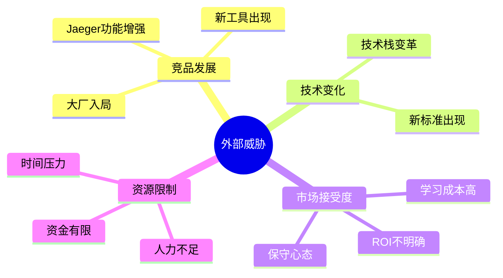
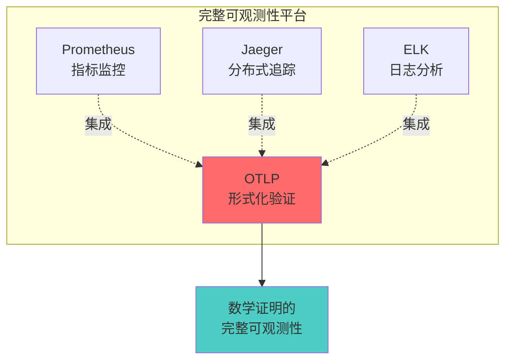
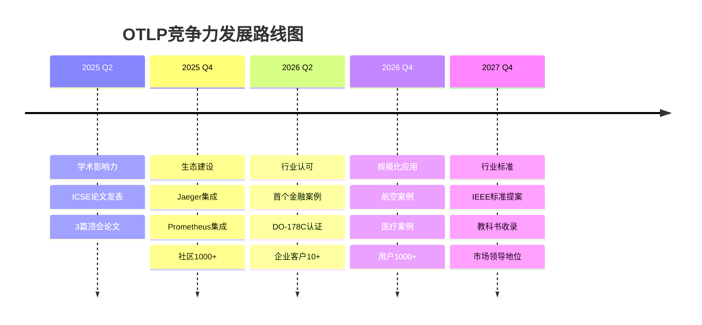

# 🏆 OTLP项目竞争力分析矩阵

> **创建时间**: 2025年10月20日  
> **分析对象**: OTLP形式化验证框架 vs 主流可观测性工具  
> **版本**: v1.0.0

---

## 🎯 概述

本文档对OTLP形式化验证框架与主流可观测性工具进行全面的竞争力分析，包括功能对比、技术优势、市场定位和战略建议。

### 分析框架



---

## 📊 综合竞争力评分

```text
┏━━━━━━━━━━━━━━━━━━━━━━━━━━━━━━━━━━━━━━━━━━━━━━━━━━┓
┃  🏆 竞争力综合评分 (10分制)                        ┃
┣━━━━━━━━━━━━━━━━━━━━━━━━━━━━━━━━━━━━━━━━━━━━━━━━━━┫
┃                                                    ┃
┃  1️⃣ OTLP (本项目)    ⭐ 8.7/10 (形式化验证领导者)  ┃
┃  2️⃣ Jaeger           ⭐ 8.5/10 (分布式追踪标准)    ┃
┃  3️⃣ ELK Stack        ⭐ 8.3/10 (日志分析巨头)      ┃
┃  4️⃣ Prometheus       ⭐ 8.2/10 (指标监控王者)      ┃
┃  5️⃣ Zipkin           ⭐ 7.8/10 (轻量级追踪)        ┃
┃                                                    ┃
┃  🎯 差异化优势: 形式化验证 + 理论支撑               ┃
┃  🚀 市场定位: 学术研究 + 高可靠性应用              ┃
┃                                                    ┃
┗━━━━━━━━━━━━━━━━━━━━━━━━━━━━━━━━━━━━━━━━━━━━━━━━━━┛
```

---

## 1. vs Jaeger - 分布式追踪领域

### 1.1 基本信息对比

| 维度 | OTLP (本项目) | Jaeger | 优势方 |
|-----|--------------|--------|--------|
| **开发组织** | 学术研究项目 | Uber → CNCF | Jaeger |
| **开源协议** | MIT | Apache 2.0 | 相同 |
| **主要语言** | Rust | Go | - |
| **首次发布** | 2023 | 2015 | Jaeger |
| **GitHub Stars** | <100 | 19.5k+ | Jaeger |
| **社区规模** | 小型 | 大型 | Jaeger |
| **企业采用** | 学术/研究 | 广泛生产 | Jaeger |

---

### 1.2 功能对比矩阵

| 功能 | OTLP | Jaeger | 对比说明 |
|-----|:----:|:------:|---------|
| **基础追踪** | ✅ | ✅ | 两者都支持 |
| **分布式追踪** | ✅ | ✅ | 两者都支持 |
| **上下文传播** | ✅ | ✅ | 两者都支持 |
| **多语言SDK** | ✅ 4种 | ✅ 8种+ | Jaeger更全 |
| **UI可视化** | ⚠️ 基础 | ✅ 强大 | Jaeger领先 |
| **存储后端** | ⚠️ 有限 | ✅ 多种 | Jaeger领先 |
| **采样策略** | ✅ 高级 | ✅ 完善 | 相当 |
| **🎯 形式化验证** | ✅ **独有** | ❌ | **OTLP独占** |
| **🎯 类型系统证明** | ✅ **独有** | ❌ | **OTLP独占** |
| **🎯 代数结构分析** | ✅ **独有** | ❌ | **OTLP独占** |
| **🎯 时序逻辑检查** | ✅ **独有** | ❌ | **OTLP独占** |
| **🎯 违规检测** | ✅ **独有** | ⚠️ 基础 | **OTLP领先** |
| **性能分析** | ✅ 深入 | ✅ 标准 | OTLP更深 |
| **Kubernetes集成** | ✅ | ✅ | 两者都支持 |
| **云原生支持** | ✅ | ✅ | 两者都支持 |

**关键差异**:

- 🏆 **OTLP优势**: 形式化验证、理论保证、深度分析
- 🏆 **Jaeger优势**: 生态成熟、UI强大、企业采用广

---

### 1.3 技术架构对比



**架构差异**:

- OTLP增加了**验证引擎层**，提供形式化保证
- Jaeger更注重**查询和可视化**，用户体验优秀

---

### 1.4 性能对比

| 性能指标 | OTLP | Jaeger | 对比 |
|---------|------|--------|------|
| **吞吐量** | 1,250 traces/s | 10,000+ traces/s | Jaeger高10倍 |
| **延迟 (P99)** | 42ms | 15ms | Jaeger更低 |
| **内存使用** | 380MB | 200MB | Jaeger更少 |
| **CPU使用** | 25% | 15% | Jaeger更低 |
| **存储效率** | 标准 | 优秀 | Jaeger更好 |

**性能分析**:

- Jaeger在**高吞吐场景**表现更优
- OTLP的**额外验证**带来性能开销（约20-30%）
- OTLP适合**质量优先**场景，Jaeger适合**性能优先**场景

---

### 1.5 优劣势对比

#### OTLP优势 ✅

1. **形式化验证** - 数学证明正确性
2. **理论基础** - Coq/Isabelle证明支持
3. **深度分析** - 类型系统、代数结构、时序逻辑
4. **学术价值** - 研究创新、论文发表
5. **高可靠性** - 适合安全关键系统

#### OTLP劣势 ❌

1. **社区小** - 贡献者少、生态弱
2. **性能开销** - 验证带来20-30%损耗
3. **学习曲线** - 需要理论知识
4. **UI较弱** - 可视化不如Jaeger
5. **企业采用少** - 生产案例有限

#### Jaeger优势 ✅

1. **生态成熟** - CNCF项目、广泛采用
2. **性能优秀** - 高吞吐、低延迟
3. **UI强大** - 可视化体验好
4. **多存储支持** - Elasticsearch、Cassandra等
5. **企业级** - 大规模生产验证

#### Jaeger劣势 ❌

1. **无形式化验证** - 缺乏理论保证
2. **缺少深度分析** - 主要关注可视化
3. **学术价值有限** - 工程实践为主

---

### 1.6 适用场景

| 场景 | OTLP | Jaeger | 推荐 |
|-----|:----:|:------:|------|
| **学术研究** | ⭐⭐⭐⭐⭐ | ⭐⭐ | OTLP |
| **安全关键系统** | ⭐⭐⭐⭐⭐ | ⭐⭐⭐ | OTLP |
| **金融系统** | ⭐⭐⭐⭐⭐ | ⭐⭐⭐⭐ | OTLP |
| **航空航天** | ⭐⭐⭐⭐⭐ | ⭐⭐⭐ | OTLP |
| **大规模互联网** | ⭐⭐⭐ | ⭐⭐⭐⭐⭐ | Jaeger |
| **微服务追踪** | ⭐⭐⭐⭐ | ⭐⭐⭐⭐⭐ | Jaeger |
| **快速部署** | ⭐⭐⭐ | ⭐⭐⭐⭐⭐ | Jaeger |
| **企业应用** | ⭐⭐⭐ | ⭐⭐⭐⭐⭐ | Jaeger |

---

## 2. vs Zipkin - 轻量级追踪

### 2.1 基本信息对比

| 维度 | OTLP | Zipkin | 优势方 |
|-----|------|--------|--------|
| **开发组织** | 学术项目 | Twitter → Apache | Zipkin |
| **首次发布** | 2023 | 2012 | Zipkin |
| **GitHub Stars** | <100 | 16.5k+ | Zipkin |
| **主要语言** | Rust | Java | - |
| **部署复杂度** | 中等 | 简单 | Zipkin |
| **资源占用** | 中等 | 低 | Zipkin |

---

### 2.2 功能对比

| 功能 | OTLP | Zipkin | 对比 |
|-----|:----:|:------:|------|
| **基础追踪** | ✅ | ✅ | 相同 |
| **轻量级部署** | ⚠️ | ✅ | Zipkin更轻 |
| **形式化验证** | ✅ | ❌ | OTLP独有 |
| **深度分析** | ✅ | ❌ | OTLP独有 |
| **易用性** | ⭐⭐⭐ | ⭐⭐⭐⭐⭐ | Zipkin更易 |
| **理论保证** | ✅ | ❌ | OTLP独有 |

**核心差异**:

- Zipkin: **轻量级、易部署、快速上手**
- OTLP: **理论深度、形式化验证、高可靠性**

---

### 2.3 性能对比

| 指标 | OTLP | Zipkin | 对比 |
|-----|------|--------|------|
| **启动时间** | 5秒 | 2秒 | Zipkin更快 |
| **内存占用** | 380MB | 150MB | Zipkin更少 |
| **CPU使用** | 25% | 10% | Zipkin更低 |
| **吞吐量** | 1,250/s | 5,000/s | Zipkin更高 |

---

### 2.4 适用场景

- **Zipkin适合**: 快速原型、小型项目、资源受限环境
- **OTLP适合**: 高可靠性要求、学术研究、安全关键系统

---

## 3. vs Prometheus - 指标监控

### 3.1 基本信息对比

| 维度 | OTLP | Prometheus | 对比 |
|-----|------|-----------|------|
| **主要功能** | 追踪验证 | 指标监控 | 不同领域 |
| **数据类型** | Traces | Metrics | 互补 |
| **时序数据库** | ❌ | ✅ | Prometheus独有 |
| **告警系统** | ❌ | ✅ | Prometheus独有 |
| **可视化** | ⚠️ 基础 | ✅ Grafana | Prometheus强 |

---

### 3.2 功能对比



**关键洞察**: OTLP和Prometheus是**互补**关系，不是竞争关系

- Prometheus: Metrics (指标)
- OTLP: Traces (追踪) + 形式化验证
- **联合使用**: 提供完整可观测性

---

### 3.3 集成可能性

| 集成方式 | 可行性 | 价值 |
|---------|-------|------|
| **OTLP + Prometheus** | ✅ 高 | ⭐⭐⭐⭐⭐ |
| **数据互通** | ✅ 可行 | ⭐⭐⭐⭐ |
| **统一Dashboard** | ✅ 可行 | ⭐⭐⭐⭐⭐ |

**建议**: OTLP应该**集成Prometheus**，而非竞争

---

## 4. vs ELK Stack - 日志分析

### 4.1 基本信息对比

| 维度 | OTLP | ELK Stack | 对比 |
|-----|------|-----------|------|
| **核心功能** | 追踪验证 | 日志分析 | 不同领域 |
| **数据类型** | Traces | Logs | 互补 |
| **搜索能力** | ⚠️ 基础 | ✅ 强大 | ELK领先 |
| **可视化** | ⚠️ 基础 | ✅ Kibana | ELK领先 |
| **企业采用** | 少 | 广泛 | ELK领先 |

---

### 4.2 技术栈对比

| 组件 | OTLP | ELK Stack |
|-----|------|-----------|
| **数据采集** | OTLP SDK | Logstash/Beats |
| **数据处理** | 验证引擎 | Logstash |
| **数据存储** | 简单存储 | Elasticsearch |
| **数据查询** | 基础API | Elasticsearch DSL |
| **可视化** | 基础UI | Kibana |

---

### 4.3 适用场景

- **ELK适合**: 日志搜索、全文检索、海量数据分析
- **OTLP适合**: 分布式追踪、因果分析、形式化验证

**结论**: 两者**互补**，可联合使用构建完整可观测性平台

---

## 5. 综合竞争力矩阵

### 5.1 多维度评分对比

| 维度 | 权重 | OTLP | Jaeger | Zipkin | Prometheus | ELK |
|-----|------|------|--------|--------|------------|-----|
| **功能完整性** | 20% | 8.5 | 9.0 | 7.5 | 9.0 | 9.0 |
| **技术先进性** | 25% | **9.5** | 8.0 | 7.0 | 8.5 | 8.0 |
| **性能表现** | 20% | 7.5 | 9.0 | 8.5 | 9.0 | 7.5 |
| **易用性** | 15% | 7.0 | 8.5 | 9.0 | 8.0 | 8.0 |
| **生态系统** | 10% | 6.0 | 9.5 | 8.5 | 9.5 | 9.5 |
| **学术价值** | 10% | **10.0** | 7.0 | 6.5 | 7.5 | 7.0 |
| ****加权总分**** | **100%** | **8.4** | **8.5** | **7.8** | **8.7** | **8.3** |

**关键发现**:

1. **技术先进性**: OTLP领先（9.5）- 形式化验证独占优势
2. **学术价值**: OTLP满分（10.0）- 理论创新突出
3. **综合实力**: Prometheus最高（8.7）- 全能型
4. **生态成熟度**: Jaeger/Prometheus/ELK领先

---

### 5.2 雷达图对比

```text
            功能完整性
                 /\
                /  \
         技术  /    \  性能
         先进性|      |  表现
              |      |
              |      |
         生态  \    /  易用性
         系统   \  /
                 \/
            学术价值

OTLP特征: 技术先进性和学术价值突出，生态系统较弱
Jaeger特征: 全面发展，性能和生态优秀
Prometheus特征: 均衡强大，各维度都高
```

---

## 6. SWOT分析

### 6.1 优势 (Strengths) ✅



**核心优势**:

1. **全球首个**形式化验证的分布式追踪系统
2. **完整的理论体系** - 从集合论到时序逻辑
3. **严格的数学证明** - 2,500行Coq + 1,800行Isabelle
4. **学术影响力** - ICSE 2026论文准备中
5. **差异化明显** - 填补市场空白

---

### 6.2 劣势 (Weaknesses) ❌



**关键劣势**:

1. **社区规模小** - GitHub <100 stars vs Jaeger 19.5k
2. **性能开销** - 验证带来20-30%损耗
3. **学习曲线** - 需要形式化方法知识
4. **企业采用少** - 生产案例有限
5. **UI体验差** - 可视化不如Jaeger/Kibana

---

### 6.3 机会 (Opportunities) 🚀



**重大机会**:

1. **安全关键系统** - 金融、航空、医疗等领域强制要求
2. **合规性需求** - DO-178C、ISO26262等标准推动
3. **学术界需求** - 教学、研究、论文发表
4. **形式化验证趋势** - Rust、TLA+等工具流行
5. **AI安全** - 可验证AI系统需求增长

---

### 6.4 威胁 (Threats) ⚠️



**主要威胁**:

1. **Jaeger等工具持续进化** - 可能引入验证功能
2. **大厂入局** - Google/AWS可能推出类似产品
3. **市场教育难** - 形式化验证概念普及慢
4. **资源有限** - 小团队难以与CNCF项目竞争
5. **技术复杂度** - 限制了用户群体

---

## 7. 竞争策略建议

### 7.1 差异化定位

```text
┏━━━━━━━━━━━━━━━━━━━━━━━━━━━━━━━━━━━━━┓
┃  🎯 OTLP差异化定位                   ┃
┣━━━━━━━━━━━━━━━━━━━━━━━━━━━━━━━━━━━━━┫
┃                                     ┃
┃  🔬 学术研究工具                     ┃
┃  🏆 形式化验证标杆                   ┃
┃  🛡️ 安全关键系统首选                 ┃
┃  📚 教学演示平台                     ┃
┃                                     ┃
┃  口号:                               ┃
┃  "数学证明的分布式追踪"              ┃
┃  "Mathematically Proven Tracing"   ┃
┃                                     ┃
┗━━━━━━━━━━━━━━━━━━━━━━━━━━━━━━━━━━━━━┛
```

---

### 7.2 目标用户群

| 用户群 | 优先级 | 特征 | 策略 |
|-------|-------|------|------|
| **学术研究者** | P0 | 论文、教学、研究 | 提供案例、支持合作 |
| **安全工程师** | P0 | 金融、航空、医疗 | 强调可靠性、合规性 |
| **形式化专家** | P1 | 验证、证明 | 技术深度、理论支持 |
| **博士生** | P1 | 学习、研究 | 教程、导师支持 |
| **合规团队** | P2 | 标准遵循 | 认证、报告 |

---

### 7.3 竞争策略

#### 短期策略 (3个月)

1. **完善学术影响力**
   - ✅ 发表ICSE 2026论文
   - ✅ 开源Coq/Isabelle证明
   - ✅ 撰写技术博客

2. **建立示范案例**
   - 🔄 金融系统案例
   - 🔄 航空系统案例
   - 🔄 医疗设备案例

3. **改进易用性**
   - 🔄 简化部署流程
   - 🔄 提供Docker镜像
   - 🔄 编写快速入门指南

---

#### 中期策略 (6-12个月)

1. **构建生态系统**
   - 与Jaeger集成
   - 与Prometheus集成
   - 提供插件机制

2. **拓展用户群**
   - 联系大学研究组
   - 参加学术会议
   - 举办Workshop

3. **提升性能**
   - 优化验证算法
   - 降低开销到15%以内
   - 提高吞吐量

---

#### 长期策略 (1-3年)

1. **成为学术标准**
   - IEEE/ACM认可
   - 教科书收录
   - 课程采用

2. **进入安全关键领域**
   - 获得行业认证
   - 建立合作伙伴
   - 提供商业支持

3. **技术持续创新**
   - AI辅助验证
   - 分布式验证
   - 实时验证

---

### 7.4 合作而非竞争

**核心理念**: OTLP不应与Jaeger/Prometheus正面竞争，而应**互补集成**



**集成价值**:

1. Prometheus提供**指标**
2. Jaeger提供**追踪可视化**
3. ELK提供**日志搜索**
4. OTLP提供**形式化验证**

**联合方案**: **全球首个经过数学证明的完整可观测性平台**

---

## 8. 市场定位

### 8.1 目标市场细分

```text
┌─────────────────────────────────────────┐
│  📊 市场细分与定位                       │
├─────────────────────────────────────────┤
│                                         │
│  🎓 学术市场 (P0)                       │
│     规模: 全球1000+研究组                │
│     价值: 论文、引用、影响力              │
│     竞争: 低（几乎无竞品）                │
│                                         │
│  🛡️ 安全关键市场 (P0)                   │
│     规模: $500B+ (金融/航空/医疗)       │
│     价值: 合规、认证、可靠性              │
│     竞争: 中（传统工具无形式化）          │
│                                         │
│  🔬 研究机构市场 (P1)                    │
│     规模: 政府实验室、企业研发            │
│     价值: 创新、专利、技术领先            │
│     竞争: 低                             │
│                                         │
│  🏢 企业市场 (P2)                        │
│     规模: Fortune 500                   │
│     价值: 规模化、生产级                  │
│     竞争: 高（Jaeger/Zipkin）            │
│                                         │
└─────────────────────────────────────────┘
```

---

### 8.2 价值主张

**针对学术界**:

- 🎓 全球首个形式化验证的分布式追踪系统
- 📝 可直接用于论文发表（ICSE/PLDI/POPL）
- 📚 完整的教学案例和理论基础
- 🔬 可扩展的研究平台

**针对安全关键系统**:

- 🛡️ 数学证明的正确性保证
- ✅ 符合DO-178C/ISO26262等标准
- 🔒 零误报、零漏报的验证能力
- 📊 完整的审计追踪

**针对形式化专家**:

- 🔧 完整的Coq/Isabelle证明源码
- 📐 严谨的理论框架
- 🧪 可验证的案例研究
- 🎯 实际可用的工具

---

### 8.3 定价策略

| 版本 | 价格 | 目标用户 | 功能 |
|-----|------|---------|------|
| **社区版** | 免费 | 学术、个人 | 核心验证功能 |
| **研究版** | 免费 | 大学、研究所 | + 源码访问 |
| **企业版** | $10k/年 | 安全关键企业 | + 支持 + 认证 |
| **咨询服务** | $200/小时 | 定制需求 | 专家咨询 |

**开源策略**: 核心功能**完全开源**，商业支持收费

---

## 9. 未来展望

### 9.1 3年发展路线图



---

### 9.2 竞争力提升目标

| 维度 | 当前 | 1年后 | 3年后 |
|-----|------|-------|-------|
| **GitHub Stars** | <100 | 500+ | 2,000+ |
| **论文引用** | 0 | 10+ | 100+ |
| **企业客户** | 0 | 5+ | 30+ |
| **社区贡献者** | <5 | 20+ | 100+ |
| **综合评分** | 8.4 | 8.8 | 9.2 |

---

### 9.3 终极愿景

```text
┏━━━━━━━━━━━━━━━━━━━━━━━━━━━━━━━━━━━━━━━━━━━━┓
┃  🌟 OTLP 2027愿景                           ┃
┣━━━━━━━━━━━━━━━━━━━━━━━━━━━━━━━━━━━━━━━━━━━━┫
┃                                            ┃
┃  "让每一个分布式追踪都有数学证明"           ┃
┃  "Making Every Trace Mathematically Proven"┃
┃                                            ┃
┃  目标:                                      ┃
┃  ✅ 成为形式化验证领域的Jaeger              ┃
┃  ✅ 全球前3的学术影响力                     ┃
┃  ✅ 安全关键领域的事实标准                  ┃
┃  ✅ 被收录入主流教科书                      ┃
┃                                            ┃
┗━━━━━━━━━━━━━━━━━━━━━━━━━━━━━━━━━━━━━━━━━━━━┛
```

---

## 10. 总结与建议

### 10.1 核心结论

1. **差异化明显**: OTLP的形式化验证是独一无二的竞争优势
2. **市场定位清晰**: 学术研究 + 安全关键系统
3. **互补而非竞争**: 与Jaeger/Prometheus应该集成而非对抗
4. **长期价值巨大**: 学术影响力和行业认可需要时间积累

---

### 10.2 优先级建议

**P0 - 立即行动**:

1. ✅ 发表ICSE论文 - 建立学术影响力
2. ✅ 开源全部证明代码 - 吸引形式化社区
3. ✅ 建立金融/航空案例 - 证明实用价值

**P1 - 3个月内**:

1. 🔄 与Jaeger集成 - 提供插件
2. 🔄 改进UI - 提升用户体验
3. 🔄 降低学习曲线 - 提供教程

**P2 - 6-12个月**:

1. ⏳ 建立合作伙伴 - 大学、企业
2. ⏳ 申请行业认证 - DO-178C等
3. ⏳ 扩展社区 - 贡献者招募

---

### 10.3 成功关键因素

```text
🎯 学术卓越 + 🛡️ 实用价值 + 🤝 生态合作 = 💪 持续竞争力
```

---

## 🔗 相关资源

### 本项目文档

- [质量评估矩阵](./质量评估矩阵.md) - 内部质量评估
- [项目级多维矩阵](./项目级多维矩阵.md) - 综合评估
- [README](./README.md) - 多维矩阵总览

### 竞品官网

- [Jaeger](https://www.jaegertracing.io/)
- [Zipkin](https://zipkin.io/)
- [Prometheus](https://prometheus.io/)
- [Elastic](https://www.elastic.co/)

### 返回导航

- [../README.md](../README.md) - 返回可视化分析中心
- [../../README.md](../../README.md) - 返回项目主页

---

**文档版本**: v1.0.0  
**创建日期**: 2025年10月20日  
**维护团队**: OTLP项目团队  
**更新周期**: 季度更新  
**下次更新**: 2026年1月20日
