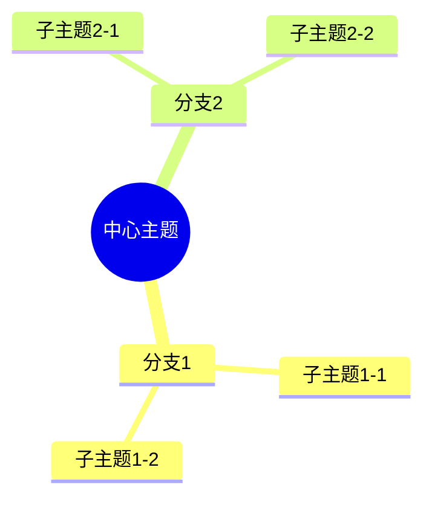

# 🌳 思维导图分析

> **目录**: 03_思维导图  
> **用途**: 以层次化方式展示OTLP项目的结构和学习路径  
> **文档数**: 5篇 (2篇已完成)

---

## 🎯 本目录概述

思维导图通过树状图和层次化结构，直观展示项目的组织架构、学习路径和战略规划，帮助快速理解项目全貌。

### 核心价值

- 🌳 **层次清晰**: 从整体到细节的层次展示
- 📖 **学习指导**: 提供系统化的学习路径
- 🎯 **快速理解**: 5-10分钟掌握项目结构
- 🗺️ **路径规划**: 学习和发展路径可视化

---

## 📁 文档列表

| # | 文档名称 | 状态 | 规模 | 重点内容 |
|---|---------|------|------|----------|
| 1 | [项目级思维导图.md](./项目级思维导图.md) | ✅ 完成 | ~1,000行 | 15个思维导图 |
| 2 | [docs文件夹思维导图.md](./docs文件夹思维导图.md) | ✅ 完成 | ~730行 | docs专项导图 |
| 3 | [学习路径导图.md](./学习路径导图.md) | 🔄 计划中 | ~500行 | 学习路径规划 |
| 4 | [战略规划导图.md](./战略规划导图.md) | 🔄 计划中 | ~600行 | 战略发展规划 |
| 5 | 本README | ✅ 完成 | ~200行 | 目录导航 |

**完成度**: 40% (2/5)

---

## 🎨 导图类型

### 1. 项目级思维导图

**文档**: [项目级思维导图.md](./项目级思维导图.md)

**包含导图**:

1. ✅ OTLP项目整体结构
2. ✅ 四大核心概念
3. ✅ 四大信号维度
4. ✅ 理论框架体系
5. ✅ 技术实现架构
6. ✅ 学术研究体系
7. ✅ 质量保证体系
8. ✅ 社区生态
9. ✅ 项目治理
10. ✅ 国际化战略
11. ✅ 核心技术栈
12. ✅ 文档体系
13. ✅ 开发工作流
14. ✅ 部署架构
15. ✅ 未来规划

**适合**:

- 新人快速入门
- 项目整体把握
- 培训和演示

---

### 2. docs文件夹思维导图

**文档**: [docs文件夹思维导图.md](./docs文件夹思维导图.md)

**包含导图**:

- ✅ docs整体结构
- ✅ 12个主题模块导图
- ✅ 文档学习路径
- ✅ 知识依赖关系

**适合**:

- 深入学习docs内容
- 文档维护
- 内容贡献

---

### 3. 学习路径导图

**文档**: 学习路径导图.md (计划中)

**计划内容**:

- 🔄 新手入门路径
- 🔄 技术人员路径
- 🔄 研究人员路径
- 🔄 管理者路径
- 🔄 贡献者路径
- 🔄 按时间规划 (1天/1周/1月/3月)

**学习维度**:

- 理论学习
- 技术实践
- 工具使用
- 项目贡献

**适合**:

- 学习规划
- 培训设计
- 能力评估

---

### 4. 战略规划导图

**文档**: 战略规划导图.md (计划中)

**计划内容**:

- 🔄 短期规划 (1个月)
- 🔄 中期规划 (3个月)
- 🔄 长期愿景 (1年)
- 🔄 技术路线图
- 🔄 生态建设
- 🔄 国际化战略

**规划维度**:

- 技术发展
- 学术影响
- 社区建设
- 商业化探索

**适合**:

- 战略决策
- 资源规划
- 里程碑设定

---

## 🔍 使用场景

### 场景1: 新人入门 (推荐⭐⭐⭐⭐⭐)

**推荐文档**: [项目级思维导图.md](./项目级思维导图.md)

**学习路径**:

1. 项目整体结构 (5min)
2. 四大核心概念 (10min)
3. 技术实现架构 (15min)
4. 文档体系 (10min)

**总时间**: 40分钟  
**效果**: 快速建立项目整体认知

---

### 场景2: 文档学习

**推荐文档**: [docs文件夹思维导图.md](./docs文件夹思维导图.md)

**学习路径**:

1. docs整体结构 (5min)
2. 选择感兴趣模块 (10min)
3. 按导图深入学习 (20min)

**总时间**: 35分钟  
**效果**: 系统化学习文档内容

---

### 场景3: 学习规划

**推荐文档**: 学习路径导图.md (计划中)

**规划流程**:

1. 确定角色和目标
2. 选择学习路径
3. 按时间规划学习
4. 跟踪学习进度

**时间**: 30-40分钟 (计划)  
**效果**: 制定个性化学习计划

---

### 场景4: 战略决策

**推荐文档**: 战略规划导图.md (计划中)

**决策流程**:

1. 评估当前状态
2. 识别机会和挑战
3. 制定战略路线图
4. 设定里程碑

**时间**: 40-50分钟 (计划)  
**效果**: 形成清晰的战略规划

---

## 🌳 思维导图特点

### 视觉直观

- 🎨 树状结构
- 🎯 颜色编码
- 📊 图标标识
- 🔗 关联线条

### 层次清晰

- 1级: 主题
- 2级: 模块
- 3级: 主题
- 4级: 细节

### 易于理解

- 📖 从左到右/从上到下
- 🎯 核心突出
- 🔗 关系清晰
- 💡 重点标注

---

## 📈 思维导图工具

### Mermaid语法



### 优点

- ✅ 文本格式，易维护
- ✅ 版本控制友好
- ✅ 自动渲染
- ✅ 跨平台支持

---

## 🚀 快速开始

### 学习者

```text
1. 开始: 项目级思维导图.md (20min)
   → 项目整体结构
   → 核心概念
   
2. 深入: docs文件夹思维导图.md (20min)
   → 选择模块
   → 系统学习
   
3. 规划: 学习路径导图.md (20min, 计划中)
   → 制定计划
   → 跟踪进度
```

### 技术人员

```text
1. 快速浏览: 项目整体结构 (10min)
2. 重点关注: 技术实现架构 (15min)
3. 实践: 运行示例代码
```

### 管理者

```text
1. 概览: 项目整体结构 (10min)
2. 评估: 战略规划导图 (30min, 计划中)
3. 决策: 制定行动计划
```

---

## 🔗 与其他维度的关联

### ← 知识图谱

知识图谱展示**概念关联**，思维导图展示**层次结构**。

- 互补关系
- 交叉验证
- 不同视角

### ← 多维矩阵

多维矩阵提供**评估数据**，思维导图基于数据规划**改进路径**。

- 评估 → 规划
- 数据支撑
- 路径优化

### → 综合分析

思维导图提供**结构基础**，综合分析基于结构进行**整体评估**。

- 结构 → 分析
- 层次清晰
- 全面评估

### ← 数据统计

数据统计提供**规模信息**，思维导图基于规模展示**层次结构**。

- 数量展示
- 规模可视化
- 重点突出

---

## 📈 更新计划

### 近期 (1个月)

- [ ] 完成学习路径导图
- [ ] 完成战略规划导图
- [ ] 优化现有导图样式

### 中期 (3个月)

- [ ] 增加交互式导图
- [ ] 添加更多案例导图
- [ ] 多种导图风格

### 长期 (6个月)

- [ ] 自动生成导图
- [ ] 导图编辑工具
- [ ] 多语言版本

---

## 💡 使用建议

### ✅ 推荐做法

- 从整体到细节逐层深入
- 结合实际需求选择路径
- 交叉参考多个导图
- 打印或截图辅助学习

### ❌ 避免做法

- 不要跳跃式阅读
- 不要忽略层次关系
- 不要孤立理解某个节点
- 不要忘记更新导图

---

## 🎓 学习建议

### 初学者

**推荐顺序**:

1. 项目级思维导图 (整体)
2. docs文件夹思维导图 (细节)
3. 学习路径导图 (规划)

**时间**: 1-2小时  
**目标**: 建立完整认知

---

### 进阶者

**推荐顺序**:

1. 技术实现架构 (技术)
2. 战略规划导图 (战略)
3. 深入技术文档 (实践)

**时间**: 2-3小时  
**目标**: 深入技术理解

---

### 专家

**推荐顺序**:

1. 快速回顾整体 (回顾)
2. 关注新增内容 (更新)
3. 制定改进计划 (贡献)

**时间**: 30分钟  
**目标**: 持续改进

---

## 🔗 相关资源

### 本目录文档

- [项目级思维导图.md](./项目级思维导图.md) ⭐ 推荐
- [docs文件夹思维导图.md](./docs文件夹思维导图.md)

### 其他维度

- [../01_知识图谱/](../01_知识图谱/) - 概念关联
- [../02_多维矩阵/](../02_多维矩阵/) - 量化评估
- [../04_综合分析/](../04_综合分析/) - 整体评估
- [../05_数据统计/](../05_数据统计/) - 数据支撑

### 返回导航

- [../README.md](../README.md) - 返回总导航
- [../🎨_快速入口.md](../🎨_快速入口.md) - 快速访问
- [../📊_完整索引.md](../📊_完整索引.md) - 完整索引

---

**目录版本**: v1.0.0  
**更新时间**: 2025年10月20日  
**维护团队**: OTLP项目团队
