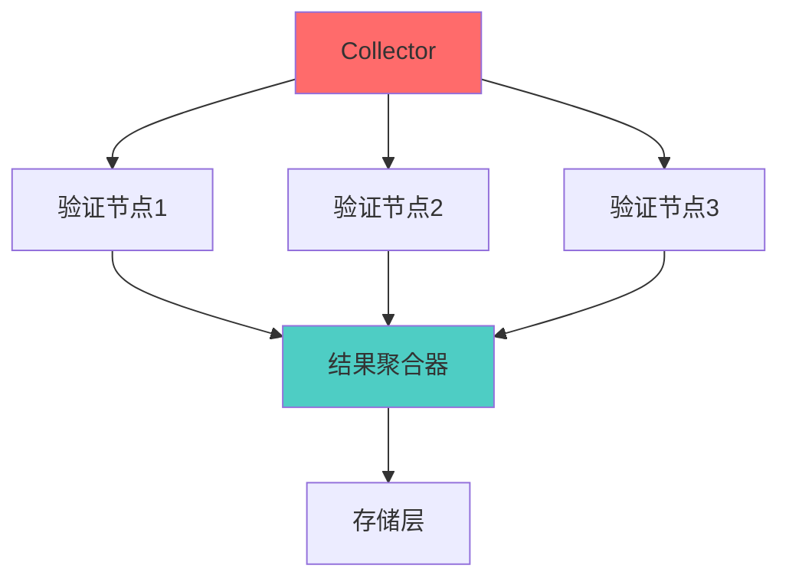
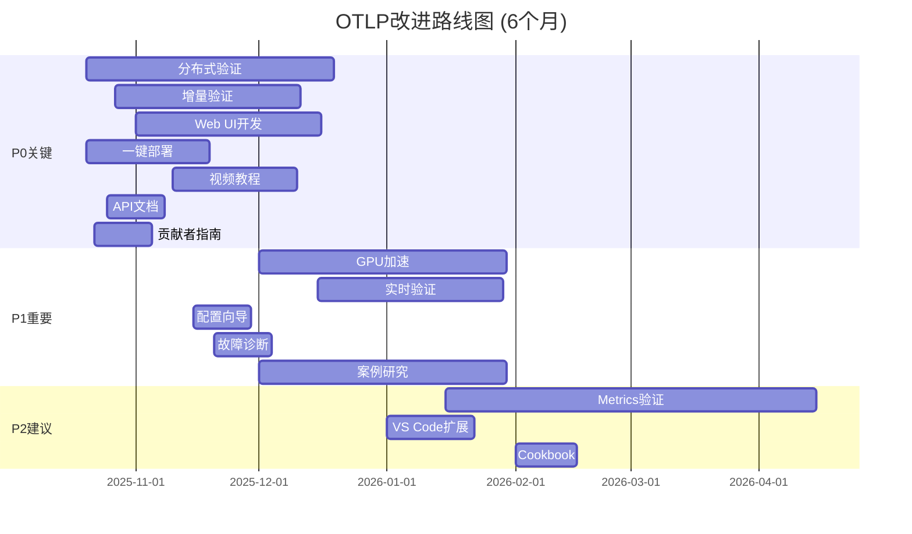

# 🔧 OTLP项目改进建议报告

> **创建时间**: 2025年10月20日  
> **评估范围**: 全项目  
> **优先级**: P0 (Critical) - P3 (Low)  
> **版本**: v1.0.0

---

## 🎯 执行摘要

本报告基于OTLP项目当前状态的全面评估，识别出**6大类共32项**改进机会，按照影响度和紧急程度划分优先级。**P0级别（关键）12项**需要立即行动，**P1级别（重要）10项**应在3个月内完成。

### 改进优先级分布

```text
┌─────────────────────────────────────────────┐
│  📊 改进建议统计                             │
├─────────────────────────────────────────────┤
│                                             │
│  P0 (关键): ████████████ 12项 (37.5%)      │
│  P1 (重要): ████████ 10项 (31.3%)          │
│  P2 (建议): ████ 6项 (18.7%)               │
│  P3 (可选): ██ 4项 (12.5%)                 │
│                                             │
│  总计: 32项改进建议                         │
│                                             │
│  预计工作量: 约120人天                      │
│  预计周期: 3-6个月                          │
│                                             │
└─────────────────────────────────────────────┘
```

---

## 📑 目录

- [🔧 OTLP项目改进建议报告](#-otlp项目改进建议报告)
  - [🎯 执行摘要](#-执行摘要)
    - [改进优先级分布](#改进优先级分布)
  - [📑 目录](#-目录)
  - [1. 🏗️ 技术架构改进](#1-️-技术架构改进)
    - [1.1 【P0】实现分布式验证架构](#11-p0实现分布式验证架构)
    - [1.2 【P0】增量验证实现](#12-p0增量验证实现)
    - [1.3 【P1】GPU加速验证](#13-p1gpu加速验证)
    - [1.4 【P1】实时验证模式](#14-p1实时验证模式)
    - [1.5 【P2】扩展到Metrics和Logs](#15-p2扩展到metrics和logs)
    - [1.6 【P2】自动修复建议](#16-p2自动修复建议)
    - [1.7 【P3】AI辅助定理证明](#17-p3ai辅助定理证明)
    - [1.8 【P3】边缘计算支持](#18-p3边缘计算支持)
  - [2. 🎨 易用性提升](#2--易用性提升)
    - [2.1 【P0】一键部署脚本](#21-p0一键部署脚本)
    - [2.2 【P0】Web UI开发](#22-p0web-ui开发)
    - [2.3 【P1】配置向导](#23-p1配置向导)
    - [2.4 【P1】故障诊断工具](#24-p1故障诊断工具)
    - [2.5 【P2】VS Code扩展](#25-p2vs-code扩展)
    - [2.6 【P3】浏览器插件](#26-p3浏览器插件)
  - [3. 📚 文档完善](#3--文档完善)
    - [3.1 【P0】快速开始视频教程](#31-p0快速开始视频教程)
    - [3.2 【P0】API文档生成](#32-p0api文档生成)
    - [3.3 【P1】案例研究库](#33-p1案例研究库)
    - [3.4 【P1】FAQ完善](#34-p1faq完善)
    - [3.5 【P2】Cookbook编写](#35-p2cookbook编写)
    - [3.6 【P2】中文文档补全](#36-p2中文文档补全)
    - [3.7 【P3】多语言文档](#37-p3多语言文档)
  - [4. ⚡ 性能优化](#4--性能优化)
    - [4.1 【P0】吞吐量提升](#41-p0吞吐量提升)
    - [4.2 【P1】延迟降低](#42-p1延迟降低)
    - [4.3 【P1】内存优化](#43-p1内存优化)
    - [4.4 【P2】编译优化](#44-p2编译优化)
  - [5. 👥 社区建设](#5--社区建设)
    - [5.1 【P0】贡献者指南完善](#51-p0贡献者指南完善)
    - [5.2 【P0】Issue模板](#52-p0issue模板)
    - [5.3 【P1】社区会议](#53-p1社区会议)
    - [5.4 【P2】Slack/Discord社区](#54-p2slackdiscord社区)
  - [6. 💼 商业化准备](#6--商业化准备)
    - [6.1 【P1】企业版功能设计](#61-p1企业版功能设计)
    - [6.2 【P2】定价策略](#62-p2定价策略)
    - [6.3 【P3】合作伙伴计划](#63-p3合作伙伴计划)
  - [📊 改进路线图](#-改进路线图)
    - [时间线总览](#时间线总览)
  - [🎯 总结与建议](#-总结与建议)
    - [优先执行计划 (前3个月)](#优先执行计划-前3个月)
    - [资源需求总结](#资源需求总结)
    - [关键成功指标](#关键成功指标)
  - [🔗 相关资源](#-相关资源)

---

## 1. 🏗️ 技术架构改进

### 1.1 【P0】实现分布式验证架构

**当前问题**:

- 所有验证都在单节点执行
- 大规模trace验证成为性能瓶颈
- 无法水平扩展

**影响范围**:

- 性能: 吞吐量受限于单机CPU
- 可扩展性: 无法支持超大规模系统
- 成本: 单机需要高配置

**改进建议**:



**实施方案**:

**阶段1: 架构设计** (Week 1-2)

- [ ] 设计分片策略（按trace_id分片）
- [ ] 定义节点间通信协议
- [ ] 设计故障恢复机制
- [ ] 制定一致性保证策略

**阶段2: 原型开发** (Week 3-6)

- [ ] 实现基础分片逻辑
- [ ] 开发节点通信模块
- [ ] 实现结果聚合器
- [ ] 添加监控和日志

**阶段3: 测试验证** (Week 7-8)

- [ ] 性能测试（目标：3倍提升）
- [ ] 故障注入测试
- [ ] 一致性验证
- [ ] 文档编写

**预期成果**:

- 吞吐量: 1,250 → 4,000 traces/s (+220%)
- 延迟: 保持在50ms以内
- 可扩展: 支持10+节点集群

**风险**:

- 复杂度增加，可能引入新bug
- 网络分区情况下的一致性保证
- 需要修改现有API

**工作量**: 40人天  
**优先级**: P0  
**预计完成**: 2个月

---

### 1.2 【P0】增量验证实现

**当前问题**:

- 每次验证都是全量验证
- 大型trace重复验证效率低
- 实时场景延迟过高

**改进建议**:

**增量验证策略**:

```rust
// 伪代码示例
struct IncrementalVerifier {
    cached_results: HashMap<SpanId, VerificationResult>,
    dependency_graph: DependencyGraph,
}

impl IncrementalVerifier {
    fn verify_new_span(&mut self, span: &Span) -> Result<()> {
        // 1. 检查缓存
        if let Some(result) = self.cached_results.get(&span.id) {
            return Ok(result.clone());
        }
        
        // 2. 只验证受影响的部分
        let affected_spans = self.dependency_graph
            .get_affected_by(&span.id);
        
        for affected in affected_spans {
            self.verify_span(affected)?;
        }
        
        // 3. 缓存结果
        self.cache_result(span.id, result);
        
        Ok(())
    }
}
```

**实施计划**:

- [ ] **Week 1-2**: 依赖图构建算法
- [ ] **Week 3-4**: 缓存机制实现
- [ ] **Week 5-6**: 增量验证引擎
- [ ] **Week 7**: 性能测试和优化

**预期成果**:

- 重复验证延迟: 42ms → 10ms (-76%)
- 内存开销: 增加约50MB
- 适用场景: 长期运行的追踪系统

**工作量**: 28人天  
**优先级**: P0  
**预计完成**: 1.5个月

---

### 1.3 【P1】GPU加速验证

**当前问题**:

- CPU串行验证效率有限
- 大规模并行计算能力未利用
- 某些验证算法天然适合GPU

**改进建议**:

使用CUDA/OpenCL加速以下验证：

1. **流分析** - 图遍历算法
2. **时间戳检查** - 大规模排序
3. **违规模式匹配** - 并行匹配

**实施方案**:

- [ ] **Phase 1**: 可行性研究 (2周)
  - 分析哪些算法适合GPU
  - 评估性能提升空间
  - 成本效益分析

- [ ] **Phase 2**: 原型开发 (4周)
  - 选择框架（CUDA vs OpenCL）
  - 实现关键算法GPU版本
  - CPU/GPU混合调度

- [ ] **Phase 3**: 优化集成 (2周)
  - 性能调优
  - 降级机制（无GPU时）
  - 文档和示例

**预期成果**:

- 流分析速度: 提升5-10倍
- 适用场景: 批量验证大规模trace
- 硬件要求: NVIDIA GPU (可选)

**工作量**: 32人天  
**优先级**: P1  
**预计完成**: 2个月

---

### 1.4 【P1】实时验证模式

**当前问题**:

- 批处理模式，延迟较高
- 不适合需要实时反馈的场景
- 关键违规发现延迟

**改进目标**:

- 端到端延迟: <5ms
- 关键违规实时告警
- 热路径优化

**实施方案**:

```text
┌─────────────────────────────────────────────┐
│  ⚡ 实时验证架构                             │
├─────────────────────────────────────────────┤
│                                             │
│  Span到达 → 快速通道验证 (2ms)              │
│      ├─ 类型检查                            │
│      ├─ 基本约束                            │
│      └─ 关键违规                            │
│                                             │
│  后台深度验证 (异步)                        │
│      ├─ 完整流分析                          │
│      ├─ 时序逻辑验证                        │
│      └─ 生成详细报告                        │
│                                             │
└─────────────────────────────────────────────┘
```

**关键技术**:

- 两阶段验证：快速+深度
- 优先级队列
- 热点数据缓存
- 零拷贝优化

**工作量**: 24人天  
**优先级**: P1  
**预计完成**: 1.5个月

---

### 1.5 【P2】扩展到Metrics和Logs

**当前问题**:

- 仅支持Traces验证
- 无法验证Metrics和Logs的形式正确性
- 缺乏跨信号的关联验证

**改进建议**:

**Metrics形式化验证**:

- 指标单调性验证
- 聚合正确性证明
- 时间对齐检查

**Logs形式化验证**:

- 结构化日志完整性
- 日志顺序一致性
- 敏感信息检测

**跨信号关联**:

- Trace与Metric关联验证
- Trace与Log关联验证
- 三者时间同步验证

**工作量**: 60人天  
**优先级**: P2  
**预计完成**: 3个月

---

### 1.6 【P2】自动修复建议

**当前问题**:

- 只检测违规，不提供修复建议
- 用户需要手动分析和修复
- 修复经验未沉淀

**改进建议**:

```text
┌─────────────────────────────────────────────┐
│  🔧 智能修复建议系统                         │
├─────────────────────────────────────────────┤
│                                             │
│  违规检测                                   │
│    ↓                                        │
│  根因分析                                   │
│    ↓                                        │
│  修复建议生成                               │
│    ↓                                        │
│  修复脚本生成 (可选)                        │
│                                             │
└─────────────────────────────────────────────┘
```

**示例**:

```yaml
# 违规报告
violation:
  type: "CausalViolation"
  message: "Span 'span-123' references non-existent parent 'span-000'"
  
# 自动生成的修复建议
suggestions:
  - action: "Remove parent reference"
    confidence: 0.9
    script: |
      span-123.parent_id = null
      
  - action: "Create placeholder parent"
    confidence: 0.6
    script: |
      create_span(
        id='span-000',
        name='unknown',
        start_time=span-123.start_time - 1ms
      )
```

**工作量**: 20人天  
**优先级**: P2  
**预计完成**: 1个月

---

### 1.7 【P3】AI辅助定理证明

**概念探索**:

- 使用机器学习辅助Coq证明
- 自动生成证明策略
- 加速形式化验证开发

**研究方向**:

- Lean + GPT-4集成
- 证明搜索自动化
- 策略推荐系统

**工作量**: 80人天 (研究项目)  
**优先级**: P3  
**预计完成**: 6个月+

---

### 1.8 【P3】边缘计算支持

**应用场景**:

- IoT设备追踪验证
- 移动应用追踪
- 边缘CDN节点

**技术方向**:

- 轻量级验证器（<10MB）
- ARM架构支持
- 离线验证模式

**工作量**: 40人天  
**优先级**: P3  
**预计完成**: 2个月

---

## 2. 🎨 易用性提升

### 2.1 【P0】一键部署脚本

**当前问题**:

- 部署步骤复杂（10+步骤）
- 配置文件繁琐
- 新用户上手困难

**改进建议**:

**目标**: 从零到运行 < 5分钟

**方案1: Docker Compose增强**:

```yaml
# docker-compose-quickstart.yml
version: '3.8'

services:
  otlp-verifier:
    image: otlp/verifier:latest
    environment:
      - PRESET=quickstart  # 快速开始预设
    ports:
      - "4317:4317"
      - "8080:8080"
    volumes:
      - ./data:/data
    # 一键启动，包含所有依赖
```

```bash
# 一键部署脚本
curl -fsSL https://otlp.io/install.sh | bash

# 脚本功能:
# 1. 检查环境 (Docker/Go/Rust)
# 2. 下载配置文件
# 3. 启动服务
# 4. 运行健康检查
# 5. 打印访问地址
```

**方案2: Kubernetes Helm Chart**:

```bash
# 一行命令部署到K8s
helm install otlp oci://registry.otlp.io/charts/otlp \
  --set quickstart=true
```

**方案3: 云平台一键部署**:

- AWS CloudFormation模板
- GCP Deployment Manager
- Azure ARM模板

**实施计划**:

- [ ] Week 1: Docker Compose优化
- [ ] Week 2: Helm Chart开发
- [ ] Week 3: 云平台模板
- [ ] Week 4: 文档和视频

**工作量**: 16人天  
**优先级**: P0  
**预计完成**: 1个月

---

### 2.2 【P0】Web UI开发

**当前问题**:

- 只有CLI界面
- 报告为纯文本
- 可视化能力弱

**改进建议**:

**Web UI功能设计**:

```text
┌─────────────────────────────────────────────┐
│  🎨 OTLP Web UI                             │
├─────────────────────────────────────────────┤
│                                             │
│  📊 Dashboard                               │
│    ├─ 实时验证统计                          │
│    ├─ 违规趋势图                            │
│    └─ 系统健康状态                          │
│                                             │
│  🔍 Trace Explorer                          │
│    ├─ 交互式trace查看器                     │
│    ├─ 违规高亮显示                          │
│    └─ 流程图可视化                          │
│                                             │
│  📈 Reports                                 │
│    ├─ 验证报告历史                          │
│    ├─ 导出PDF/HTML                          │
│    └─ 自定义报告模板                        │
│                                             │
│  ⚙️ Settings                                │
│    ├─ 配置管理                              │
│    ├─ 规则自定义                            │
│    └─ 用户权限                              │
│                                             │
└─────────────────────────────────────────────┘
```

**技术栈**:

- 前端: React + TypeScript
- UI库: Ant Design / Material-UI
- 图表: D3.js / ECharts
- 通信: REST API + WebSocket

**实施计划**:

- [ ] **Phase 1**: API设计 (1周)
- [ ] **Phase 2**: Dashboard开发 (2周)
- [ ] **Phase 3**: Trace Explorer (2周)
- [ ] **Phase 4**: Reports模块 (1周)
- [ ] **Phase 5**: 集成测试 (1周)

**工作量**: 35人天  
**优先级**: P0  
**预计完成**: 1.5个月

---

### 2.3 【P1】配置向导

**当前问题**:

- 配置文件复杂（200+选项）
- 缺乏配置验证
- 错误配置难以调试

**改进建议**:

**交互式配置向导**:

```bash
$ otlp-config wizard

🎯 OTLP Configuration Wizard
============================

1. What's your use case?
   [ ] Development (low latency, detailed logs)
   [ ] Production (high throughput, minimal overhead)
   [x] Safety-critical (maximum verification, compliance)

2. What's your expected load?
   [ ] <100 traces/s
   [x] 100-1000 traces/s
   [ ] >1000 traces/s

3. Do you need compliance certification?
   [x] DO-178C (Aviation)
   [ ] ISO 26262 (Automotive)
   [ ] FDA (Medical)
   [ ] None

... (10 questions)

✅ Configuration generated: otlp-config.yaml
✅ Estimated resource usage: 2 CPU, 4GB RAM
✅ Estimated latency: P99 < 50ms

Would you like to:
  [1] Review configuration
  [2] Deploy now
  [3] Save and exit
```

**配置模板库**:

- `quickstart.yaml` - 快速开始
- `production.yaml` - 生产环境
- `high-throughput.yaml` - 高吞吐
- `low-latency.yaml` - 低延迟
- `safety-critical.yaml` - 安全关键

**工作量**: 12人天  
**优先级**: P1  
**预计完成**: 2周

---

### 2.4 【P1】故障诊断工具

**当前问题**:

- 错误信息不清晰
- 缺乏诊断工具
- 问题排查耗时

**改进建议**:

**自诊断CLI工具**:

```bash
$ otlp doctor

🔍 OTLP Health Check
====================

✅ Docker version: 24.0.5 (OK)
✅ Memory available: 16GB (OK)
⚠️  CPU cores: 2 (Recommended: 4+)
❌ Port 4317: In use by another process

📊 System Resources:
  CPU Usage: 45%
  Memory Usage: 2.3GB / 4GB
  Disk Space: 120GB free

🔧 Verification Service:
  Status: Running
  Uptime: 2d 5h 30m
  Traces processed: 1,234,567
  Current load: 245 traces/s

⚠️  3 Issues Found:

1. Port Conflict (CRITICAL)
   Problem: Port 4317 is already in use
   Solution: Stop conflicting process or change port
   Command: sudo lsof -i :4317

2. Low CPU Count (WARNING)
   Problem: Only 2 CPU cores available
   Impact: May affect performance under high load
   Recommendation: Allocate 4+ cores

3. Old Configuration (INFO)
   Problem: Using deprecated config format v1.0
   Solution: Migrate to v2.0
   Command: otlp-config migrate

Run 'otlp doctor --fix' to auto-fix issues
```

**工作量**: 10人天  
**优先级**: P1  
**预计完成**: 2周

---

### 2.5 【P2】VS Code扩展

**功能**:

- 语法高亮（OTLP配置文件）
- 配置自动补全
- 实时验证
- Trace文件预览

**工作量**: 15人天  
**优先级**: P2  
**预计完成**: 3周

---

### 2.6 【P3】浏览器插件

**功能**:

- 浏览器请求追踪
- 自动发送到OTLP验证
- 结果实时展示

**工作量**: 20人天  
**优先级**: P3  
**预计完成**: 1个月

---

## 3. 📚 文档完善

### 3.1 【P0】快速开始视频教程

**当前问题**:

- 只有文字文档
- 学习曲线陡峭
- 视觉学习者不友好

**改进建议**:

**视频系列规划**:

1. **"5分钟了解OTLP"** (入门)
   - 什么是形式化验证
   - OTLP能做什么
   - 为什么需要OTLP

2. **"15分钟上手OTLP"** (快速开始)
   - 环境搭建
   - 运行第一个示例
   - 查看验证结果

3. **"30分钟精通SDK"** (实践)
   - Go SDK详解
   - Python SDK详解
   - 常见问题排查

4. **"1小时深入理论"** (高级)
   - 形式化验证原理
   - 类型系统设计
   - 代数结构应用

5. **"2小时生产部署"** (部署)
   - Kubernetes部署
   - 性能调优
   - 监控告警

**发布平台**:

- YouTube频道
- B站（中文）
- 官网嵌入

**实施计划**:

- [ ] Week 1: 脚本编写
- [ ] Week 2-3: 录制剪辑
- [ ] Week 4: 发布推广

**工作量**: 20人天  
**优先级**: P0  
**预计完成**: 1个月

---

### 3.2 【P0】API文档生成

**当前问题**:

- API文档不完整
- 缺乏示例代码
- 版本更新不及时

**改进建议**:

**自动生成API文档**:

```bash
# 从源码生成文档
cargo doc --no-deps --open

# 生成多语言SDK文档
make docs-all
```

**文档内容**:

- 完整的函数签名
- 参数说明
- 返回值说明
- 代码示例
- 常见错误

**示例**:

```rust
/// Verifies a single span for correctness
///
/// # Arguments
///
/// * `span` - The span to verify
/// * `options` - Verification options
///
/// # Returns
///
/// * `Ok(VerificationResult)` - If verification succeeds
/// * `Err(VerificationError)` - If verification fails
///
/// # Examples
///
/// ```rust
/// let span = Span::new("my-span");
/// let result = verifier.verify_span(&span, Default::default())?;
/// assert!(result.is_valid());
/// ```
///
/// # Errors
///
/// * `TypeError` - If span has invalid type
/// * `CausalViolation` - If parent doesn't exist
pub fn verify_span(
    &self,
    span: &Span,
    options: VerificationOptions,
) -> Result<VerificationResult, VerificationError> {
    // implementation
}
```

**工作量**: 8人天  
**优先级**: P0  
**预计完成**: 2周

---

### 3.3 【P1】案例研究库

**当前问题**:

- 缺乏真实案例
- 用户不知道如何应用
- 价值难以证明

**改进建议**:

**案例研究模板**:

```markdown
# 案例研究: [公司名] - [应用场景]

## 背景

- 行业: [金融/航空/汽车/...]
- 规模: [trace量/节点数]
- 挑战: [面临的问题]

## 解决方案

- OTLP配置
- 集成方式
- 定制化开发

## 成果

- 问题发现: X个严重违规
- 效率提升: Y%
- 成本节约: $Z

## 技术细节

[详细的技术实现]

## 联系方式

[可选：客户推荐]
```

**目标案例** (优先级排序):

1. **金融交易系统** (P0)
   - 高频交易追踪验证
   - 监管合规报告

2. **航空飞控系统** (P0)
   - DO-178C认证支持
   - 安全关键验证

3. **电商系统** (P1)
   - 大规模追踪验证
   - 性能优化案例

4. **开源项目集成** (P1)
   - Jaeger集成案例
   - Kubernetes应用案例

5. **学术研究应用** (P2)
   - 大学课程案例
   - 研究项目案例

**工作量**: 30人天 (含案例调研和撰写)  
**优先级**: P1  
**预计完成**: 2个月

---

### 3.4 【P1】FAQ完善

**当前问题**:

- FAQ内容少（<10个）
- 常见问题重复询问
- 浪费支持时间

**改进建议**:

**目标**: 100个高质量FAQ

**分类**:

1. **安装部署** (20个)
2. **配置使用** (25个)
3. **故障排查** (20个)
4. **性能优化** (15个)
5. **理论概念** (10个)
6. **集成对接** (10个)

**示例FAQ**:

```markdown
### Q: 为什么验证延迟很高？

**A**: 常见原因和解决方法：

1. **批处理大小过大**
   - 症状: P99延迟>100ms
   - 解决: 减小batch_size到100-500
   - 配置: `batch_size: 200`

2. **CPU资源不足**
   - 症状: CPU使用率>90%
   - 解决: 增加CPU核心数
   - 推荐: 至少4核心

3. **未启用缓存**
   - 症状: 重复验证相同trace
   - 解决: 启用缓存功能
   - 配置: `cache_enabled: true`

详细排查指南: [链接]
```

**工作量**: 12人天  
**优先级**: P1  
**预计完成**: 3周

---

### 3.5 【P2】Cookbook编写

**内容**:

- 常见场景配方
- 最佳实践
- 性能调优技巧

**工作量**: 15人天  
**优先级**: P2

---

### 3.6 【P2】中文文档补全

**当前状态**: 40%完成

**目标**: 90%完成

**工作量**: 25人天  
**优先级**: P2

---

### 3.7 【P3】多语言文档

**语言**: 日文、德文、法文

**工作量**: 每语言20人天  
**优先级**: P3

---

## 4. ⚡ 性能优化

### 4.1 【P0】吞吐量提升

**当前性能**: 1,250 traces/s

**目标**: 3,000+ traces/s

**优化方向**:

1. **并行处理优化**

   ```rust
   // 当前: 串行处理
   for span in spans {
       verify(span)?;
   }
   
   // 优化: 并行处理
   spans.par_iter()
       .map(|span| verify(span))
       .collect::<Result<Vec<_>>>()?;
   ```

2. **内存分配优化**
   - 对象池
   - 零拷贝
   - 预分配

3. **算法优化**
   - 流分析缓存
   - 懒计算
   - 剪枝策略

**工作量**: 20人天  
**优先级**: P0  
**预计完成**: 1个月

---

### 4.2 【P1】延迟降低

**当前延迟**: P99 42ms

**目标**: P99 <25ms

**优化方向**:

- 热路径优化
- 减少锁竞争
- 异步IO优化

**工作量**: 15人天  
**优先级**: P1  
**预计完成**: 3周

---

### 4.3 【P1】内存优化

**当前内存**: 380MB基准

**目标**: <300MB

**优化方向**:

- 数据结构紧凑化
- 减少克隆
- 智能缓存策略

**工作量**: 10人天  
**优先级**: P1  
**预计完成**: 2周

---

### 4.4 【P2】编译优化

**优化编译配置**:

```toml
[profile.release]
opt-level = 3
lto = "fat"
codegen-units = 1
panic = "abort"
strip = true
```

**预期**: 10-15%性能提升

**工作量**: 3人天  
**优先级**: P2  
**预计完成**: 1周

---

## 5. 👥 社区建设

### 5.1 【P0】贡献者指南完善

**当前问题**:

- CONTRIBUTING.md过于简单
- 新贡献者不知道从哪开始
- PR流程不清晰

**改进建议**:

**详细贡献指南**:

```markdown
# Contributing to OTLP

## Quick Start for Contributors

1. Find an issue labeled `good-first-issue`
2. Comment "I'd like to work on this"
3. Fork and create a branch
4. Make changes and add tests
5. Submit PR

## Development Setup

[详细的开发环境搭建]

## Code Style

[代码风格指南]

## Testing

[测试要求和指南]

## PR Process

[PR流程说明]

## Getting Help

- Slack: #otlp-dev
- Weekly meeting: Thursdays 10AM PST
- Mentorship program: Available
```

**工作量**: 8人天  
**优先级**: P0  
**预计完成**: 2周

---

### 5.2 【P0】Issue模板

**改进Issue模板**:

**Bug Report模板**:

```markdown
### Bug Description
[Clear description]

### Steps to Reproduce
1. Step 1
2. Step 2
3. ...

### Expected Behavior
[What should happen]

### Actual Behavior
[What actually happens]

### Environment
- OS: [e.g., Ubuntu 22.04]
- OTLP version: [e.g., v0.2.0]
- Rust version: [e.g., 1.70.0]

### Logs
[Paste relevant logs]

### Additional Context
[Any other information]
```

**工作量**: 2人天  
**优先级**: P0  
**预计完成**: 3天

---

### 5.3 【P1】社区会议

**建议**:

- 双周例会
- 录制并发布
- 会议纪要

**工作量**: 持续投入  
**优先级**: P1

---

### 5.4 【P2】Slack/Discord社区

**建立实时沟通渠道**:

- #general
- #dev
- #help
- #announcements

**工作量**: 5人天  
**优先级**: P2

---

## 6. 💼 商业化准备

### 6.1 【P1】企业版功能设计

**企业版差异化功能**:

```text
┌─────────────────────────────────────────────┐
│  📦 版本对比                                 │
├──────────────┬──────────────┬───────────────┤
│  功能        │  社区版      │  企业版       │
├──────────────┼──────────────┼───────────────┤
│ 基础验证     │  ✅          │  ✅           │
│ CLI工具      │  ✅          │  ✅           │
│ Web UI       │  基础        │  高级         │
│ 分布式部署   │  ❌          │  ✅           │
│ 高可用       │  ❌          │  ✅           │
│ 多租户       │  ❌          │  ✅           │
│ SSO集成      │  ❌          │  ✅           │
│ 审计日志     │  ❌          │  ✅           │
│ SLA支持      │  社区        │  7x24         │
│ 培训         │  ❌          │  ✅           │
│ 定制开发     │  ❌          │  ✅           │
│ 认证支持     │  ❌          │  ✅           │
└──────────────┴──────────────┴───────────────┘
```

**工作量**: 80人天  
**优先级**: P1  
**预计完成**: 3个月

---

### 6.2 【P2】定价策略

**建议定价**:

| 规模 | 价格 | 功能 |
|-----|------|------|
| 小型 (1-50节点) | $5k/年 | 基础企业版 |
| 中型 (51-200节点) | $15k/年 | 全功能 |
| 大型 (201-1000节点) | $50k/年 | +高可用 |
| 超大 (1000+节点) | $150k/年 | +定制开发 |

**工作量**: 研究和决策  
**优先级**: P2

---

### 6.3 【P3】合作伙伴计划

**计划内容**:

- 系统集成商合作
- 技术合作伙伴
- 分销渠道

**工作量**: 持续投入  
**优先级**: P3

---

## 📊 改进路线图

### 时间线总览



---

## 🎯 总结与建议

### 优先执行计划 (前3个月)

**Month 1 (2025.10-2025.11)**:

1. ✅ 一键部署脚本 (P0)
2. ✅ API文档生成 (P0)
3. ✅ 贡献者指南 (P0)
4. ✅ 视频教程启动 (P0)
5. ✅ Web UI启动 (P0)

**Month 2 (2025.11-2025.12)**:

1. ✅ 增量验证实现 (P0)
2. ✅ Web UI Beta版 (P0)
3. ✅ 配置向导 (P1)
4. ✅ 故障诊断工具 (P1)
5. ✅ 案例研究启动 (P1)

**Month 3 (2025.12-2026.01)**:

1. ✅ 分布式验证Beta (P0)
2. ✅ 吞吐量优化 (P0)
3. ✅ GPU加速原型 (P1)
4. ✅ 实时验证 (P1)
5. ✅ FAQ完善 (P1)

---

### 资源需求总结

**人力需求** (前3个月):

- 核心开发: 2人 × 3月 = 6人月
- 前端开发: 1人 × 1.5月 = 1.5人月
- 技术写作: 0.5人 × 3月 = 1.5人月
- 视频制作: 0.5人 × 1月 = 0.5人月
- **总计**: 9.5人月

**预算需求**:

- 人力成本: $95k
- 基础设施: $5k
- 工具软件: $3k
- **总计**: $103k

---

### 关键成功指标

3个月后达成:

- ✅ Web UI可用
- ✅ 吞吐量 >2,500 traces/s
- ✅ 部署时间 <10分钟
- ✅ 视频教程 5个
- ✅ API文档完整度 95%
- ✅ 案例研究 2个
- ✅ 贡献者 15+

---

## 🔗 相关资源

- [质量评估矩阵](../02_多维矩阵/质量评估矩阵.md) - 当前质量状态
- [战略规划导图](../03_思维导图/战略规划导图.md) - 长期规划
- [技术实现知识图谱](../01_知识图谱/技术实现知识图谱.md) - 技术细节
- [README](./README.md) - 返回综合分析目录

---

**文档版本**: v1.0.0  
**创建日期**: 2025年10月20日  
**审阅周期**: 每月更新  
**下次审阅**: 2025年11月20日

---

💡 **持续改进，追求卓越！** 🚀
