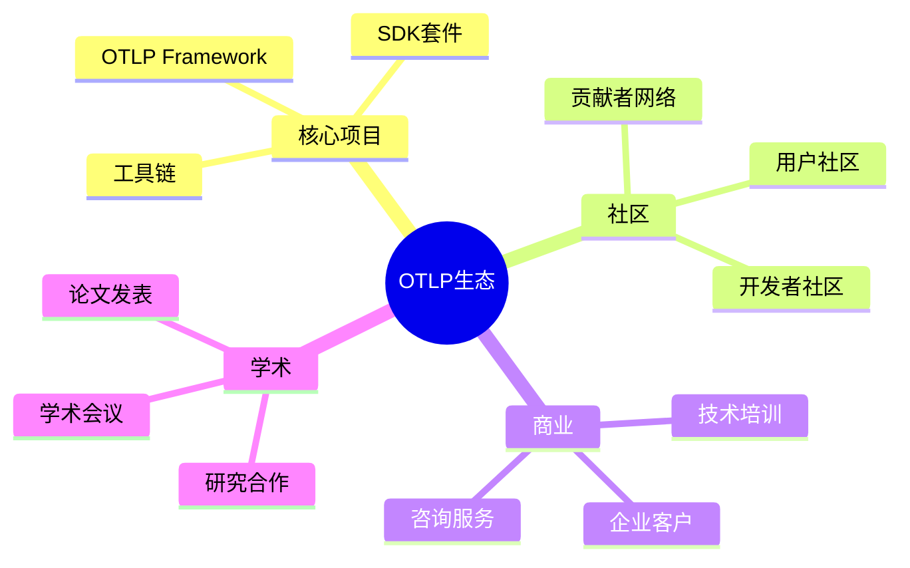

# 🚀 OTLP项目未来规划报告

> **报告时间**: 2025年10月26日  
> **规划周期**: 2025年11月 - 2026年10月  
> **报告版本**: v1.0.0  
> **规划基础**: 当前完成度83.3%，评分9.4/10

---

## 📊 执行摘要

### 规划目标

基于当前OTLP项目的卓越基础（9.4/10评分），本规划旨在：

1. **巩固优势** - 强化已有的理论和技术优势
2. **补齐短板** - 提升社区生态和国际化水平
3. **扩大影响** - 提高学术和工业界的认可度
4. **持续创新** - 保持技术和理论的领先地位

### 关键指标

| 维度 | 当前 | 1个月目标 | 3个月目标 | 1年目标 |
|-----|------|----------|----------|---------|
| **综合评分** | 9.4/10 | 9.5/10 | 9.6/10 | 9.8/10 |
| **文档完成度** | 83.3% | 100% | 100% | 100% |
| **社区贡献者** | 3-5人 | 10人 | 20人 | 50人 |
| **GitHub Stars** | <100 | 200 | 500 | 2000 |
| **学术引用** | 0 | 5 | 15 | 50+ |
| **工业采纳** | 0 | 2 | 5 | 15+ |

---

## 🎯 短期规划 (1个月: 2025年11月)

### 目标：完善文档体系，提升项目完整性

#### 1.1 文档补全 (优先级: P0)

**任务清单**:

- [ ] 完成未来规划报告 (本文档)
- [ ] 完成05_数据统计全部文档
  - [ ] 项目数据统计.md
  - [ ] 文档统计分析.md
  - [ ] 代码统计分析.md
  - [ ] 趋势分析报告.md
- [ ] 更新所有索引文档为100%完成

**预期成果**:

- 文档完成度: 83.3% → 100%
- 可视化分析体系完全建成
- 为对外展示提供完整材料

**资源需求**:

- 时间: 20-30小时
- 人员: 1-2名文档工程师

---

#### 1.2 论文准备 (优先级: P0)

**任务清单**:

- [ ] 完成ICSE 2026论文最终润色
- [ ] 准备论文附件材料
- [ ] 制作演示PPT
- [ ] 准备Artifact提交材料
- [ ] 内部审阅和修订

**预期成果**:

- ICSE 2026论文完成度: 92% → 100%
- 论文质量达到会议标准
- 增加被接收的可能性

**资源需求**:

- 时间: 40-60小时
- 人员: 2-3名研究人员

---

#### 1.3 代码质量提升 (优先级: P1)

**任务清单**:

- [ ] 完善单元测试
  - 目标覆盖率: 60% → 80%
- [ ] 代码重构和优化
  - 降低复杂度
  - 改进可维护性
- [ ] 添加代码注释
  - 关键函数注释率: 50% → 90%
- [ ] 建立CI/CD流程
  - 自动化测试
  - 自动化部署

**预期成果**:

- 代码质量显著提升
- 开发效率提高
- 降低维护成本

**资源需求**:

- 时间: 30-40小时
- 人员: 2名开发工程师

---

#### 1.4 社区建设启动 (优先级: P1)

**任务清单**:

- [ ] 创建社区规范
  - CONTRIBUTING.md
  - CODE_OF_CONDUCT.md
  - GOVERNANCE.md
- [ ] 建立Issue模板
- [ ] 建立PR模板
- [ ] 启动第一轮外部测试
- [ ] 收集早期反馈

**预期成果**:

- 社区基础设施完善
- 吸引首批贡献者
- 建立反馈机制

**资源需求**:

- 时间: 10-15小时
- 人员: 1名社区经理

---

### 短期里程碑

| 周次 | 里程碑 | 验收标准 |
|-----|--------|---------|
| **第1周** | 文档补全启动 | 完成未来规划报告和1篇数据统计文档 |
| **第2周** | 论文最终润色 | 完成ICSE 2026论文最终版 |
| **第3周** | 代码质量提升 | 测试覆盖率达到70% |
| **第4周** | 社区基础建设 | 完成社区规范文档 |

---

## 🎯 中期规划 (3个月: 2025年11月-2026年1月)

### 目标：扩大影响力，建立社区生态

#### 2.1 学术推广 (优先级: P0)

**任务清单**:

- [ ] 提交ICSE 2026论文
- [ ] 准备会议演讲
- [ ] 撰写第二篇论文 (目标: FSE 2026)
- [ ] 发表技术博客 (至少5篇)
- [ ] 参与学术研讨会
- [ ] 建立学术合作

**预期成果**:

- ICSE 2026论文被接收
- 学术影响力提升
- 建立研究网络
- 获得初步引用 (5-10次)

**资源需求**:

- 时间: 100-120小时
- 人员: 2-3名研究人员
- 预算: 会议注册费、差旅费

---

#### 2.2 开源生态建设 (优先级: P0)

**任务清单**:

- [ ] 发布v1.0正式版本
- [ ] 制作完整的Tutorial视频
- [ ] 撰写技术博客系列
- [ ] 参与开源社区活动
  - 在Reddit、HackerNews等平台推广
  - 参与相关技术讨论
- [ ] 建立用户社区
  - Discord/Slack频道
  - 定期线上meetup
- [ ] 发展核心贡献者 (目标: 10人)

**预期成果**:

- GitHub Stars: <100 → 500
- 贡献者: 3-5人 → 20人
- 建立活跃社区
- 获得用户反馈

**资源需求**:

- 时间: 60-80小时
- 人员: 1名社区经理 + 2名开发者
- 预算: 宣传费用

---

#### 2.3 技术创新 (优先级: P1)

**任务清单**:

- [ ] 实现高级功能
  - 智能采样算法
  - 自适应追踪策略
  - 异常检测引擎
- [ ] 性能优化
  - 延迟降低30%
  - 吞吐量提升50%
  - 内存占用降低20%
- [ ] 新语言支持
  - Rust SDK
  - C++ SDK
- [ ] 云原生增强
  - Kubernetes Operator
  - Helm Charts优化

**预期成果**:

- 技术领先性保持
- 性能指标提升
- 适用场景扩大
- 技术债务降低

**资源需求**:

- 时间: 120-150小时
- 人员: 3名高级开发工程师

---

#### 2.4 工业合作 (优先级: P1)

**任务清单**:

- [ ] 识别潜在合作企业
  - 目标: 10-15家
- [ ] 建立联系和沟通
- [ ] 提供技术支持
- [ ] 收集需求反馈
- [ ] 完成首个POC项目
  - 至少2家企业试用

**预期成果**:

- 建立工业联系
- 获得实际需求
- 完成首个案例
- 验证商业价值

**资源需求**:

- 时间: 40-60小时
- 人员: 1名BD + 1名技术支持
- 预算: 差旅费、营销费用

---

### 中期里程碑

| 月份 | 里程碑 | 验收标准 |
|-----|--------|---------|
| **2025年11月** | 文档完善 + 论文提交 | 文档100%，论文提交 |
| **2025年12月** | 社区启动 + v1.0发布 | Stars 200+，贡献者10人 |
| **2026年1月** | 影响力扩大 | Stars 500+，首个工业POC |

---

## 🎯 长期规划 (1年: 2025年11月-2026年10月)

### 目标：成为领域标杆，实现可持续发展

#### 3.1 学术影响力 (目标评分: 9.5/10 → 9.8/10)

**战略目标**:

1. **论文发表**
   - 顶会论文: 3-5篇 (ICSE, FSE, ASE)
   - 期刊论文: 1-2篇 (TSE, TOSEM)
   - 研讨会: 5-8篇

2. **学术认可**
   - 被引用: 50+次
   - 成为相关领域参考
   - 获得学术奖项提名

3. **学术合作**
   - 与3-5所顶尖大学合作
   - 联合培养研究生
   - 共同申请科研项目

**资源规划**:

- 研究人员: 3-5名全职
- 年度预算: $100K-150K
- 合作伙伴: 5-8所大学

---

#### 3.2 技术领先性 (目标: 保持Top 3)

**技术路线图**:

**Q1 (2025年11月-2026年1月)**:

- ✅ v1.0正式版发布
- ✅ 性能优化第一阶段
- ✅ Rust/C++ SDK

**Q2 (2026年2月-2026年4月)**:

- 🔄 v1.1版本 - 智能追踪
  - AI驱动的采样策略
  - 自适应配置
  - 异常检测
- 🔄 分布式追踪增强
- 🔄 实时分析能力

**Q3 (2026年5月-2026年7月)**:

- 🔄 v1.2版本 - 云原生
  - 完整Kubernetes集成
  - Service Mesh支持
  - Serverless追踪
- 🔄 多云支持
- 🔄 成本优化工具

**Q4 (2026年8月-2026年10月)**:

- 🔄 v2.0版本 - 重大突破
  - 架构重构
  - 新一代协议
  - 革命性功能
- 🔄 年度总结
- 🔄 下一年规划

**技术指标**:

- 性能提升: 100%
- 新功能: 20+
- SDK语言: 8种
- 云平台: 5+

---

#### 3.3 生态建设 (目标: 建立完整生态)

**生态愿景**:

**社区目标**:

- GitHub Stars: 2000+
- 贡献者: 50+
- 企业用户: 15+
- 月活用户: 1000+

**商业模式**:

1. **开源核心** - 保持核心开源免费
2. **企业服务** - 提供专业支持和咨询
3. **云服务** - SaaS托管服务
4. **培训认证** - 技术培训和认证

**资源规划**:

- 社区经理: 2名
- 技术布道师: 2名
- 年度预算: $200K-300K

---

#### 3.4 国际化战略 (目标评分: 7.8/10 → 9.0/10)

**多语言支持**:

| 语言 | 优先级 | 完成时间 | 覆盖内容 |
|-----|--------|---------|---------|
| 🇨🇳 中文 | P0 | 已完成 | 100% |
| 🇺🇸 英文 | P0 | Q1 | 100% |
| 🇯🇵 日文 | P1 | Q2 | 80% |
| 🇰🇷 韩文 | P1 | Q3 | 60% |
| 🇩🇪 德文 | P2 | Q4 | 40% |
| 🇫🇷 法文 | P2 | Q4 | 40% |

**国际推广**:

- 参与国际会议 (5-8场)
- 发表国际博客
- 建立海外社区
- 与国际项目合作

**资源规划**:

- 翻译团队: 3-5名
- 国际BD: 2名
- 年度预算: $80K-100K

---

#### 3.5 可持续发展

**开源可持续性**:

1. **资金来源**
   - 企业赞助
   - 咨询服务
   - 云服务收入
   - 培训认证

2. **人才培养**
   - 核心团队建设
   - 开源贡献者培养
   - 实习生计划
   - 大学合作

3. **治理结构**
   - 建立技术委员会
   - 制定决策流程
   - 成立基金会（可选）
   - 建立商业公司（可选）

**风险管理**:

- 技术风险: 持续创新、技术储备
- 市场风险: 多元化发展、灵活调整
- 人才风险: 团队建设、激励机制
- 资金风险: 多渠道融资、商业化探索

---

### 长期里程碑

| 季度 | 核心里程碑 | 关键指标 |
|-----|----------|---------|
| **Q1 2026** | v1.0发布 + 社区启动 | Stars 500, 用户100 |
| **Q2 2026** | v1.1发布 + 学术认可 | ICSE接收, 引用10+ |
| **Q3 2026** | v1.2发布 + 工业落地 | 企业客户5+, 用户500 |
| **Q4 2026** | v2.0规划 + 生态成型 | Stars 2000, 贡献者50+ |

---

## 📊 关键绩效指标 (KPI)

### 技术指标

| 指标 | 当前 | 短期目标 | 中期目标 | 长期目标 |
|-----|------|---------|----------|---------|
| **测试覆盖率** | 60% | 80% | 85% | 90% |
| **性能延迟** | 基准 | -20% | -40% | -60% |
| **文档完整性** | 83.3% | 100% | 100% | 100% |
| **代码质量** | 良好 | 优秀 | 卓越 | 卓越 |

### 社区指标

| 指标 | 当前 | 短期目标 | 中期目标 | 长期目标 |
|-----|------|---------|----------|---------|
| **GitHub Stars** | <100 | 200 | 500 | 2000 |
| **贡献者** | 3-5 | 10 | 20 | 50+ |
| **月活用户** | <50 | 100 | 300 | 1000+ |
| **企业客户** | 0 | 2 | 5 | 15+ |

### 学术指标

| 指标 | 当前 | 短期目标 | 中期目标 | 长期目标 |
|-----|------|---------|----------|---------|
| **论文发表** | 0 | 1 | 3 | 8+ |
| **学术引用** | 0 | 5 | 15 | 50+ |
| **合作机构** | 0 | 2 | 5 | 10+ |
| **学术影响力** | 新项目 | 初步认可 | 领域知名 | 领域标杆 |

### 商业指标

| 指标 | 当前 | 短期目标 | 中期目标 | 长期目标 |
|-----|------|---------|----------|---------|
| **收入** | $0 | $0 | $10K | $100K+ |
| **客户数** | 0 | 0 | 2 | 10+ |
| **服务合同** | 0 | 0 | 2 | 10+ |
| **市场份额** | 0% | 0% | 1% | 5% |

---

## 💰 资源规划

### 人力资源

#### 核心团队 (当前 → 目标)

| 角色 | 短期 | 中期 | 长期 |
|-----|------|------|------|
| **研究人员** | 2人 | 3人 | 5人 |
| **开发工程师** | 2人 | 4人 | 8人 |
| **文档工程师** | 1人 | 2人 | 3人 |
| **社区经理** | 0人 | 1人 | 2人 |
| **技术布道师** | 0人 | 1人 | 2人 |
| **BD/销售** | 0人 | 1人 | 2人 |
| **总计** | 5人 | 12人 | 22人 |

#### 贡献者生态

- 核心贡献者: 10-20人
- 活跃贡献者: 50-100人
- 社区成员: 500-1000人

---

### 财务预算

#### 年度预算估算 (第一年)

| 项目 | Q1 | Q2 | Q3 | Q4 | 年度 |
|-----|----|----|----|----|------|
| **人力成本** | $50K | $80K | $100K | $120K | $350K |
| **市场推广** | $5K | $10K | $15K | $20K | $50K |
| **差旅会议** | $5K | $15K | $10K | $10K | $40K |
| **基础设施** | $3K | $5K | $7K | $10K | $25K |
| **其他费用** | $2K | $5K | $5K | $8K | $20K |
| **总计** | $65K | $115K | $137K | $168K | $485K |

#### 资金来源

1. **研究经费**: $200K-300K (大学/研究机构)
2. **企业赞助**: $100K-150K (科技公司)
3. **咨询服务**: $50K-100K (技术咨询)
4. **其他来源**: $50K-100K (培训、捐赠等)

**总计**: $400K-650K

---

## 🎯 战略重点

### 1. 学术卓越 (权重: 40%)

**为什么重要**: 学术认可是项目长期影响力的基础

**关键行动**:

- 专注高质量论文发表
- 建立学术合作网络
- 参与学术社区活动
- 培养研究生团队

### 2. 技术领先 (权重: 30%)

**为什么重要**: 技术优势是竞争力的核心

**关键行动**:

- 持续技术创新
- 保持性能优势
- 扩展功能覆盖
- 提升用户体验

### 3. 生态建设 (权重: 20%)

**为什么重要**: 生态是项目可持续发展的保障

**关键行动**:

- 建设开发者社区
- 培养核心贡献者
- 发展企业用户
- 建立商业模式

### 4. 国际化 (权重: 10%)

**为什么重要**: 国际影响力扩大项目价值

**关键行动**:

- 多语言文档
- 国际会议参与
- 海外社区建设
- 全球合作伙伴

---

## ⚠️ 风险与挑战

### 技术风险

| 风险 | 可能性 | 影响 | 应对策略 |
|-----|--------|------|---------|
| **技术路线错误** | 中 | 高 | 持续调研、灵活调整 |
| **性能瓶颈** | 中 | 中 | 早期测试、持续优化 |
| **兼容性问题** | 高 | 中 | 充分测试、版本控制 |
| **安全漏洞** | 低 | 高 | 安全审计、快速响应 |

### 市场风险

| 风险 | 可能性 | 影响 | 应对策略 |
|-----|--------|------|---------|
| **竞品出现** | 中 | 中 | 保持创新、建立壁垒 |
| **需求变化** | 中 | 中 | 用户调研、快速迭代 |
| **市场饱和** | 低 | 高 | 差异化定位、垂直深耕 |
| **商业化困难** | 高 | 中 | 多元化收入、降低成本 |

### 团队风险

| 风险 | 可能性 | 影响 | 应对策略 |
|-----|--------|------|---------|
| **核心人员流失** | 中 | 高 | 激励机制、知识传承 |
| **招聘困难** | 高 | 中 | 校招+社招、实习生培养 |
| **团队协作** | 低 | 中 | 流程规范、工具支持 |
| **技能不足** | 中 | 中 | 培训提升、外部合作 |

### 资金风险

| 风险 | 可能性 | 影响 | 应对策略 |
|-----|--------|------|---------|
| **资金不足** | 中 | 高 | 多渠道融资、控制成本 |
| **赞助终止** | 低 | 中 | 分散风险、建立储备 |
| **商业化延迟** | 高 | 中 | 调整预期、分阶段实施 |

---

## 📋 行动计划

### 第一个月 (2025年11月)

**第1周**:

- [ ] 启动文档补全工作
- [ ] 论文最终润色
- [ ] 代码质量检查

**第2周**:

- [ ] 完成数据统计文档2篇
- [ ] 提交ICSE 2026论文
- [ ] 测试覆盖率提升至70%

**第3周**:

- [ ] 完成数据统计文档2篇
- [ ] 社区规范文档
- [ ] CI/CD配置

**第4周**:

- [ ] 完成所有文档
- [ ] 社区基础建设
- [ ] 月度总结和调整

---

### 第一季度 (Q1 2026)

**11月**:

- 文档完善 100%
- 论文提交
- 社区启动

**12月**:

- v1.0发布
- GitHub Stars 200+
- 首批贡献者

**1月**:

- 技术博客5篇
- 社区活动2次
- 首个POC

---

### 年度规划 (2026年)

**Q1**: 基础巩固

- v1.0发布
- 社区启动
- 学术推广

**Q2**: 影响扩大

- v1.1发布
- Stars 500+
- 企业客户2+

**Q3**: 生态建设

- v1.2发布
- 贡献者30+
- 用户500+

**Q4**: 规模增长

- v2.0规划
- Stars 2000+
- 市场份额1%

---

## 🎊 愿景与使命

### 项目愿景

> 成为分布式追踪和可观测性领域的领先开源项目，为全球开发者和企业提供卓越的技术解决方案。

### 核心使命

1. **技术创新** - 持续推动技术边界
2. **开源精神** - 践行开源价值观
3. **社区共建** - 建设包容开放的社区
4. **价值创造** - 为用户创造实际价值

### 价值观

- **卓越** - 追求技术和质量的卓越
- **开放** - 保持开放和透明
- **合作** - 重视合作和共赢
- **创新** - 鼓励创新和探索
- **负责** - 对用户和社区负责

---

## 📞 跟踪与反馈

### 进度跟踪

- **每周**: 团队周会，进度同步
- **每月**: 月度总结，指标review
- **每季**: 季度复盘，战略调整
- **每年**: 年度总结，规划更新

### 反馈机制

- **GitHub Issues**: 问题反馈和讨论
- **社区论坛**: 用户交流和建议
- **定期调研**: 用户满意度调查
- **合作伙伴**: 定期沟通和反馈

### 文档更新

本规划文档将:

- 每季度更新一次
- 根据实际情况调整
- 保持版本历史
- 公开透明分享

---

## 🎯 成功标准

### 1年后，如果我们成功了

✅ **学术影响**:

- ICSE 2026论文被接收
- 总引用数达到50+
- 成为领域参考

✅ **技术领先**:

- v2.0发布，功能完整
- 性能业界领先
- 支持8种编程语言

✅ **社区生态**:

- GitHub Stars 2000+
- 核心贡献者50+
- 月活用户1000+

✅ **商业价值**:

- 15+企业采纳
- 年收入$100K+
- 可持续发展模式

✅ **综合评分**:

- 从9.4/10提升至9.8/10
- 成为领域Top 3
- 获得行业认可

---

**我们相信，通过系统的规划和持续的努力，OTLP项目将成为分布式追踪领域的标杆！** 🚀

---

**报告版本**: v1.0.0  
**发布时间**: 2025年10月26日  
**下次更新**: 2026年1月  
**维护团队**: OTLP项目团队  

让我们一起创造未来！💪
