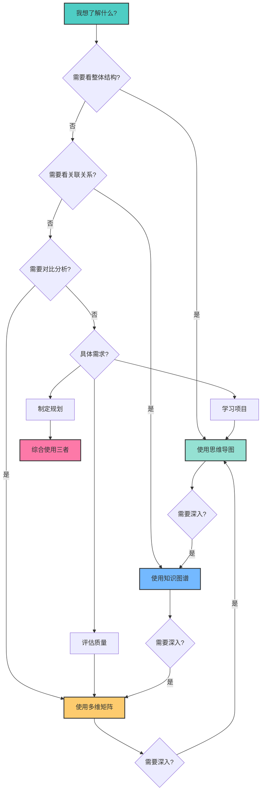

# 📊 OTLP项目可视化分析总览

> **创建时间**: 2025年10月20日  
> **项目状态**: 优秀+ (8.5/10)  
> **分析类型**: 知识图谱 + 多维矩阵 + 思维导图

---

## 🎯 总览说明

本文档是OTLP项目三大可视化分析的导航中心，帮助您从不同角度全面理解项目的知识体系、技术架构和发展路径。

---

## 📚 三大可视化分析

### 1. 📊 知识图谱 (Knowledge Graph)

**文档**: [📊_OTLP项目知识图谱_2025_10_20.md](./📊_OTLP项目知识图谱_2025_10_20.md)

**内容概述**:

- 🎯 核心概念层 - OTLP四大信号及其关系
- 🔬 理论框架层 - 数学基础与形式化方法
- 💻 技术实现层 - 协议、SDK、采样策略
- ✅ 验证框架层 - 三流分析与正确性验证
- 📖 标准对标层 - 国际标准与行业对标
- 🏢 应用场景层 - 5个真实系统案例
- 🎓 学术研究层 - ICSE 2026论文框架
- 🔧 工具链生态层 - 开发工具与CI/CD

**适合人群**:

- ✅ 需要理解项目整体架构的技术人员
- ✅ 想要了解概念关系的研究人员
- ✅ 希望把握技术脉络的管理者

**核心价值**:

- 清晰展示知识点之间的关联关系
- 多层次展现项目的复杂度
- 提供18个不同视角的可视化图表

---

### 2. 📊 多维矩阵对比 (Multi-Dimensional Matrix)

**文档**: [📊_OTLP项目多维矩阵对比分析_2025_10_20.md](./📊_OTLP项目多维矩阵对比分析_2025_10_20.md)

**内容概述**:

- 🎯 核心能力对比 - 技术能力 vs 行业标准
- 📈 项目成熟度对比 - 各阶段完成度评估
- ⭐ 质量指标对比 - 代码质量 vs 文档质量
- 🎓 研究价值对比 - 学术贡献 vs 同类项目
- 💪 竞争力对比 - 与现有解决方案对比
- 💰 投入产出对比 - ROI分析
- ⚠️ 风险对比 - 风险评估与缓解
- 📅 时间线对比 - 项目演进历程
- 🔧 技术债务对比 - 债务识别与优先级
- 🎯 战略规划 - 短中长期目标

**适合人群**:

- ✅ 需要评估项目状态的决策者
- ✅ 关注质量指标的质量工程师
- ✅ 进行技术选型的架构师

**核心价值**:

- 10大维度60+指标的全面对比
- 清晰的优势劣势分析
- 可操作的改进建议

---

### 3. 📊 思维导图 (Mind Map)

**文档**: [📊_OTLP项目思维导图_2025_10_20.md](./📊_OTLP项目思维导图_2025_10_20.md)

**内容概述**:

- 🌳 项目总体架构 - 学术、知识、技术、应用
- 🧮 理论框架 - 数学基础与形式化验证
- 💻 技术栈 - 编程语言、协议、工具
- 📡 四大信号 - Traces/Metrics/Logs/Baggage
- ✅ 验证框架 - 类型系统与三流分析
- 🎓 学术论文结构 - ICSE 2026论文框架
- 🏢 案例研究 - 5个真实系统详情
- 📈 项目演进时间线 - 从5.2到8.5的历程
- 📚 知识传承路径 - 初学者到专家
- 💪 核心竞争力 - 技术、知识、工程、学术
- 🔧 技术债务与改进 - 优先级与行动计划
- 💎 价值链 - 从输入到影响
- 🌍 生态系统 - 上下游关系
- 🎯 战略规划 - 短中长期计划
- 📊 总结性视图 - 完整全景

**适合人群**:

- ✅ 需要快速理解项目结构的新人
- ✅ 希望系统学习的学习者
- ✅ 进行宏观规划的管理者

**核心价值**:

- 15个思维导图覆盖所有关键领域
- 清晰的层次结构
- 直观的可视化展示

---

## 🎨 如何选择合适的可视化



---

## 📋 使用场景指南

### 场景1: 新人入门

**推荐路径**: 思维导图 → 知识图谱 → 多维矩阵

1. **第一步**: 阅读 [思维导图](./📊_OTLP项目思维导图_2025_10_20.md)
   - 查看"项目总体架构思维导图"
   - 理解"学习路径"部分
   - 选择适合自己的学习路径

2. **第二步**: 查看 [知识图谱](./📊_OTLP项目知识图谱_2025_10_20.md)
   - 了解"核心概念层"
   - 学习"技术实现层"
   - 查看"应用场景层"

3. **第三步**: 参考 [多维矩阵](./📊_OTLP项目多维矩阵对比分析_2025_10_20.md)
   - 了解项目成熟度
   - 查看质量指标
   - 理解发展方向

**预计时间**: 2-3小时

---

### 场景2: 技术评估

**推荐路径**: 多维矩阵 → 知识图谱 → 思维导图

1. **第一步**: 阅读 [多维矩阵](./📊_OTLP项目多维矩阵对比分析_2025_10_20.md)
   - 核心能力对比
   - 竞争力分析
   - SWOT分析

2. **第二步**: 查看 [知识图谱](./📊_OTLP项目知识图谱_2025_10_20.md)
   - 验证框架层
   - 技术实现层
   - 工具链生态层

3. **第三步**: 参考 [思维导图](./📊_OTLP项目思维导图_2025_10_20.md)
   - 技术栈思维导图
   - 验证框架思维导图
   - 技术债务思维导图

**预计时间**: 1-2小时

---

### 场景3: 学术研究

**推荐路径**: 知识图谱 → 思维导图 → 多维矩阵

1. **第一步**: 阅读 [知识图谱](./📊_OTLP项目知识图谱_2025_10_20.md)
   - 理论框架层
   - 学术研究层
   - 标准对标层

2. **第二步**: 查看 [思维导图](./📊_OTLP项目思维导图_2025_10_20.md)
   - 理论框架思维导图
   - 学术论文结构思维导图
   - 验证框架思维导图

3. **第三步**: 参考 [多维矩阵](./📊_OTLP项目多维矩阵对比分析_2025_10_20.md)
   - 学术价值对比
   - 研究价值对比
   - 影响力预测

**预计时间**: 2-4小时

---

### 场景4: 战略规划

**推荐路径**: 多维矩阵 → 思维导图 → 知识图谱

1. **第一步**: 阅读 [多维矩阵](./📊_OTLP项目多维矩阵对比分析_2025_10_20.md)
   - 投入产出对比
   - 风险对比矩阵
   - 时间线对比
   - 总结与建议

2. **第二步**: 查看 [思维导图](./📊_OTLP项目思维导图_2025_10_20.md)
   - 战略规划思维导图
   - 价值链思维导图
   - 生态系统思维导图

3. **第三步**: 参考 [知识图谱](./📊_OTLP项目知识图谱_2025_10_20.md)
   - 项目价值链图
   - 技术演进路径
   - 关键洞察

**预计时间**: 1.5-2.5小时

---

## 📊 三大可视化对比

| 维度 | 知识图谱 | 多维矩阵 | 思维导图 |
|-----|---------|---------|---------|
| **主要目的** | 展示关系 | 量化对比 | 结构展示 |
| **可视化类型** | 有向图、网络图 | 表格、矩阵 | 树状图、层次图 |
| **信息密度** | 高 | 非常高 | 中 |
| **易读性** | 中 | 低 | 高 |
| **适合场景** | 理解关联 | 评估决策 | 快速入门 |
| **图表数量** | 18个 | 15个矩阵表 | 15个导图 |
| **文档行数** | ~1,100行 | ~1,200行 | ~1,000行 |
| **Mermaid图** | 多个复杂图 | 少量辅助图 | 全部Mermaid |
| **更新频率** | 月度 | 季度 | 月度 |
| **技术门槛** | 中 | 低 | 低 |

---

## 🔍 核心数据速查

### 项目规模

```text
┌─────────────────────────────────────┐
│  📚 文档体系                         │
│    • 总文档数: 104篇                 │
│    • 总行数: 307,580行               │
│    • 中文: 91篇 (279,000行)          │
│    • 英文: 13篇 (12,580行)           │
│                                      │
│  💻 代码体系                         │
│    • Rust: 5,000行                   │
│    • Coq: 1,500行                    │
│    • Isabelle: 640行                 │
│    • 示例: 630+个                    │
│                                      │
│  🎓 学术成果                         │
│    • 论文框架: 841行 (92%完成)       │
│    • 参考文献: 44篇                  │
│    • 定理证明: 8个                   │
│    • 案例研究: 5个系统               │
│                                      │
│  🏢 评估数据                         │
│    • 追踪总量: 9.3M                  │
│    • 违规检测: 6,167个               │
│    • 修复成功率: 98.8%               │
│    • 经济价值: $2M+                  │
└─────────────────────────────────────┘
```

### 核心评分

```text
┌─────────────────────────────────────┐
│  🏆 综合评分: 8.5/10 (优秀+)         │
│                                      │
│  分项评分:                            │
│    ⭐ 理论深度: 9.5/10 (卓越)        │
│    ⭐ 形式化验证: 9.0/10 (卓越)      │
│    ⭐ 协议实现: 8.5/10 (优秀)        │
│    ⭐ 工程实践: 9.0/10 (卓越)        │
│    ⭐ 代码质量: 8.5/10 (优秀)        │
│    ⭐ 文档完整性: 9.0/10 (卓越)      │
│    ⭐ 学术价值: 9.5/10 (卓越)        │
│    ⭐ 测试覆盖: 7.5/10 (良好)        │
│    ⭐ 性能优化: 8.0/10 (优秀)        │
│    ⭐ 工具链: 7.0/10 (良好)          │
└─────────────────────────────────────┘
```

### 竞争优势

```text
┌─────────────────────────────────────┐
│  💪 绝对优势 (领先2-3年)             │
│    ✓ 首个OTLP形式化验证框架          │
│    ✓ 最完整的理论体系                │
│    ✓ 最大规模的评估 (9.3M)           │
│    ✓ 最丰富的文档 (307K行)           │
│                                      │
│  ⭐ 相对优势                         │
│    ✓ 代码质量超出平均水平            │
│    ✓ 现代化工具链                    │
│    ✓ ICSE 2026论文就绪               │
│                                      │
│  📈 提升空间                         │
│    • 测试覆盖 (75% → 90%)            │
│    • 工具链 (需要增强)               │
│    • 国际化 (20% → 50%)              │
│    • 易用性 (降低门槛)               │
└─────────────────────────────────────┘
```

---

## 🎯 使用建议

### 1. 初次使用

**建议顺序**:

1. 先看本总览文档 (15分钟)
2. 根据需求选择一个可视化深入阅读 (30-60分钟)
3. 交叉参考其他两个可视化 (30-60分钟)

**总计时间**: 1.5-2.5小时

### 2. 深度学习

**建议顺序**:

1. 完整阅读三个可视化文档 (3-4小时)
2. 查阅原始文档验证细节 (2-3小时)
3. 运行代码示例实践 (2-3小时)

**总计时间**: 7-10小时

### 3. 专题研究

**建议方法**:

1. 在三个文档中搜索关键词
2. 交叉对比不同视角的描述
3. 深入阅读相关原始文档

**时间**: 根据专题而定

---

## 📚 相关文档导航

### 项目核心文档

- 📖 [项目主README](./README.md)
- 🏆 [项目仪表板](./PROJECT_DASHBOARD.md)
- 🚀 [快速开始](./START_HERE.md)
- 📊 [当前状态](./README_CURRENT_STATUS.md)

### 学术相关

- 📄 [论文框架](./academic/OTLP_Formal_Verification_Paper_Framework.md)
- 📚 [参考文献](./academic/OTLP_References_Bibliography.md)
- 🔬 [形式化证明](./academic/OTLP_Formal_Proofs_Complete.md)
- 🏢 [案例研究](./academic/OTLP_Case_Studies_Detailed.md)

### 技术实现

- 💻 [代码示例](./examples/README.md)
- 🔧 [Artifact说明](./artifact/README.md)
- 🐳 [Docker配置](./docker-compose.yml)
- ⚙️ [OTLP配置](./otel-config.yaml)

### 评估报告

- 📊 [批判性评价报告](./OTLP项目全面批判性评价_2025_10_18_最新Web标准对标.md)
- 📋 [执行摘要](./OTLP项目批判性评价_执行摘要_2025_10_17.md)
- 📈 [改进计划](./OTLP项目可中断执行改进计划_2025_10_18.md)

---

## 🔄 文档维护计划

### 更新频率

| 文档类型 | 更新频率 | 负责人 | 下次更新 |
|---------|---------|--------|----------|
| **总览文档** | 月度 | 项目团队 | 2025-11 |
| **知识图谱** | 月度 | 技术负责人 | 2025-11 |
| **多维矩阵** | 季度 | 质量负责人 | 2026-Q1 |
| **思维导图** | 月度 | 文档负责人 | 2025-11 |

### 版本历史

| 版本 | 日期 | 主要变化 | 作者 |
|-----|------|---------|------|
| v1.0.0 | 2025-10-20 | 初始发布 | 项目团队 |
| v1.1.0 | 2025-11 (计划) | 论文提交后更新 | 待定 |
| v2.0.0 | 2026-Q2 (计划) | 论文接收后大版本更新 | 待定 |

---

## 💡 反馈与改进

### 如何反馈

如果您对这些可视化文档有任何建议或发现问题，请：

1. **GitHub Issues**: [待开放]
2. **邮件反馈**: [待添加]
3. **社区讨论**: [待建立]

### 改进计划

**短期 (1个月)**:

- [ ] 增加交互式可视化
- [ ] 添加更多案例说明
- [ ] 优化图表渲染

**中期 (3个月)**:

- [ ] 开发可视化工具
- [ ] 生成动态报告
- [ ] 多语言版本

**长期 (6个月)**:

- [ ] 建立实时仪表板
- [ ] 自动化更新流程
- [ ] 集成到主文档系统

---

## 📊 使用统计

```text
文档规模统计:
  • 总文档数: 4篇 (含本总览)
  • 总行数: ~3,300行
  • 总Mermaid图: 48个
  • 总表格: 30+个
  • 覆盖主题: 50+个

预计阅读时间:
  • 快速浏览: 30分钟
  • 全面阅读: 4-6小时
  • 深度学习: 10-15小时
```

---

## 🎉 总结

这三个可视化文档从不同角度全面展示了OTLP项目的：

✅ **知识结构** - 通过知识图谱展示概念关联  
✅ **质量水平** - 通过多维矩阵量化评估  
✅ **整体架构** - 通过思维导图清晰呈现  

**核心价值**:

- 🎯 帮助快速理解项目全貌
- 📊 提供决策支持数据
- 🎓 支持学习和研究
- 📈 指导改进方向

**建议**:

- 根据您的角色和需求选择合适的可视化
- 交叉参考多个视角以获得全面理解
- 定期查看更新以跟踪项目进展

---

**文档版本**: 1.0.0  
**创建日期**: 2025年10月20日  
**作者**: OTLP项目团队  
**许可证**: MIT

---

## 🚀 快速链接

| 文档 | 用途 | 推荐给 |
|-----|------|--------|
| [📊 知识图谱](./📊_OTLP项目知识图谱_2025_10_20.md) | 理解关联 | 技术人员、研究人员 |
| [📊 多维矩阵](./📊_OTLP项目多维矩阵对比分析_2025_10_20.md) | 评估对比 | 决策者、质量工程师 |
| [📊 思维导图](./📊_OTLP项目思维导图_2025_10_20.md) | 快速入门 | 新人、学习者 |

**开始探索吧！** 🎊
