# 🔗 OTLP项目多维关联图

> **创建时间**: 2025年10月20日  
> **用途**: 展示5大维度之间的深度关联关系  
> **更新频率**: 月度

---

## 🎯 关联概述

本文档展示可视化分析中心5大维度（知识图谱、多维矩阵、思维导图、综合分析、数据统计）之间的多维关联关系。

---

## 1. 整体关联架构

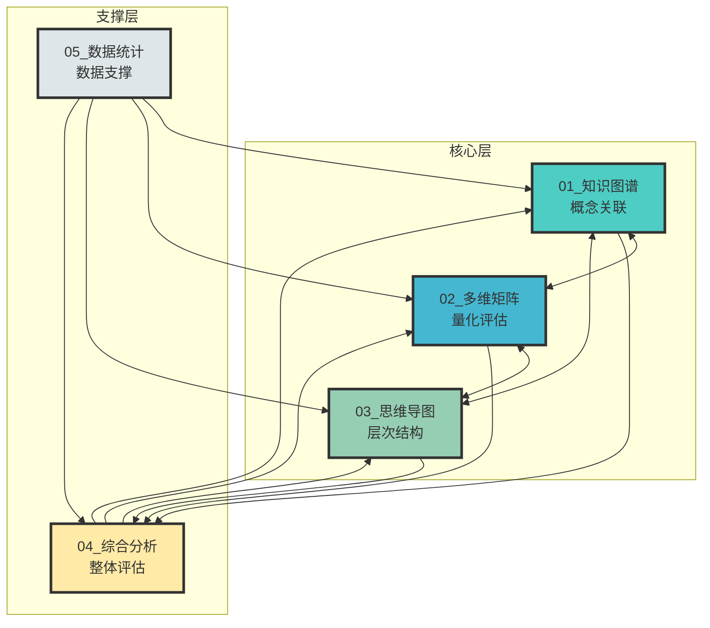

---

## 2. 维度间关联矩阵

| 从\到 | 知识图谱 | 多维矩阵 | 思维导图 | 综合分析 | 数据统计 |
|------|---------|---------|---------|---------|---------|
| **知识图谱** | - | ⭐⭐⭐⭐⭐ | ⭐⭐⭐⭐⭐ | ⭐⭐⭐⭐ | ⭐⭐⭐ |
| **多维矩阵** | ⭐⭐⭐⭐⭐ | - | ⭐⭐⭐⭐ | ⭐⭐⭐⭐⭐ | ⭐⭐⭐⭐⭐ |
| **思维导图** | ⭐⭐⭐⭐⭐ | ⭐⭐⭐⭐ | - | ⭐⭐⭐⭐ | ⭐⭐⭐ |
| **综合分析** | ⭐⭐⭐⭐ | ⭐⭐⭐⭐⭐ | ⭐⭐⭐⭐ | - | ⭐⭐⭐⭐ |
| **数据统计** | ⭐⭐⭐ | ⭐⭐⭐⭐⭐ | ⭐⭐⭐ | ⭐⭐⭐⭐ | - |

**说明**: ⭐数量表示关联强度（1-5星）

---

## 3. 知识图谱关联网

### 3.1 输出关联

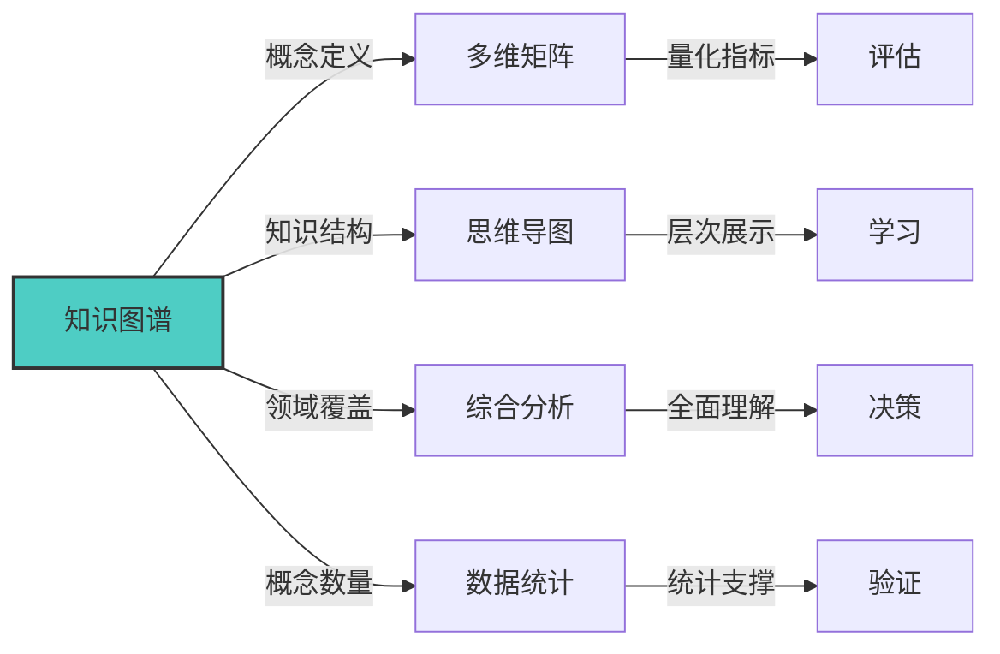

### 3.2 输入关联

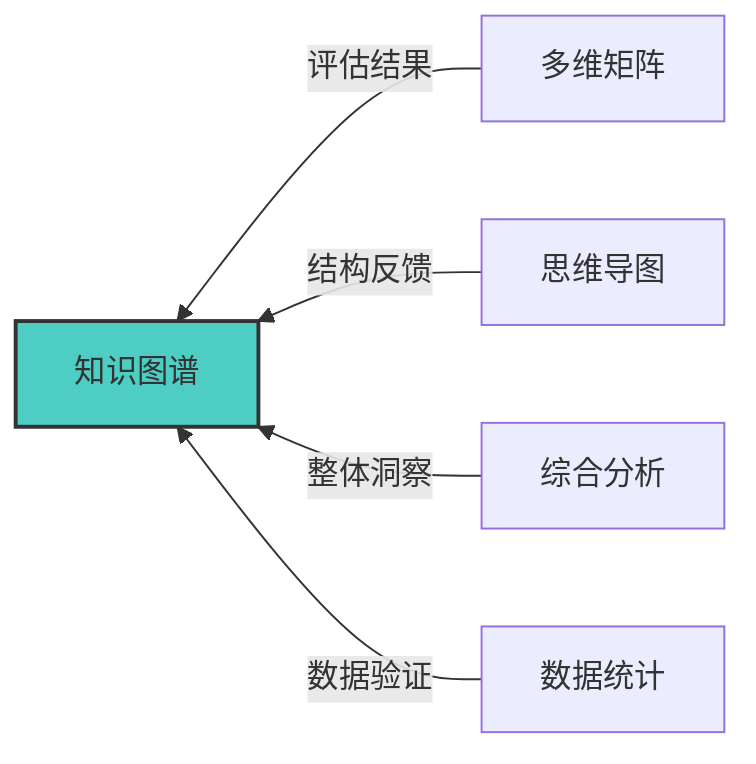

---

## 4. 多维矩阵关联网

### 4.1 数据流向

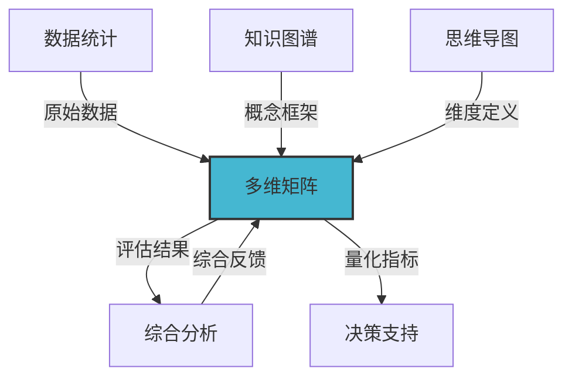

### 4.2 关联强度

- **与数据统计**: ⭐⭐⭐⭐⭐ (最强) - 需要大量数据支撑
- **与综合分析**: ⭐⭐⭐⭐⭐ (最强) - 提供量化评估
- **与知识图谱**: ⭐⭐⭐⭐⭐ (强) - 概念框架定义
- **与思维导图**: ⭐⭐⭐⭐ (中强) - 维度结构参考

---

## 5. 思维导图关联网

### 5.1 层次关联

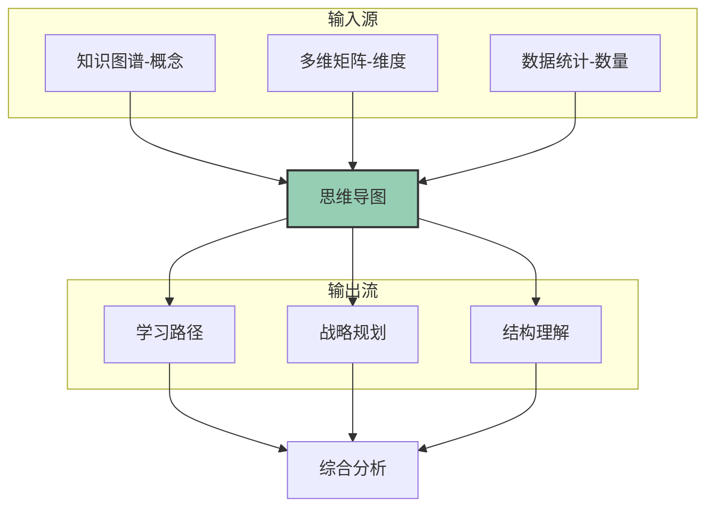

---

## 6. 综合分析关联网

### 6.1 信息汇聚

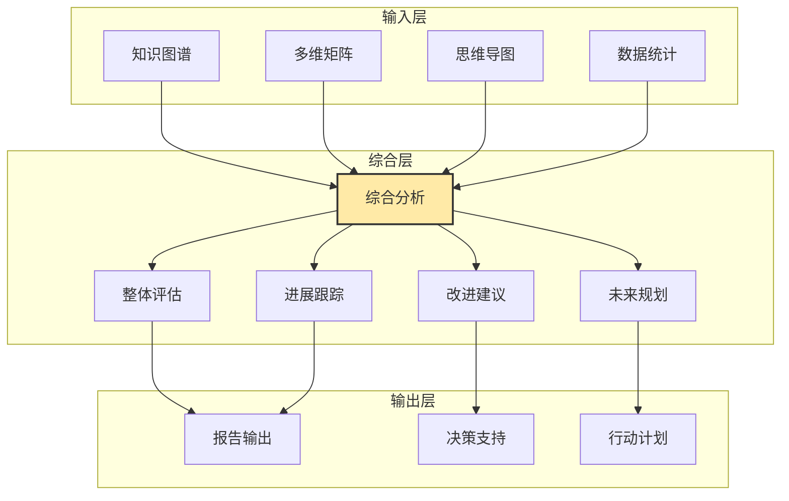

### 6.2 综合能力

- **信息整合**: 从4个维度汇聚信息
- **洞察生成**: 产生综合性洞察
- **决策支持**: 提供战略建议
- **行动指导**: 指导具体行动

---

## 7. 数据统计关联网

### 7.1 数据支撑关系

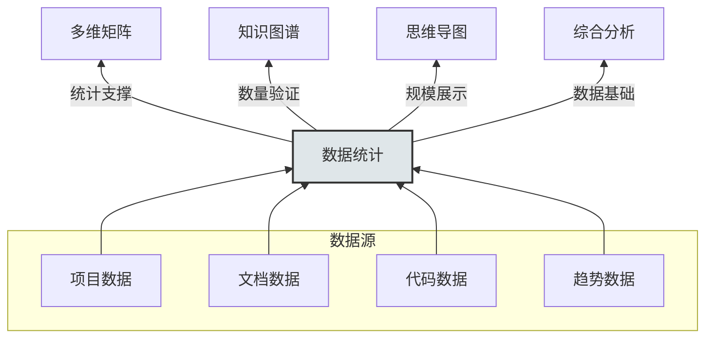

---

## 8. 跨维度应用场景

### 场景1: 新人入门

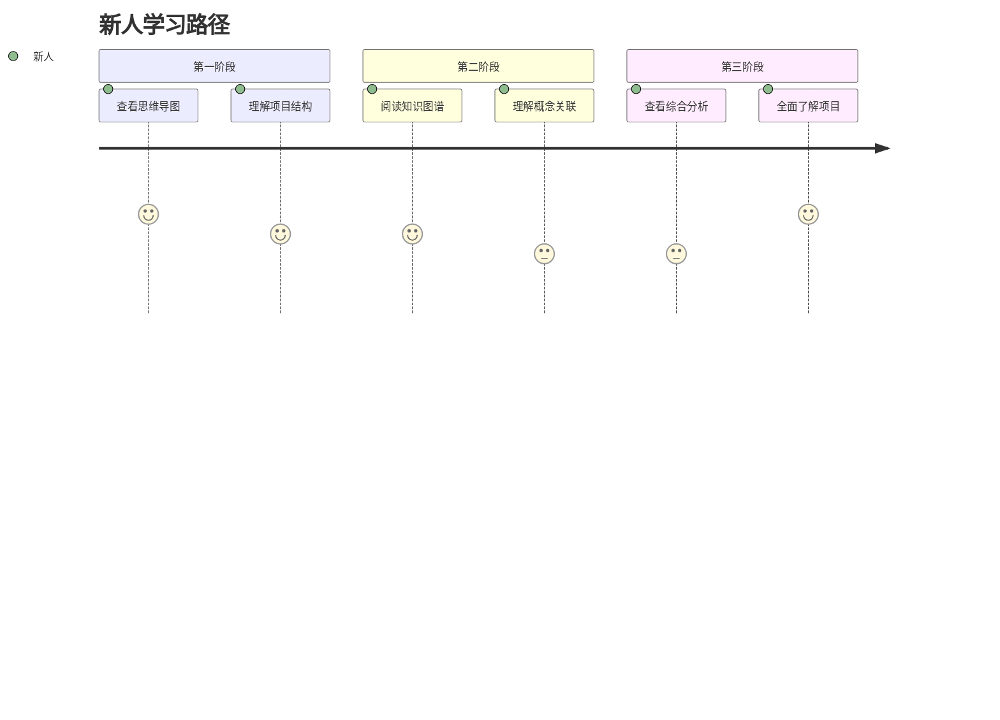

**关联路径**: 思维导图 → 知识图谱 → 综合分析

---

### 场景2: 质量评估


**关联路径**: 数据统计 → 多维矩阵 → 综合分析

---

### 场景3: 战略规划

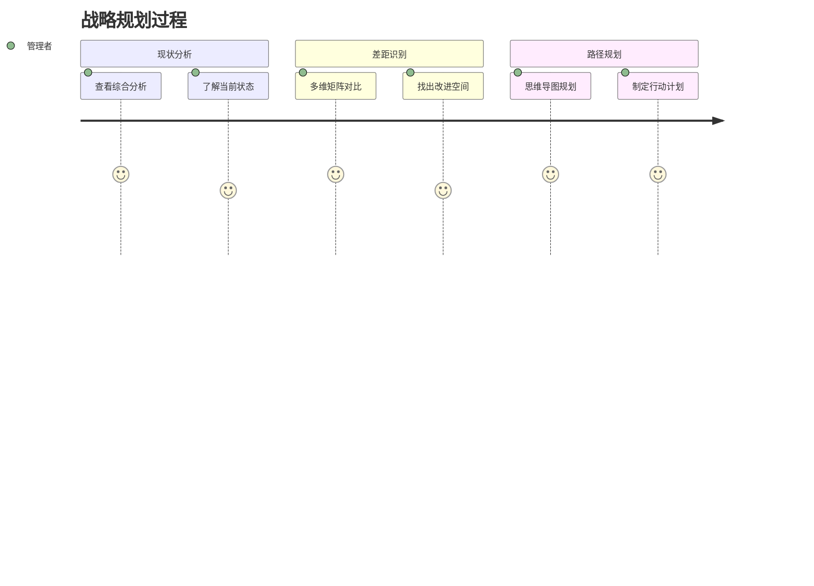

**关联路径**: 综合分析 → 多维矩阵 → 思维导图

---

## 9. 内容关联地图

### 9.1 项目级关联

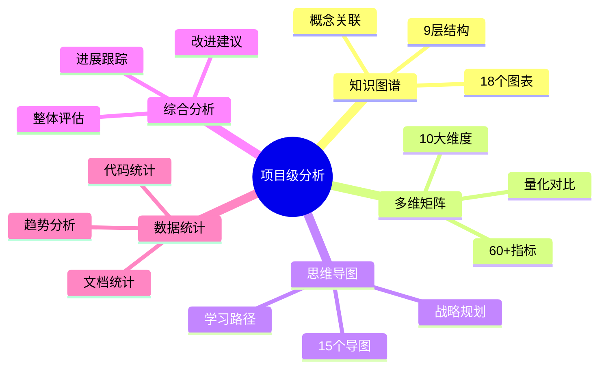

### 9.2 专项级关联

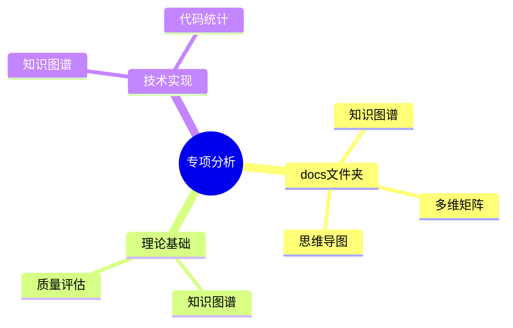

---

## 10. 使用建议

### 10.1 选择策略

| 需求 | 推荐组合 | 顺序 |
|-----|---------|------|
| **快速入门** | 思维导图 + 知识图谱 | MD → KG |
| **质量评估** | 数据统计 + 多维矩阵 + 综合分析 | DS → MM → CA |
| **深度学习** | 知识图谱 + 思维导图 + 综合分析 | KG → MD → CA |
| **战略决策** | 综合分析 + 多维矩阵 + 思维导图 | CA → MM → MD |
| **数据分析** | 数据统计 + 多维矩阵 | DS → MM |

### 10.2 阅读顺序

**推荐顺序1** (理解优先):

```text
知识图谱 → 思维导图 → 多维矩阵 → 综合分析 → 数据统计
```

**推荐顺序2** (决策优先):

```text
综合分析 → 多维矩阵 → 数据统计 → 知识图谱 → 思维导图
```

**推荐顺序3** (学习优先):

```text
思维导图 → 知识图谱 → 综合分析 → 多维矩阵 → 数据统计
```

---

## 11. 关联强度说明

### 强关联 (⭐⭐⭐⭐⭐)

- 知识图谱 ↔ 多维矩阵: 概念定义支撑量化评估
- 知识图谱 ↔ 思维导图: 知识结构支撑层次展示
- 多维矩阵 ↔ 数据统计: 数据支撑量化分析
- 多维矩阵 ↔ 综合分析: 评估结果汇入综合报告

### 中关联 (⭐⭐⭐⭐)

- 知识图谱 ↔ 综合分析: 知识支撑综合理解
- 思维导图 ↔ 多维矩阵: 维度定义参考
- 思维导图 ↔ 综合分析: 结构支撑整体分析
- 数据统计 ↔ 综合分析: 数据支撑综合判断

### 弱关联 (⭐⭐⭐)

- 知识图谱 ↔ 数据统计: 概念数量统计
- 思维导图 ↔ 数据统计: 结构数量统计

---

## 12. 更新维护

### 更新机制

- **知识图谱**: 概念变化时更新 → 触发其他维度更新
- **多维矩阵**: 季度评估更新 → 触发综合分析更新
- **思维导图**: 结构调整时更新 → 触发学习路径更新
- **综合分析**: 定期汇总更新 → 整合所有维度变化
- **数据统计**: 月度统计更新 → 提供最新数据支撑

### 关联维护

定期检查和维护各维度间的关联一致性，确保：

- ✅ 数据一致性
- ✅ 概念一致性
- ✅ 结构一致性
- ✅ 评估一致性

---

## 🎉 总结

**5大维度相互关联、相互支撑，形成完整的可视化分析体系**:

- 🔍 知识图谱: 提供概念基础
- 📊 多维矩阵: 提供量化评估
- 🌳 思维导图: 提供结构展示
- 📋 综合分析: 提供整体洞察
- 📈 数据统计: 提供数据支撑

**建议**: 根据具体需求，灵活组合使用多个维度！

---

**文档版本**: v1.0.0  
**创建日期**: 2025年10月20日  
**维护团队**: OTLP项目团队  
**更新频率**: 月度
