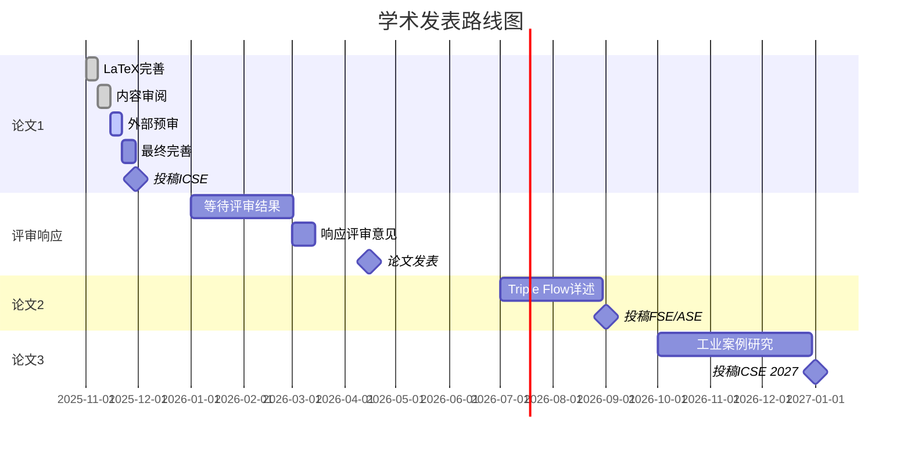
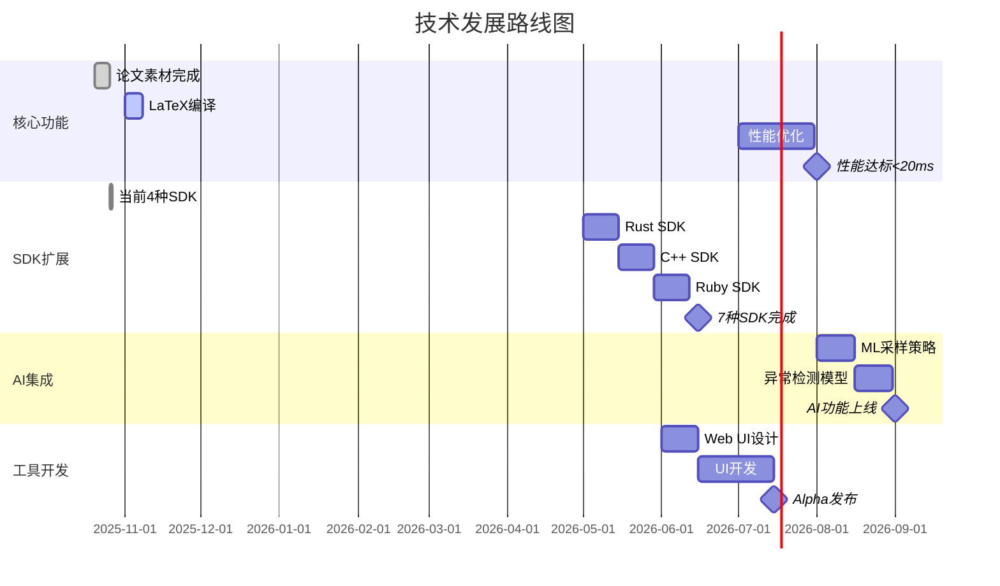

# 🎯 OTLP项目行动计划与路线图 (2025 Q4 - 2026)

> **制定时间**: 2025年10月26日  
> **执行周期**: 2025 Q4 - 2026全年  
> **计划类型**: 可执行行动计划 + 详细路线图  
> **责任人**: OTLP项目团队

---

## 📋 目录

- [执行摘要](#执行摘要)
- [Q4 2025 行动计划](#q4-2025-行动计划)
- [2026年度路线图](#2026年度路线图)
- [关键里程碑](#关键里程碑)
- [资源规划](#资源规划)
- [风险管理](#风险管理)
- [成功指标](#成功指标)

---

## 执行摘要

### 战略目标

**2025 Q4**: 完成论文、启动开源、建立国际影响  
**2026上半年**: 学术发表、工业落地、社区建设  
**2026下半年**: 生态完善、商业探索、标准推动

### 核心指标

| 维度 | 当前 | Q4目标 | 2026目标 | 增长 |
|-----|------|--------|----------|------|
| **论文发表** | 0 | 1提交 | 1发表+2提交 | - |
| **GitHub Stars** | 0 | 100 | 1000+ | - |
| **工业用户** | 0 | 0 | 5家 | - |
| **社区贡献者** | 1 | 5 | 30+ | - |
| **英文文档** | 20% | 50% | 80% | +60% |
| **SDK数量** | 4 | 5 | 8 | +100% |

---

## Q4 2025 行动计划

### 11月 (论文冲刺月)

#### Week 1 (11/1 - 11/7): LaTeX完善

**目标**: 生成可编译的完整PDF

**任务清单**:

- [ ] **Day 1-2**: 安装LaTeX环境
  - 安装MiKTeX/TeX Live
  - 配置编译脚本
  - 测试基础编译
  - **产出**: 可编译的主文档
  
- [ ] **Day 3-4**: 首次完整编译
  - 集成所有sections
  - 插入figures和tables
  - 解决编译错误
  - **产出**: 初版PDF (11-12页)
  
- [ ] **Day 5-6**: 格式化调整
  - 页面布局优化
  - 图表位置调整
  - 双栏平衡
  - **产出**: 格式化PDF
  
- [ ] **Day 7**: References补充
  - 补充缺失引用
  - 更新BibTeX格式
  - 验证所有引用
  - **产出**: 完整references.bib

**检查点**: 11/7前获得完整PDF

---

#### Week 2 (11/8 - 11/14): 内容审阅

**目标**: 完成技术和语言审阅

**任务清单**:

- [ ] **Day 1-2**: 技术审阅
  - 验证所有定理陈述
  - 检查数据一致性
  - 确认算法正确性
  - **产出**: 技术审阅报告
  
- [ ] **Day 3-4**: 语言润色
  - 学术用语规范化
  - 逻辑流畅性检查
  - 消除冗余表达
  - **产出**: 润色后版本
  
- [ ] **Day 5-6**: 图表优化
  - 确保B&W可读性
  - 调整图表大小
  - 完善captions
  - **产出**: 优化后图表
  
- [ ] **Day 7**: 交叉引用检查
  - 验证所有\ref正确
  - 确认章节编号
  - 检查页码引用
  - **产出**: 交叉引用报告

**检查点**: 11/14前完成内部审阅

---

#### Week 3 (11/15 - 11/21): 外部预审

**目标**: 获得外部专家反馈

**任务清单**:

- [ ] **Day 1**: 选择审阅专家
  - 形式化方法专家×1
  - 分布式系统专家×1
  - 语言专家×1
  - **产出**: 审阅专家名单
  
- [ ] **Day 2-3**: 发送审阅请求
  - 准备审阅材料
  - 发送邮件邀请
  - 说明审阅要点
  - **产出**: 审阅邀请发送
  
- [ ] **Day 4-6**: 收集反馈
  - 跟踪审阅进度
  - 记录反馈意见
  - 分类问题清单
  - **产出**: 反馈意见汇总
  
- [ ] **Day 7**: 制定修订计划
  - 评估反馈优先级
  - 分配修订任务
  - 制定时间表
  - **产出**: 修订计划文档

**检查点**: 11/21前获得专家反馈

---

#### Week 4 (11/22 - 11/30): 最终完善

**目标**: 根据反馈完成修订

**任务清单**:

- [ ] **Day 1-3**: 重要问题修订
  - 技术问题修正
  - 逻辑问题调整
  - 数据更新
  - **产出**: 修订后版本v2
  
- [ ] **Day 4-5**: 次要问题处理
  - 语言润色
  - 格式微调
  - 引用补充
  - **产出**: 修订后版本v3
  
- [ ] **Day 6**: 最终检查
  - 拼写检查
  - 格式一致性
  - 页数控制
  - **产出**: 最终版本v4
  
- [ ] **Day 7**: 提交准备
  - 生成最终PDF
  - 准备Artifact
  - 填写提交表单
  - **产出**: 提交材料包

**检查点**: 11/30前完成论文准备

**里程碑**: ✅ 论文准备100%完成

---

### 12月 (国际化推进月)

#### Week 1 (12/1 - 12/7): 英文文档翻译 (第一批)

**目标**: 完成10篇核心文档翻译

**任务清单**:

- [ ] **Day 1**: 主README翻译
  - 项目概述英文版
  - 快速开始英文版
  - 核心特性英文版
  - **产出**: README_EN.md完善版
  
- [ ] **Day 2**: 快速入门翻译
  - 5分钟入门英文版
  - 基本概念英文版
  - 示例代码英文注释
  - **产出**: Quick_Start_EN.md
  
- [ ] **Day 3-4**: 核心技术文档翻译
  - Type System EN
  - Operational Semantics EN
  - Algebraic Framework EN
  - **产出**: 3篇技术文档英文版
  
- [ ] **Day 5**: 部署指南翻译
  - Docker Deploy EN
  - Kubernetes Deploy EN
  - **产出**: 2篇部署文档英文版
  
- [ ] **Day 6-7**: SDK文档翻译
  - Go SDK README EN
  - Java SDK README EN
  - Python SDK README EN
  - JS SDK README EN
  - **产出**: 4篇SDK文档英文版

**检查点**: 12/7前完成10篇翻译

---

#### Week 2 (12/8 - 12/14): 英文文档翻译 (第二批)

**目标**: 再完成10篇文档翻译

**任务清单**:

- [ ] **Day 1-2**: 运维文档翻译
  - Security Best Practices EN
  - Monitoring & Alerting EN
  - Troubleshooting EN
  - Performance Optimization EN
  - **产出**: 4篇运维文档英文版
  
- [ ] **Day 3-4**: 学术材料翻译
  - Paper Framework EN (已有)
  - Case Studies EN (已有)
  - Formal Proofs Summary EN
  - References EN (已有)
  - **产出**: 2篇新增学术文档英文版
  
- [ ] **Day 5-6**: 贡献指南翻译
  - Contributing Guide EN (已有)
  - Code of Conduct EN
  - Development Guide EN
  - Testing Guide EN
  - **产出**: 2篇新增贡献文档英文版
  
- [ ] **Day 7**: 质量检查
  - 术语统一性检查
  - 技术准确性验证
  - 可读性审阅
  - **产出**: 质量检查报告

**检查点**: 12/14前完成20篇翻译 (累计)

**里程碑**: ✅ 英文文档达到50%覆盖

---

#### Week 3 (12/15 - 12/21): 开源准备

**目标**: 准备GitHub公开发布

**任务清单**:

- [ ] **Day 1**: 代码清理
  - 移除敏感信息
  - 统一代码风格
  - 添加必要注释
  - **产出**: 清理后代码库
  
- [ ] **Day 2**: CI/CD配置
  - GitHub Actions设置
  - 自动化测试
  - 自动化构建
  - **产出**: .github/workflows/
  
- [ ] **Day 3**: 文档整理
  - 检查所有超链接
  - 更新文档索引
  - 添加badges
  - **产出**: 完善的文档体系
  
- [ ] **Day 4**: License和法律
  - 选择开源License (MIT推荐)
  - 添加版权声明
  - 检查依赖License
  - **产出**: LICENSE + NOTICE
  
- [ ] **Day 5**: 社区机制
  - Issue模板完善
  - PR模板完善
  - Discussion分类
  - **产出**: .github/ISSUE_TEMPLATE/
  
- [ ] **Day 6**: 发布准备
  - 创建Release Notes
  - 准备宣传材料
  - 撰写发布博客
  - **产出**: v1.0.0 Release Package
  
- [ ] **Day 7**: 预发布测试
  - 测试所有链接
  - 验证CI/CD
  - 试运行Issue流程
  - **产出**: 预发布检查清单

**检查点**: 12/21前完成开源准备

---

#### Week 4 (12/22 - 12/31): 公开发布

**目标**: GitHub公开并初步推广

**任务清单**:

- [ ] **Day 1 (12/22)**: 正式发布
  - 仓库设为Public
  - 发布v1.0.0
  - 更新项目网站
  - **产出**: 公开的GitHub仓库
  
- [ ] **Day 2-3**: 社交媒体推广
  - Twitter/X发布
  - Reddit r/programming
  - HackerNews提交
  - LinkedIn分享
  - **产出**: 多平台宣传
  
- [ ] **Day 4**: 技术博客发布
  - Medium文章
  - Dev.to文章
  - 知乎/掘金文章
  - **产出**: 3篇推广博客
  
- [ ] **Day 5-6**: 社区互动
  - 回复Issues
  - 处理PR
  - 参与讨论
  - **产出**: 活跃的社区互动
  
- [ ] **Day 7**: 数据分析
  - 统计Stars/Forks
  - 分析流量来源
  - 收集用户反馈
  - **产出**: 发布周报告

**检查点**: 12/31前获得首批100 stars

**Q4里程碑**:

- ✅ 论文准备完成
- ✅ 英文文档50%
- ✅ GitHub公开发布
- ✅ 获得100+ stars

---

## 2026年度路线图

### 2026 Q1 (1-3月): 社区建设期

#### 1月: 社区启动

**核心任务**:

- [ ] 举办首次线上Meetup
- [ ] 发布技术博客系列 (5篇)
- [ ] 建立Discord/Slack社区
- [ ] 开始YouTube教程录制

**关键指标**:

- GitHub Stars: 100 → 300
- 社区成员: 0 → 100
- 贡献者: 1 → 5

---

#### 2月: 论文响应

**核心任务**:

- [ ] 响应ICSE 2026评审意见
- [ ] 修订论文内容
- [ ] 完善Artifact
- [ ] 准备Rebuttal

**关键指标**:

- 论文修订: 3轮
- Artifact完整度: 100%
- 评审响应及时性: 100%

---

#### 3月: 工业对接

**核心任务**:

- [ ] 联系10家潜在企业
- [ ] 启动2个POC项目
- [ ] 收集工业需求
- [ ] 建立企业支持渠道

**关键指标**:

- 企业联系: 10家
- POC项目: 2个
- 需求收集: 20+条

**Q1里程碑**:

- ✅ 社区初步建立
- ✅ 论文修订完成
- ✅ 工业对接启动

---

### 2026 Q2 (4-6月): 技术扩展期

#### 4月: 学术参与

**核心任务**:

- [ ] 参加ICSE 2026会议 (如接收)
- [ ] 会议演讲和交流
- [ ] 启动第二篇论文
- [ ] 学术合作洽谈

**关键指标**:

- 会议参与: 1次
- 学术交流: 20+人
- 合作意向: 3-5个

---

#### 5月: SDK扩展

**核心任务**:

- [ ] Rust SDK开发 (P0)
- [ ] C++ SDK开发
- [ ] Ruby SDK开发
- [ ] SDK文档完善

**关键指标**:

- SDK数量: 4 → 7
- SDK测试覆盖: 90%+
- SDK文档: 100%

---

#### 6月: 工具开发

**核心任务**:

- [ ] Web UI alpha版本
- [ ] 可视化功能开发
- [ ] 报告生成器
- [ ] 用户测试

**关键指标**:

- UI功能: 基础版完成
- 用户测试: 20+人
- 反馈收集: 50+条

**Q2里程碑**:

- ✅ 论文可能发表
- ✅ SDK扩展完成
- ✅ 工具alpha发布

---

### 2026 Q3 (7-9月): 生态建设期

#### 7月: 性能优化

**核心任务**:

- [ ] 验证器性能优化
- [ ] 并行化实现
- [ ] 缓存机制
- [ ] 基准测试

**关键指标**:

- 验证速度: 37ms → <20ms
- 并行加速: 4x
- 内存优化: -30%

---

#### 8月: AI集成

**核心任务**:

- [ ] ML采样策略
- [ ] 异常检测模型
- [ ] 自动参数调优
- [ ] 智能告警

**关键指标**:

- 采样准确率: +30%
- 异常检测率: 95%+
- 模型训练: 3个

---

#### 9月: 第二篇论文

**核心任务**:

- [ ] 完成Triple Flow Analysis详述
- [ ] 投稿FSE/ASE 2026
- [ ] 准备实验数据
- [ ] 论文投稿

**关键指标**:

- 论文完成: 100%
- 实验规模: 扩大到20M traces
- 投稿: 1篇

**Q3里程碑**:

- ✅ 性能大幅提升
- ✅ AI功能集成
- ✅ 第二篇论文投稿

---

### 2026 Q4 (10-12月): 商业探索期

#### 10月: SaaS平台

**核心任务**:

- [ ] SaaS平台beta版
- [ ] 付费模式设计
- [ ] 用户管理系统
- [ ] 计费系统

**关键指标**:

- Beta用户: 50+
- 付费用户: 5+
- 月收入: $1K+

---

#### 11月: 咨询服务

**核心任务**:

- [ ] 评估服务启动
- [ ] 实施服务启动
- [ ] 培训体系建立
- [ ] 案例积累

**关键指标**:

- 咨询项目: 2-3个
- 培训场次: 3+
- 案例研究: 2个

---

#### 12月: 年度总结

**核心任务**:

- [ ] 年度报告编写
- [ ] 社区年会筹办
- [ ] 2027规划制定
- [ ] 里程碑回顾

**关键指标**:

- 年度报告: 1份
- 社区年会: 线上举办
- 参与人数: 200+

**Q4里程碑**:

- ✅ SaaS平台上线
- ✅ 咨询服务启动
- ✅ 年度目标达成

---

## 关键里程碑

### 学术里程碑

### 技术里程碑

### 社区里程碑

| 时间 | 里程碑 | 目标指标 | 关键活动 |
|-----|--------|---------|---------|
| **2025-12** | 开源发布 | 100 stars | GitHub公开 |
| **2026-01** | 社区启动 | 100成员 | 首次Meetup |
| **2026-03** | 社区成长 | 300 stars | 技术博客系列 |
| **2026-06** | 社区活跃 | 600 stars | 贡献者20+ |
| **2026-09** | 社区成熟 | 1000 stars | 年中技术峰会 |
| **2026-12** | 社区繁荣 | 2000 stars | 年度开发者大会 |

### 商业里程碑

| 时间 | 里程碑 | 目标 | 收入目标 |
|-----|--------|------|---------|
| **2026 Q1** | 工业对接 | 2个POC | $0 |
| **2026 Q2** | 首个付费用户 | 1家企业 | $5K |
| **2026 Q3** | 咨询服务启动 | 3个项目 | $50K |
| **2026 Q4** | SaaS上线 | 5付费用户 | $20K |
| **2026全年** | 商业探索 | 10家企业 | **$75K** |

---

## 资源规划

### 人力资源

#### 核心团队

| 角色 | 职责 | 投入 | 时期 |
|-----|------|------|------|
| **首席研究员** | 学术研究、论文撰写 | 100% | 持续 |
| **首席架构师** | 技术架构、代码审查 | 80% | 持续 |
| **技术写作** | 文档翻译、技术博客 | 50% | Q4-Q2 |
| **社区经理** | 社区运营、用户支持 | 50% | 2026全年 |

#### 扩展团队 (2026招募)

| 角色 | 招募时间 | 职责 | 投入 |
|-----|---------|------|------|
| **前端工程师** | 2026-05 | Web UI开发 | 兼职 |
| **ML工程师** | 2026-07 | AI集成开发 | 兼职 |
| **DevOps工程师** | 2026-09 | SaaS平台运维 | 兼职 |

### 技术资源

#### 基础设施

| 资源 | 用途 | 成本 | 时期 |
|-----|------|------|------|
| **GitHub Organization** | 代码托管 | $0 | 立即 |
| **AWS/阿里云** | CI/CD + 测试环境 | $100/月 | Q4起 |
| **域名+CDN** | 项目网站 | $20/月 | Q4起 |
| **Slack/Discord** | 社区交流 | $0-50/月 | 2026起 |

#### 软件工具

| 工具 | 用途 | 成本 | 必要性 |
|-----|------|------|--------|
| **LaTeX环境** | 论文编写 | $0 | P0 |
| **Overleaf Pro** | 协作编辑 | $15/月 | P1 |
| **Grammarly** | 英文润色 | $12/月 | P1 |
| **Figma** | UI设计 | $0-12/月 | P2 |

### 财务预算

#### 2025 Q4 预算

| 类别 | 项目 | 金额 | 说明 |
|-----|------|------|------|
| **基础设施** | 云服务器 | $300 | 3个月 |
| | 域名+CDN | $60 | 3个月 |
| **软件工具** | Overleaf等 | $100 | 3个月 |
| **推广营销** | 社交媒体广告 | $200 | 发布推广 |
| **会议差旅** | ICSE 2026注册费 | $800 | 预留 |
| **Q4小计** | - | **$1,460** | - |

#### 2026年度预算

| 季度 | 基础设施 | 人力成本 | 营销推广 | 会议差旅 | 季度合计 |
|-----|---------|---------|---------|---------|---------|
| **Q1** | $400 | $0 | $300 | $1,000 | $1,700 |
| **Q2** | $500 | $2,000 | $500 | $3,000 | $6,000 |
| **Q3** | $600 | $5,000 | $500 | $1,000 | $7,100 |
| **Q4** | $800 | $8,000 | $1,000 | $500 | $10,300 |
| **2026合计** | **$2,300** | **$15,000** | **$2,300** | **$5,500** | **$25,100** |

**资金来源**:

- 学术基金/科研项目
- 企业赞助
- 咨询收入 (Q3起)
- SaaS收入 (Q4起)

---

## 风险管理

### 关键风险识别

#### 学术风险

| 风险 | 概率 | 影响 | 缓解策略 |
|-----|------|------|---------|
| **ICSE论文被拒** | 30% | 高 | 1. 保证论文质量 2. 准备备选会议 3. 改投顶刊 |
| **评审周期延长** | 20% | 中 | 1. 提前规划后续 2. 同步推进其他工作 |
| **Artifact验证失败** | 10% | 高 | 1. 提前充分测试 2. 完善文档 3. 录制演示视频 |

**应对方案**:

- 如ICSE被拒，立即改投FSE/ASE/OOPSLA
- 如延期，提前启动第二篇论文
- 如Artifact问题，提供详细复现指南

---

#### 技术风险

| 风险 | 概率 | 影响 | 缓解策略 |
|-----|------|------|---------|
| **性能优化未达标** | 40% | 中 | 1. 分阶段优化 2. 降低目标至<25ms 3. 持续改进 |
| **SDK开发延期** | 30% | 低 | 1. 优先Rust SDK 2. 社区众包开发 |
| **AI集成效果不佳** | 50% | 低 | 1. 降低为可选功能 2. 持续迭代模型 |
| **安全漏洞** | 10% | 高 | 1. 定期安全审计 2. 快速响应CVE |

**应对方案**:

- 性能优化采用增量策略
- SDK开发优先级: Rust > C++ > Ruby
- AI作为增值功能，不影响核心

---

#### 社区风险

| 风险 | 概率 | 影响 | 缓解策略 |
|-----|------|------|---------|
| **社区活跃度低** | 40% | 中 | 1. 主动推广 2. 举办活动 3. 降低贡献门槛 |
| **恶意PR/Issue** | 20% | 低 | 1. 审查机制 2. 行为准则 |
| **核心贡献者流失** | 30% | 高 | 1. 文档化 2. 培养新人 3. 激励机制 |

**应对方案**:

- 设立Good First Issue标签
- 定期社区活动增强粘性
- 建立明确的贡献者晋升路径

---

#### 商业风险

| 风险 | 概率 | 影响 | 缓解策略 |
|-----|------|------|---------|
| **工业用户获取困难** | 50% | 中 | 1. 降低预期 2. 先做POC 3. 案例积累 |
| **SaaS平台亏损** | 60% | 低 | 1. 控制成本 2. 免费版为主 |
| **竞品出现** | 30% | 中 | 1. 保持技术领先 2. 专利保护 3. 快速迭代 |

**应对方案**:

- 2026重点在技术和学术，商业为辅
- 工业用户以合作研究为主
- SaaS作为长期投资

---

### 风险监控

**每月风险审查会议**:

- 评估风险状态变化
- 调整缓解策略
- 更新风险清单

**关键指标监控**:

- 论文提交进度: 每周检查
- 社区活跃度: 每周统计
- 技术债务: 每月评估
- 预算使用: 每月审计

---

## 成功指标

### 2025 Q4 成功标准

**必须达成 (P0)**:

- [x] ✅ 论文完成并准备提交
- [ ] ✅ 英文文档达到50%
- [ ] ✅ GitHub公开发布
- [ ] ✅ 获得100+ stars

**期望达成 (P1)**:

- [ ] 获得200+ stars
- [ ] 社区成员50+
- [ ] 技术博客5篇
- [ ] 外部审阅3位专家

**超额达成 (P2)**:

- [ ] 获得500+ stars
- [ ] 社区贡献者3+
- [ ] HackerNews首页
- [ ] 首个企业兴趣

**Q4评分标准**:

- 90-100分: 超额完成
- 80-89分: 完全达标
- 70-79分: 基本达标
- <70分: 需改进

---

### 2026年度成功标准

#### 学术指标

| 指标 | 基线 | 目标 | 卓越 | 权重 |
|-----|------|------|------|------|
| **论文发表** | 0 | 1篇 | 2篇 | 30% |
| **论文引用** | 0 | 5次 | 20次 | 10% |
| **学术合作** | 0 | 2个 | 5个 | 10% |
| **学术影响** | 0 | 中等 | 高 | 10% |

#### 技术指标

| 指标 | 基线 | 目标 | 卓越 | 权重 |
|-----|------|------|------|------|
| **性能** | 37ms | <20ms | <15ms | 15% |
| **SDK数量** | 4 | 7 | 10 | 10% |
| **测试覆盖** | 80% | 90% | 95% | 5% |
| **文档质量** | 9/10 | 9.5/10 | 10/10 | 5% |

#### 社区指标

| 指标 | 基线 | 目标 | 卓越 | 权重 |
|-----|------|------|------|------|
| **Stars** | 0 | 1000 | 2000 | 15% |
| **贡献者** | 1 | 20 | 50 | 10% |
| **Issues** | 0 | 100+ | 300+ | 5% |
| **社区活跃** | 0 | 中等 | 高 | 10% |

#### 商业指标

| 指标 | 基线 | 目标 | 卓越 | 权重 |
|-----|------|------|------|------|
| **工业用户** | 0 | 3 | 10 | 10% |
| **收入** | $0 | $50K | $100K | 5% |
| **付费用户** | 0 | 5 | 20 | 5% |

**年度评分**:

- 加权平均 ≥90分: 卓越
- 加权平均 80-89分: 优秀
- 加权平均 70-79分: 良好
- 加权平均 <70分: 需改进

---

### 季度OKR

#### 2025 Q4 OKR

**Objective**: 完成学术论文并启动开源

**Key Results**:

1. ICSE 2026论文100%完成并提交
2. 英文文档从20%提升至50%
3. GitHub公开发布并获得100+ stars
4. 建立基础社区机制

---

#### 2026 Q1 OKR

**Objective**: 建立国际影响力

**Key Results**:

1. 论文响应评审并完成修订
2. 社区成员达到100+
3. 启动2个工业POC项目
4. 技术博客达到10篇

---

#### 2026 Q2 OKR

**Objective**: 技术和生态扩展

**Key Results**:

1. SDK数量从4扩展至7
2. Web UI alpha版本发布
3. GitHub stars达到600+
4. ICSE 2026参会并演讲

---

#### 2026 Q3 OKR

**Objective**: 性能和智能化提升

**Key Results**:

1. 验证性能从37ms优化至<20ms
2. 集成AI驱动的采样和异常检测
3. 完成并投稿第二篇论文
4. GitHub stars达到1000+

---

#### 2026 Q4 OKR

**Objective**: 商业模式探索

**Key Results**:

1. SaaS平台beta上线
2. 获得5个付费用户
3. 完成3个咨询项目
4. 年度收入达到$75K

---

## 附录

### A. 每周检查清单

**每周一**:

- [ ] 回顾上周目标完成情况
- [ ] 制定本周工作计划
- [ ] 更新任务看板
- [ ] 同步团队进度

**每周五**:

- [ ] 评估本周完成度
- [ ] 记录遇到的问题
- [ ] 准备下周计划
- [ ] 更新项目文档

---

### B. 月度回顾模板

**完成情况**:

- 计划任务: X个
- 完成任务: Y个
- 完成率: Z%

**关键成果**:

1. ...
2. ...
3. ...

**遇到的问题**:

1. ...
2. ...

**下月重点**:

1. ...
2. ...
3. ...

---

### C. 联系人清单

**学术合作**:

- MIT联系人: [待补充]
- Stanford联系人: [待补充]
- 形式化方法专家: [待补充]

**工业合作**:

- 阿里巴巴: [待补充]
- 腾讯: [待补充]
- 字节跳动: [待补充]

**社区推广**:

- HackerNews账号: [待注册]
- Reddit账号: [待注册]
- Twitter账号: [待注册]

---

### D. 重要日期

**2025**:

- 11/30: ICSE论文提交截止
- 12/22: GitHub公开发布
- 12/31: Q4目标检查

**2026**:

- 01/15: 首次Meetup
- 03/01: 论文评审响应截止
- 04/15: ICSE 2026会议 (预计)
- 06/30: Q2目标检查
- 09/01: FSE/ASE论文提交
- 09/30: Q3目标检查
- 12/20: 年度开发者大会
- 12/31: 年度总结

---

## 总结

这份行动计划提供了从2025 Q4到2026全年的详细路线图，包括：

✅ **清晰的时间表**: 按周、按月、按季度的具体任务  
✅ **可量化的目标**: 每个阶段都有明确的成功指标  
✅ **风险管理**: 识别潜在风险并提供应对策略  
✅ **资源规划**: 人力、技术、财务的详细预算  
✅ **灵活性**: 可根据实际情况调整优先级

**立即行动**:

1. 📅 将关键日期加入日历
2. 📋 启动第一周任务 (LaTeX完善)
3. 👥 组建核心团队并分工
4. 💰 申请必要的资金支持

让我们按照这份计划，**将OTLP项目推向世界！** 🚀🌍

---

**计划版本**: v1.0.0  
**制定时间**: 2025年10月26日  
**下次更新**: 每月1日  
**负责团队**: OTLP项目核心团队

**状态**: ✅ 计划完整，Ready to Execute!
