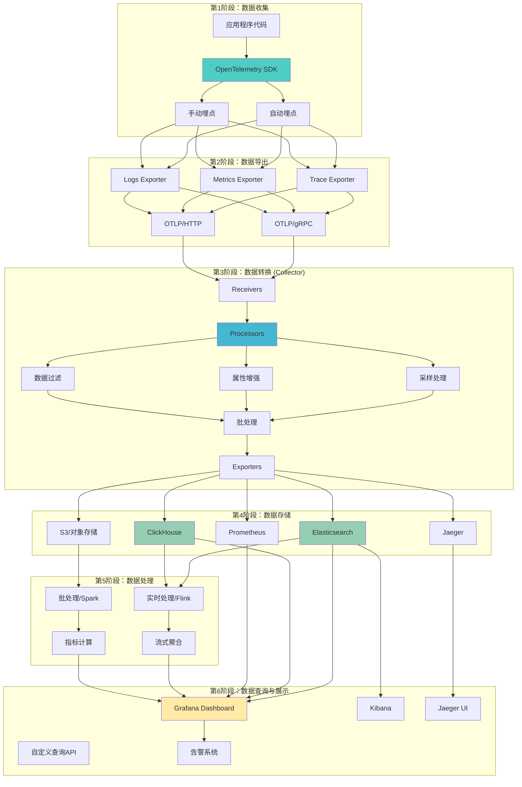
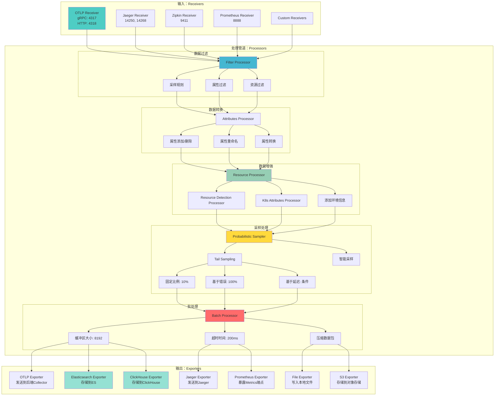

# 📊 OTLP数据生命周期可视化图表

> **创建时间**: 2025年10月20日  
> **用途**: 可视化展示OTLP数据的完整生命周期  
> **图表数量**: 4个Mermaid流程图  
> **关联文档**: [数据模型与语义转换完整指南](./📊_数据模型与语义转换完整指南_2025_10_20.md)

---

## 📋 图表目录

1. [图表1：OTLP数据生命周期全流程图](#图表1otlp数据生命周期全流程图)
2. [图表2：OTLP语义模型层次结构图](#图表2otlp语义模型层次结构图)
3. [图表3：Collector处理流程详细图](#图表3collector处理流程详细图)
4. [图表4：多后端存储架构图](#图表4多后端存储架构图)

---

## 图表1：OTLP数据生命周期全流程图

### 概述

展示从应用程序生成遥测数据，到最终查询分析的完整数据流转过程。

### 流程图



### 关键阶段说明

| 阶段 | 名称 | 核心组件 | 数据量级 | 延迟 |
|------|------|---------|---------|------|
| **1️⃣** | 数据收集 | SDK + 埋点 | 100% | <1ms |
| **2️⃣** | 数据导出 | OTLP Exporter | 100% | 1-10ms |
| **3️⃣** | 数据转换 | Collector | 1-10% (采样后) | 10-50ms |
| **4️⃣** | 数据存储 | 多后端存储 | 1-10% | 50-200ms |
| **5️⃣** | 数据处理 | 实时+批处理 | 聚合数据 | 秒-分钟级 |
| **6️⃣** | 数据查询 | 可视化+告警 | 按需 | 100ms-1s |

---

## 图表2：OTLP语义模型层次结构图

### 概述

展示OTLP标准定义的三层语义模型结构关系。

### 层次结构图

```mermaid
graph TD
    subgraph "完整OTLP数据包"
        ROOT[ResourceSpans/ResourceMetrics/ResourceLogs]
    end
    
    subgraph "第1层：Resource Model (资源模型)"
        R1[Resource]
        R2[service.name]
        R3[service.version]
        R4[service.namespace]
        R5[host.name]
        R6[cloud.provider]
        R7[k8s.pod.name]
        R8[其他资源属性...]
        
        ROOT --> R1
        R1 --> R2
        R1 --> R3
        R1 --> R4
        R1 --> R5
        R1 --> R6
        R1 --> R7
        R1 --> R8
    end
    
    subgraph "第2层：Instrumentation Scope (仪器化作用域)"
        I1[ScopeSpans/ScopeMetrics/ScopeLogs]
        I2[Scope Name: 库名称]
        I3[Scope Version: 库版本]
        I4[Scope Attributes]
        I5[Schema URL]
        
        R1 --> I1
        I1 --> I2
        I1 --> I3
        I1 --> I4
        I1 --> I5
    end
    
    subgraph "第3层：Telemetry Data Model (遥测数据模型)"
        subgraph "Traces (追踪)"
            T1[Span Array]
            T2[Span: trace_id]
            T3[Span: span_id]
            T4[Span: parent_span_id]
            T5[Span: name]
            T6[Span: kind]
            T7[Span: start_time]
            T8[Span: end_time]
            T9[Span: attributes]
            T10[Span: events]
            T11[Span: links]
            T12[Span: status]
            
            I1 --> T1
            T1 --> T2
            T1 --> T3
            T1 --> T4
            T1 --> T5
            T1 --> T6
            T1 --> T7
            T1 --> T8
            T1 --> T9
            T1 --> T10
            T1 --> T11
            T1 --> T12
        end
        
        subgraph "Metrics (指标)"
            M1[Metric Array]
            M2[Metric: name]
            M3[Metric: description]
            M4[Metric: unit]
            M5[Metric: data_type]
            M6[Counter]
            M7[Gauge]
            M8[Histogram]
            M9[Summary]
            M10[data_points]
            
            I1 --> M1
            M1 --> M2
            M1 --> M3
            M1 --> M4
            M1 --> M5
            M5 --> M6
            M5 --> M7
            M5 --> M8
            M5 --> M9
            M6 --> M10
            M7 --> M10
            M8 --> M10
            M9 --> M10
        end
        
        subgraph "Logs (日志)"
            L1[LogRecord Array]
            L2[LogRecord: timestamp]
            L3[LogRecord: severity]
            L4[LogRecord: body]
            L5[LogRecord: attributes]
            L6[LogRecord: trace_id]
            L7[LogRecord: span_id]
            L8[LogRecord: flags]
            
            I1 --> L1
            L1 --> L2
            L1 --> L3
            L1 --> L4
            L1 --> L5
            L1 --> L6
            L1 --> L7
            L1 --> L8
        end
    end
    
    style ROOT fill:#ff6b6b
    style R1 fill:#4ecdc4
    style I1 fill:#45b7d1
    style T1 fill:#96ceb4
    style M1 fill:#96ceb4
    style L1 fill:#96ceb4
```



### 三层模型说明

#### 第1层：Resource Model（资源模型）

```text
作用: 描述产生遥测数据的实体（服务、主机、容器等）
特点:
  ✅ 在整个请求链路中保持不变
  ✅ 标识数据来源
  ✅ 用于分组和聚合

必需属性:
  - service.name: 服务名称 (必需)
  - service.version: 服务版本 (推荐)
  
推荐属性:
  - service.namespace: 服务命名空间
  - deployment.environment: 部署环境
  - host.name: 主机名
  - cloud.provider: 云提供商
  - k8s.pod.name: K8s Pod名称
```

#### 第2层：Instrumentation Scope（仪器化作用域）

```text
作用: 标识生成数据的库或模块
特点:
  ✅ 区分不同的SDK/库版本
  ✅ 方便故障隔离
  ✅ 支持库级别的配置

典型值:
  - Scope Name: "opentelemetry.instrumentation.http"
  - Scope Version: "1.20.0"
  - Schema URL: "https://opentelemetry.io/schemas/1.21.0"
```

#### 第3层：Telemetry Data Model（遥测数据模型）

```text
作用: 实际的遥测数据（Traces/Metrics/Logs）
特点:
  ✅ 高度结构化
  ✅ 类型严格
  ✅ 支持丰富的元数据

数据类型:
  - Traces: 分布式追踪 (Span)
  - Metrics: 性能指标 (Counter/Gauge/Histogram/Summary)
  - Logs: 结构化日志 (LogRecord)
```

---

## 图表3：Collector处理流程详细图

### 概述

展示OpenTelemetry Collector内部的数据处理pipeline详细流程。

### 处理流程图



### Collector处理步骤详解

#### 步骤1：Receivers（接收器）

```yaml
receivers:
  otlp:
    protocols:
      grpc:
        endpoint: 0.0.0.0:4317
      http:
        endpoint: 0.0.0.0:4318
  
  jaeger:
    protocols:
      grpc:
        endpoint: 0.0.0.0:14250
      thrift_http:
        endpoint: 0.0.0.0:14268
  
  prometheus:
    config:
      scrape_configs:
        - job_name: 'otel-collector'
          scrape_interval: 10s
          static_configs:
            - targets: ['localhost:8888']
```

**作用**: 接收来自不同来源和协议的遥测数据

**支持的协议**:

- ✅ OTLP (gRPC + HTTP)
- ✅ Jaeger (gRPC + Thrift)
- ✅ Zipkin (HTTP)
- ✅ Prometheus (Pull)
- ✅ 自定义Receivers

#### 步骤2：Processors（处理器）

**2.1 数据过滤 (Filter)**:

```yaml
processors:
  filter:
    traces:
      span:
        # 过滤健康检查请求
        - 'attributes["http.target"] == "/health"'
        - 'attributes["http.target"] == "/metrics"'
    
    metrics:
      metric:
        # 过滤内部指标
        - 'name == "internal.metric"'
```

**2.2 采样处理 (Sampling)**:

```yaml
processors:
  # 概率采样 (10%)
  probabilistic_sampler:
    sampling_percentage: 10
  
  # 尾部采样 (智能采样)
  tail_sampling:
    decision_wait: 10s
    num_traces: 100
    expected_new_traces_per_sec: 10
    policies:
      # 错误追踪100%保留
      - name: errors-policy
        type: status_code
        status_code:
          status_codes: [ERROR]
      
      # 慢请求100%保留
      - name: slow-traces-policy
        type: latency
        latency:
          threshold_ms: 1000
      
      # 其他请求10%采样
      - name: probabilistic-policy
        type: probabilistic
        probabilistic:
          sampling_percentage: 10
```

**2.3 属性增强 (Attributes)**:

```yaml
processors:
  attributes:
    actions:
      # 添加环境信息
      - key: environment
        value: production
        action: insert
      
      # 添加K8s信息
      - key: k8s.cluster.name
        value: prod-cluster-01
        action: upsert
      
      # 删除敏感信息
      - key: http.request.header.authorization
        action: delete
  
  resource:
    attributes:
      - key: service.namespace
        value: ecommerce
        action: insert
```

#### 步骤3：Exporters（导出器）

```yaml
exporters:
  # 导出到Elasticsearch
  elasticsearch:
    endpoints: [http://elasticsearch:9200]
    logs_index: logs-otlp
    traces_index: traces-otlp
    metrics_index: metrics-otlp
  
  # 导出到ClickHouse
  clickhouse:
    endpoint: tcp://clickhouse:9000
    database: otlp
    ttl_days: 30
    compression: lz4
  
  # 导出到Jaeger
  jaeger:
    endpoint: jaeger-collector:14250
    tls:
      insecure: false
  
  # 导出到S3
  awss3:
    s3uploader:
      region: us-west-2
      s3_bucket: otlp-archive
      s3_prefix: traces/
```

### 性能指标

| 指标 | 典型值 | 说明 |
|------|--------|------|
| **吞吐量** | 100K spans/秒 | 单Collector实例 |
| **延迟** | P50: 10ms, P99: 50ms | 处理延迟 |
| **内存占用** | 512MB - 2GB | 取决于批处理大小 |
| **CPU使用** | 2-4 cores | 生产环境推荐 |
| **数据压缩比** | 5:1 - 10:1 | 采样后 |

---

## 图表4：多后端存储架构图

### 概述

展示OTLP数据在多个后端存储系统中的分布和查询架构。

### 存储架构图

```mermaid
graph TB
    subgraph "数据入口"
        C[OpenTelemetry Collector]
    end
    
    subgraph "存储层"
        subgraph "热数据存储 (7天)"
            S1[Elasticsearch Cluster]
            S1_1[Master Node x3]
            S1_2[Data Node x6]
            S1_3[Coordinating Node x2]
            
            S1 --> S1_1
            S1 --> S1_2
            S1 --> S1_3
        end
        
        subgraph "温数据存储 (30天)"
            S2[ClickHouse Cluster]
            S2_1[Shard 1: 3 replicas]
            S2_2[Shard 2: 3 replicas]
            S2_3[Shard 3: 3 replicas]
            S2_4[ZooKeeper x3]
            
            S2 --> S2_1
            S2 --> S2_2
            S2 --> S2_3
            S2 --> S2_4
        end
        
        subgraph "冷数据存储 (1年+)"
            S3[S3/对象存储]
            S3_1[Standard: 30-90天]
            S3_2[IA: 90-365天]
            S3_3[Glacier: 1年+]
            
            S3 --> S3_1
            S3 --> S3_2
            S3 --> S3_3
        end
        
        subgraph "专用存储"
            S4[Jaeger Backend<br/>专用于Traces]
            S5[Prometheus<br/>专用于Metrics]
            S6[Loki<br/>专用于Logs]
        end
    end
    
    subgraph "数据分流策略"
        D1[Traces → ES + ClickHouse + Jaeger]
        D2[Metrics → Prometheus + ClickHouse]
        D3[Logs → ES + Loki]
        D4[Archive → S3]
    end
    
    subgraph "查询层"
        subgraph "实时查询 (<1秒)"
            Q1[Grafana]
            Q2[Kibana]
            Q3[Jaeger UI]
        end
        
        subgraph "批量查询 (秒级)"
            Q4[ClickHouse SQL]
            Q5[Presto/Trino<br/>联邦查询]
        end
        
        subgraph "归档查询 (分钟级)"
            Q6[S3 Select]
            Q7[Athena]
        end
    end
    
    subgraph "数据处理"
        P1[Flink 实时流处理]
        P2[Spark 批处理分析]
        P3[聚合指标计算]
        P4[异常检测]
    end
    
    C --> D1
    C --> D2
    C --> D3
    C --> D4
    
    D1 --> S1
    D1 --> S2
    D1 --> S4
    D2 --> S2
    D2 --> S5
    D3 --> S1
    D3 --> S6
    D4 --> S3
    
    S1 --> Q1
    S1 --> Q2
    S2 --> Q1
    S2 --> Q4
    S2 --> Q5
    S3 --> Q6
    S3 --> Q7
    S4 --> Q3
    S5 --> Q1
    S6 --> Q1
    
    S1 --> P1
    S2 --> P1
    S2 --> P2
    S3 --> P2
    
    P1 --> P3
    P1 --> P4
    P2 --> P3
    
    style C fill:#4ecdc4
    style S1 fill:#45b7d1
    style S2 fill:#96ceb4
    style S3 fill:#ffeaa7
    style Q1 fill:#ff6b6b
    style P1 fill:#95e1d3
```



### 存储策略详解

#### 1. 热数据存储（Elasticsearch）- 7天

```yaml
配置:
  保留时间: 7天
  数据量: 完整数据
  查询延迟: <100ms
  成本: $$$$

适用场景:
  ✅ 实时告警
  ✅ 运维排查
  ✅ 性能分析
  ✅ 故障定位

索引策略:
  - 按天滚动: traces-2025-10-20
  - ILM策略: 7天后自动删除
  - 副本数: 1
  - 分片数: 根据数据量动态调整
```

**Elasticsearch索引模板示例**:

```json
{
  "index_patterns": ["traces-*"],
  "settings": {
    "number_of_shards": 6,
    "number_of_replicas": 1,
    "index.lifecycle.name": "traces-ilm-policy",
    "index.lifecycle.rollover_alias": "traces"
  },
  "mappings": {
    "properties": {
      "trace_id": { "type": "keyword" },
      "span_id": { "type": "keyword" },
      "parent_span_id": { "type": "keyword" },
      "name": { "type": "text" },
      "start_time": { "type": "date" },
      "end_time": { "type": "date" },
      "duration": { "type": "long" },
      "attributes": { "type": "object" },
      "resource": { "type": "object" },
      "status": { "type": "keyword" }
    }
  }
}
```

#### 2. 温数据存储（ClickHouse）- 30天

```yaml
配置:
  保留时间: 30天
  数据量: 采样后数据 (10%)
  查询延迟: <1s
  成本: $$

适用场景:
  ✅ 趋势分析
  ✅ 报表生成
  ✅ 聚合查询
  ✅ 成本分析

表结构:
  引擎: ReplicatedMergeTree
  分区键: toYYYYMMDD(start_time)
  排序键: (service_name, start_time, trace_id)
  TTL: start_time + INTERVAL 30 DAY
```

**ClickHouse表结构示例**:

```sql
CREATE TABLE otlp.traces ON CLUSTER prod_cluster (
    trace_id String,
    span_id String,
    parent_span_id String,
    name String,
    start_time DateTime64(9),
    end_time DateTime64(9),
    duration UInt64,
    
    -- Resource
    service_name String,
    service_namespace String,
    service_version String,
    
    -- Attributes
    attributes Map(String, String),
    
    -- Status
    status_code String,
    status_message String,
    
    -- 索引列
    INDEX idx_service_name service_name TYPE bloom_filter GRANULARITY 4,
    INDEX idx_status status_code TYPE set(0) GRANULARITY 1
)
ENGINE = ReplicatedMergeTree('/clickhouse/tables/{cluster}/{shard}/otlp/traces', '{replica}')
PARTITION BY toYYYYMMDD(start_time)
ORDER BY (service_name, start_time, trace_id)
TTL start_time + INTERVAL 30 DAY
SETTINGS index_granularity = 8192;
```

#### 3. 冷数据存储（S3）- 1年+

```yaml
配置:
  保留时间: 1年 - 永久
  数据量: 完整原始数据
  查询延迟: 分钟级
  成本: $

适用场景:
  ✅ 合规审计
  ✅ 历史分析
  ✅ 机器学习训练
  ✅ 灾难恢复

存储分层:
  - Standard (30-90天): $0.023/GB/月
  - IA (90-365天): $0.0125/GB/月
  - Glacier (1年+): $0.004/GB/月

文件格式: Parquet (列式存储，高压缩比)
压缩: SNAPPY
分区: year=2025/month=10/day=20/hour=14/
```

**S3生命周期策略**:

```xml
<LifecycleConfiguration>
  <Rule>
    <ID>otlp-traces-lifecycle</ID>
    <Status>Enabled</Status>
    <Prefix>traces/</Prefix>
    
    <Transition>
      <Days>30</Days>
      <StorageClass>STANDARD_IA</StorageClass>
    </Transition>
    
    <Transition>
      <Days>90</Days>
      <StorageClass>GLACIER</StorageClass>
    </Transition>
    
    <Expiration>
      <Days>2555</Days>  <!-- 7年后删除 -->
    </Expiration>
  </Rule>
</LifecycleConfiguration>
```

### 数据分流配置示例

```yaml
# OpenTelemetry Collector配置
exporters:
  # 热数据 → Elasticsearch (全量，7天)
  elasticsearch/hot:
    endpoints: [http://es-hot-cluster:9200]
    traces_index: traces-hot
    logs_index: logs-hot
    sending_queue:
      enabled: true
      num_consumers: 10
      queue_size: 5000
  
  # 温数据 → ClickHouse (采样10%，30天)
  clickhouse/warm:
    endpoint: tcp://clickhouse:9000
    database: otlp
    traces_table: traces
    metrics_table: metrics
    compression: lz4
  
  # 冷数据 → S3 (全量，永久归档)
  awss3/cold:
    s3uploader:
      region: us-west-2
      s3_bucket: otlp-archive
      s3_prefix: year={year}/month={month}/day={day}/
      file_format: parquet
      compression: snappy
  
  # 专用 → Jaeger (Traces)
  jaeger:
    endpoint: jaeger:14250
  
  # 专用 → Prometheus (Metrics)
  prometheus:
    endpoint: 0.0.0.0:8889
    namespace: otlp

service:
  pipelines:
    traces:
      receivers: [otlp]
      processors: [batch]
      exporters: 
        - elasticsearch/hot    # 全量
        - clickhouse/warm      # 采样
        - awss3/cold          # 全量归档
        - jaeger              # 专用
    
    metrics:
      receivers: [otlp]
      processors: [batch]
      exporters:
        - clickhouse/warm
        - prometheus
    
    logs:
      receivers: [otlp]
      processors: [batch]
      exporters:
        - elasticsearch/hot
```

### 成本对比

| 存储类型 | 数据量 | 月成本估算 (1TB原始) | 查询延迟 |
|----------|--------|---------------------|---------|
| **Elasticsearch (热)** | 100% (7天) | $350 | <100ms |
| **ClickHouse (温)** | 10% (30天) | $45 | <1s |
| **S3 Standard (温)** | 100% (60天) | $46 | 分钟级 |
| **S3 IA (冷)** | 100% (275天) | $34 | 分钟级 |
| **S3 Glacier (冷)** | 100% (1年+) | $48/年 | 小时级 |
| **总成本** | - | **~$500/月** | - |

### 查询性能对比

| 查询类型 | 热数据 (ES) | 温数据 (CH) | 冷数据 (S3) |
|----------|------------|------------|------------|
| **单trace查询** | 50ms | 200ms | 30s |
| **时间范围查询** | 100ms | 500ms | 2min |
| **聚合统计** | 500ms | 1s | 5min |
| **全文搜索** | 200ms | 2s | 不支持 |
| **联邦查询** | 不支持 | 通过Presto | 通过Athena |

---

## 📊 图表使用说明

### 使用场景

1. **技术分享**: 在技术会议或内部分享中使用
2. **文档配图**: 在技术文档中引用
3. **架构设计**: 作为系统设计的参考
4. **培训教育**: 用于新人培训和知识传递

### 在Markdown中引用

```markdown
查看完整流程，请参考：
[OTLP数据生命周期全流程图](./📊_OTLP数据生命周期可视化图表_2025_10_20.md#图表1otlp数据生命周期全流程图)
```

### 导出为PNG/SVG

这些Mermaid图表可以通过以下工具导出为图片：

1. **Mermaid Live Editor**: <https://mermaid.live/>
2. **VS Code插件**: Markdown Preview Mermaid Support
3. **命令行工具**: mermaid-cli

```bash
# 安装mermaid-cli
npm install -g @mermaid-js/mermaid-cli

# 导出为PNG
mmdc -i diagram.md -o diagram.png

# 导出为SVG
mmdc -i diagram.md -o diagram.svg
```

---

## 🔗 相关资源

### 关联文档

- [📊 数据模型与语义转换完整指南](./📊_数据模型与语义转换完整指南_2025_10_20.md)
- [📊 OTLP项目全面对标分析报告](./📊_OTLP项目2025年10月20日全面对标分析报告.md)
- [🚀 OTLP项目持续推进计划](./🚀_OTLP项目持续推进计划_2025_10_20.md)
- [PROJECT_DASHBOARD.md](./PROJECT_DASHBOARD.md)

### 官方资源

- [OpenTelemetry官网](https://opentelemetry.io/)
- [OTLP协议规范](https://opentelemetry.io/docs/specs/otlp/)
- [Collector文档](https://opentelemetry.io/docs/collector/)
- [Semantic Conventions](https://opentelemetry.io/docs/specs/semconv/)

---

## 📝 更新日志

### v1.0.0 (2025-10-20)

- ✅ 创建4个核心可视化图表
- ✅ 添加详细的配置示例
- ✅ 补充性能和成本对比数据

---

**文档版本**: v1.0.0  
**创建时间**: 2025年10月20日  
**维护者**: OTLP项目团队  
**许可证**: MIT

---

**🎉 数据生命周期可视化图表创建完成！**
