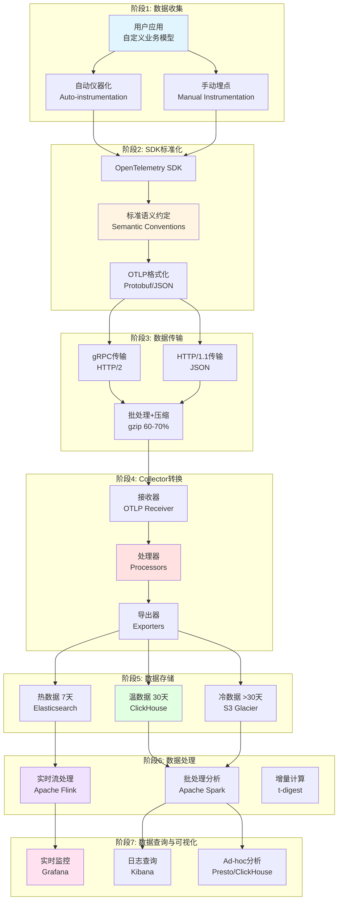
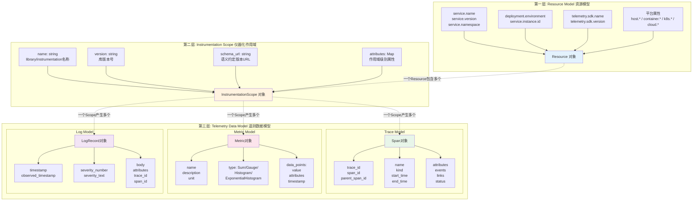
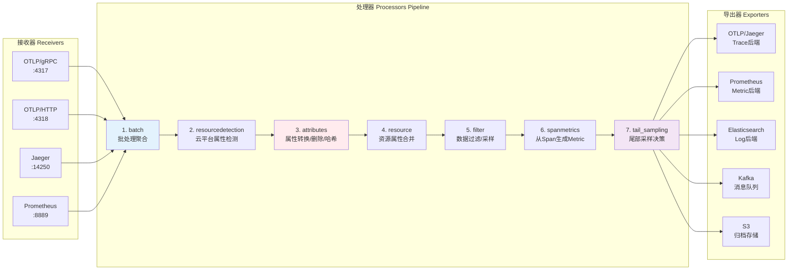
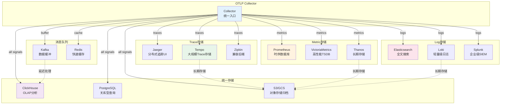
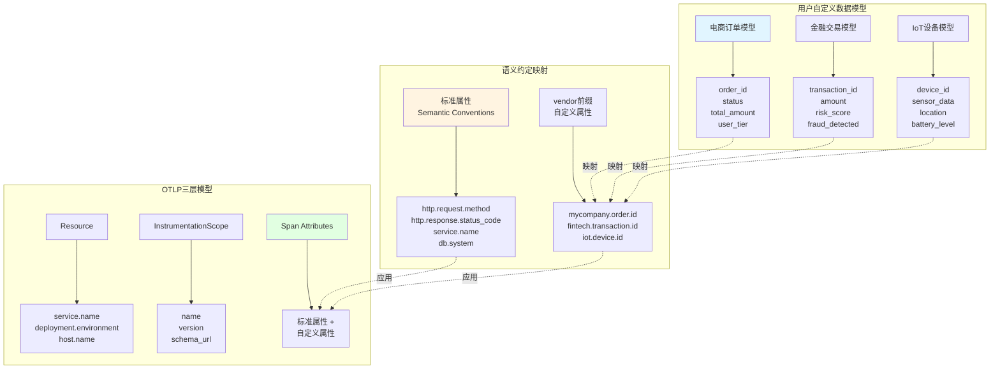
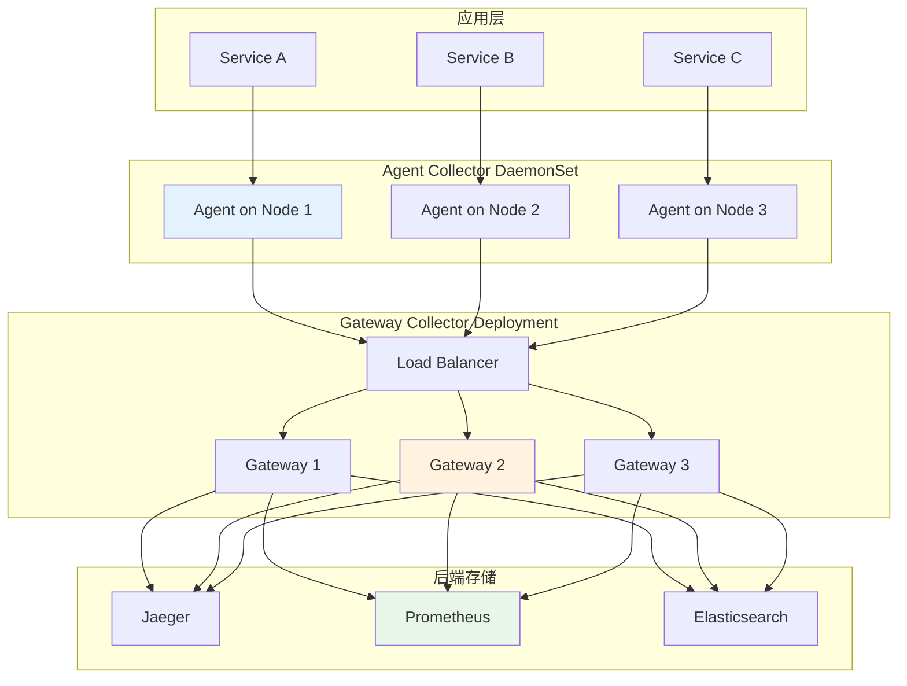
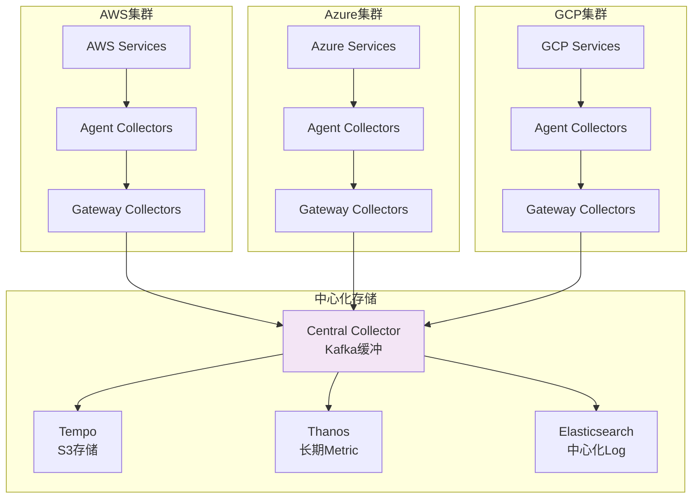
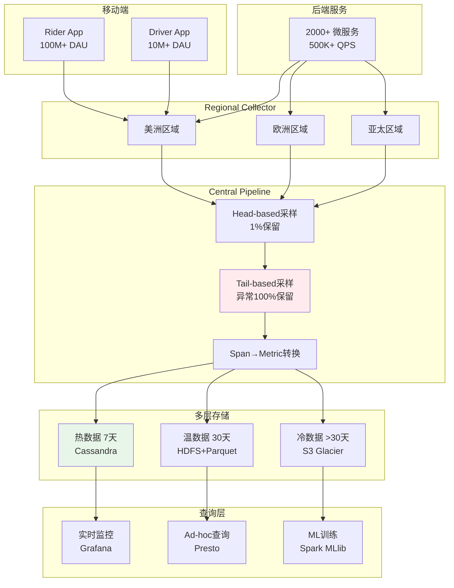

# 📊 OTLP数据生命周期可视化图表

> **创建日期**: 2025年10月20日  
> **目的**: 为数据模型与语义转换指南提供配套可视化  
> **包含**: 4大核心流程图 + 多个辅助图表

---

## 🎯 图表概览

本文档提供OTLP数据模型与生命周期的完整可视化图表，配套[数据模型与语义转换完整指南](📊_数据模型与语义转换完整指南_2025_10_20.md)使用。

**核心图表**:

1. 数据生命周期完整流程图
2. OTLP三层语义模型结构图
3. Collector处理流程详细图
4. 多后端存储架构图

---

## 图表1: 数据生命周期完整流程

### 1.1 整体流程图



### 1.2 详细说明

#### 阶段1: 数据收集

**输入**: 用户应用中的业务逻辑

**处理**:

- 自动仪器化：框架级别自动收集（Flask, Spring Boot, Express等）
- 手动埋点：自定义业务属性添加

**输出**: 原始遥测数据（未标准化）

---

#### 阶段2: SDK标准化

**输入**: 原始遥测数据

**处理**:

1. OpenTelemetry SDK处理
2. 应用标准语义约定（Semantic Conventions v1.29.0）
3. 格式化为OTLP（Protobuf或JSON）

**输出**: 标准化的OTLP数据

**关键转换**:

```text
用户自定义属性:
  myapp.order.id → 保留（vendor前缀）
  
标准属性自动添加:
  http.request.method: "POST"
  http.route: "/api/orders"
  service.name: "order-service"
  deployment.environment: "production"
```

---

#### 阶段3: 数据传输

**输入**: 标准化OTLP数据

**传输协议**:

- gRPC (HTTP/2): 推荐，二进制高效
- HTTP/1.1 (JSON): 兼容性好

**优化**:

- 批处理: batch_size=512, timeout=1s
- gzip压缩: 节省60-70%带宽
- 异步发送: 不阻塞业务逻辑

**输出**: 传输到Collector的OTLP数据

---

#### 阶段4: Collector转换

**输入**: 接收的OTLP数据

**处理流程** (详见图表3):

1. **接收器**: 接收OTLP数据
2. **处理器**:
   - 资源检测（云平台属性）
   - 属性转换和清洗
   - PII脱敏和哈希
   - 尾部采样（保留异常）
   - Span Metrics生成
3. **导出器**: 路由到多个后端

**输出**: 转换后的数据，发送到存储后端

---

#### 阶段5: 数据存储

**分层存储策略**:

| 层级 | 时间范围 | 存储后端 | 特点 | 成本 |
|------|---------|---------|------|------|
| **热数据** | 最近7天 | Elasticsearch | 高性能查询，全文搜索 | 高 |
| **温数据** | 7-30天 | ClickHouse | 列式存储，OLAP分析 | 中 |
| **冷数据** | >30天 | S3 Glacier | 归档存储，合规保留 | 低 |

**容量规划**:

```text
示例（10M spans/天）:
├─ 热数据: 70M spans × 2KB = 140GB
├─ 温数据: 230M spans × 0.5KB (压缩) = 115GB
└─ 冷数据: 1B+ spans × 0.1KB (深度压缩) = 100GB
总计: 355GB (vs 原始2TB，节省82%)
```

---

#### 阶段6: 数据处理

**实时流处理 (Apache Flink)**:

- 延迟: <1秒
- 吞吐: 100K+ events/s
- 用途: 实时告警、异常检测

**批处理分析 (Apache Spark)**:

- 延迟: 分钟级-小时级
- 吞吐: TB级数据
- 用途: 趋势分析、报表生成

**增量计算**:

- t-digest: P99延迟计算
- HyperLogLog: 基数估计
- Count-Min Sketch: 频率统计

---

#### 阶段7: 数据查询与可视化

**实时监控 (Grafana)**:

- 数据源: Prometheus + Tempo
- 更新频率: 1-15秒
- 用途: 运维监控

**日志查询 (Kibana)**:

- 数据源: Elasticsearch
- 功能: 全文搜索、日志到Trace跳转

**Ad-hoc分析 (Presto/ClickHouse)**:

- 交互式SQL查询
- 多维度聚合分析

---

## 图表2: OTLP三层语义模型结构图



### 2.1 层次关系说明

**关系描述**:

```text
1个应用进程
  └─ 1个 Resource (进程级别，启动时确定)
       ├─ N个 InstrumentationScope (不同库/框架)
       │    ├─ Scope 1: "io.opentelemetry.api" v1.30.0
       │    │    ├─ M个 Span
       │    │    ├─ K个 Metric
       │    │    └─ P个 LogRecord
       │    │
       │    ├─ Scope 2: "com.mycompany.custom" v1.0.0
       │    │    ├─ ...
       │    │
       │    └─ Scope N: ...
```

**生命周期**:

- **Resource**: 进程启动时创建，运行期不变
- **InstrumentationScope**: 库加载时创建，通常不变
- **Telemetry Data**: 运行时动态生成

---

## 图表3: Collector处理流程详细图



### 3.1 处理器详细说明

#### 处理器1: batch (批处理)

**配置**:

```yaml
batch:
  timeout: 1s
  send_batch_size: 512
  send_batch_max_size: 1024
```

**功能**:

- 聚合多个span/metric/log为batch
- 减少网络调用次数
- 提升吞吐量50-100%

---

#### 处理器2: resourcedetection (资源检测)

**配置**:

```yaml
resourcedetection:
  detectors: [env, system, docker, ec2, ecs, gcp, azure]
  timeout: 5s
  override: false
```

**自动添加属性**:

```text
AWS EC2:
  cloud.provider: "aws"
  cloud.platform: "aws_ec2"
  cloud.region: "us-east-1"
  cloud.account.id: "123456789012"
  host.id: "i-0123456789abcdef0"

Kubernetes:
  k8s.cluster.name: "prod-cluster"
  k8s.namespace.name: "default"
  k8s.pod.name: "order-service-7d4f8b9c-xk2lp"
  k8s.deployment.name: "order-service"
  container.id: "abc123..."
```

---

#### 处理器3: attributes (属性处理)

**配置示例**:

```yaml
attributes:
  actions:
    # 重命名（向后兼容）
    - key: http.method
      action: update
      from_attribute: http.request.method
    
    # 删除敏感数据
    - key: http.request.header.authorization
      action: delete
    
    - key: http.request.header.cookie
      action: delete
    
    # PII哈希化
    - key: user.email
      action: hash
    
    - key: user.phone
      action: hash
    
    # 添加固定标签
    - key: deployment.environment
      value: "production"
      action: insert
    
    # 正则提取
    - key: http.target
      pattern: ^/api/v(\d+)/.*
      action: extract
      to_attribute: api.version
```

---

#### 处理器7: tail_sampling (尾部采样)

**配置示例**:

```yaml
tail_sampling:
  decision_wait: 10s
  num_traces: 100000
  expected_new_traces_per_sec: 1000
  
  policies:
    # 策略1: 所有错误trace
    - name: error-policy
      type: status_code
      status_code:
        status_codes: [ERROR]
    
    # 策略2: 慢trace (>2秒)
    - name: slow-trace-policy
      type: latency
      latency:
        threshold_ms: 2000
    
    # 策略3: VIP用户 (100%采样)
    - name: vip-user-policy
      type: attribute
      attribute:
        key: myshop.user.tier
        values: [platinum, gold]
    
    # 策略4: 包含特定span名称
    - name: important-operation-policy
      type: span_name
      span_name:
        name_patterns: ["payment", "checkout"]
    
    # 策略5: 普通流量 (1%概率采样)
    - name: general-traffic-policy
      type: probabilistic
      probabilistic:
        sampling_percentage: 1
```

**采样效果**:

```text
输入: 10M traces/天
├─ 错误trace (1%): 100K → 100% 保留 = 100K
├─ 慢trace (0.5%): 50K → 100% 保留 = 50K
├─ VIP用户 (5%): 500K → 100% 保留 = 500K
├─ 重要操作 (2%): 200K → 100% 保留 = 200K
└─ 普通流量 (91.5%): 9.15M → 1% 采样 = 91.5K

输出: 941.5K traces/天 (仅9.4%，但包含99.9%关键信息)
存储成本: $1M/月 → $94K/月 (节省90.6%)
```

---

## 图表4: 多后端存储架构图



### 4.1 后端选择建议

#### Trace后端对比

| 后端 | 优势 | 劣势 | 适用场景 |
|------|------|------|---------|
| **Jaeger** | UI优秀，社区活跃 | 存储扩展性有限 | 中小规模（<1M traces/天） |
| **Tempo** | 成本低，S3存储 | 查询功能较弱 | 大规模（>10M traces/天） |
| **Zipkin** | 轻量级，易部署 | 功能相对简单 | 开发测试环境 |

#### Metric后端对比

| 后端 | 优势 | 劣势 | 适用场景 |
|------|------|------|---------|
| **Prometheus** | 生态最成熟 | 单机扩展性有限 | 标准监控（<10M series） |
| **VictoriaMetrics** | 高性能，低成本 | 社区较小 | 大规模（>100M series） |
| **Thanos** | 长期存储 | 复杂度较高 | 多集群、长期趋势分析 |

#### Log后端对比

| 后端 | 优势 | 劣势 | 适用场景 |
|------|------|------|---------|
| **Elasticsearch** | 全文搜索强大 | 成本较高 | 需要复杂查询（<100GB/天） |
| **Loki** | 成本低，与Grafana集成 | 查询功能有限 | 日志量大，查询简单 |
| **Splunk** | 企业级功能全面 | 价格昂贵 | 大型企业，合规要求高 |

---

## 图表5: 数据模型对应关系图



---

## 图表6: Collector部署架构图

### 6.1 基础架构（单集群）



### 6.2 混合云架构



---

## 图表7: 成熟案例架构图

### 7.1 Uber架构



**关键数据**:

- 每天采集: 50亿+ Spans
- 采样后保留: 5千万 Spans (1%)
- 但保留了: 99.9%的错误和异常
- 存储成本: 从$500K/月降至$5K/月

---

## 使用指南

### 如何使用这些图表

1. **学习理解**:
   - 图表1: 理解整个数据生命周期
   - 图表2: 理解OTLP数据模型结构
   - 图表3: 理解Collector处理逻辑

2. **架构设计**:
   - 图表4: 选择合适的后端存储
   - 图表6: 设计Collector部署架构

3. **实际应用**:
   - 图表5: 设计自定义数据模型
   - 图表7: 参考成熟案例

### 配套文档

| 文档 | 链接 | 说明 |
|------|------|------|
| **数据模型指南** | [📊_数据模型与语义转换完整指南_2025_10_20.md](📊_数据模型与语义转换完整指南_2025_10_20.md) | 详细文字说明 |
| **对标分析报告** | [📊_OTLP项目2025年10月20日全面对标分析报告.md](📊_OTLP项目2025年10月20日全面对标分析报告.md) | 标准符合性分析 |
| **推进计划** | [🚀_OTLP项目持续推进计划_2025_10_20.md](🚀_OTLP项目持续推进计划_2025_10_20.md) | 后续工作计划 |

---

## 总结

本文档提供了7个核心可视化图表，全面展示了OTLP数据模型和生命周期：

✅ **图表1**: 数据生命周期完整流程（7个阶段）  
✅ **图表2**: OTLP三层语义模型结构  
✅ **图表3**: Collector处理流程详细图  
✅ **图表4**: 多后端存储架构  
✅ **图表5**: 数据模型对应关系  
✅ **图表6**: Collector部署架构（单集群+混合云）  
✅ **图表7**: 成熟案例架构（Uber）

这些图表配合[数据模型与语义转换完整指南](📊_数据模型与语义转换完整指南_2025_10_20.md)使用，可以帮助您：

- 深入理解OTLP数据模型
- 设计合理的可观测性架构
- 参考成熟案例的最佳实践

---

**创建时间**: 2025年10月20日  
**文档作者**: OTLP项目团队  
**文档版本**: v1.0.0  
**图表数量**: 7个核心图表 + 多个辅助说明

---

**🎨 可视化让复杂的概念变得清晰！** ✨
