# 📊 OTLP项目多维思维表征体系

> **创建时间**: 2025年12月
> **文档类型**: 思维表征可视化
> **覆盖范围**: 全项目主题

---

## 📋 目录

- [📊 OTLP项目多维思维表征体系](#-otlp项目多维思维表征体系)
  - [📋 目录](#-目录)
  - [1. 思维导图体系](#1-思维导图体系)
    - [1.1 项目总体架构思维导图](#11-项目总体架构思维导图)
    - [1.2 理论框架思维导图](#12-理论框架思维导图)
    - [1.3 技术栈思维导图](#13-技术栈思维导图)
  - [2. 概念定义关系矩阵](#2-概念定义关系矩阵)
    - [2.1 核心概念关系矩阵](#21-核心概念关系矩阵)
    - [2.2 概念层次关系](#22-概念层次关系)
    - [2.3 概念依赖关系图](#23-概念依赖关系图)
  - [3. 决策树图](#3-决策树图)
    - [3.1 OTLP实施决策树](#31-otlp实施决策树)
    - [3.2 故障排查决策树](#32-故障排查决策树)
  - [4. 证明树图](#4-证明树图)
    - [4.1 协议正确性证明树](#41-协议正确性证明树)
    - [4.2 采样策略正确性证明树](#42-采样策略正确性证明树)
  - [5. 控制执行数据流图](#5-控制执行数据流图)
    - [5.1 OTLP端到端数据流图](#51-otlp端到端数据流图)
    - [5.2 Context传播数据流](#52-context传播数据流)
    - [5.3 Collector处理流程](#53-collector处理流程)
  - [6. 论证思维图](#6-论证思维图)
    - [6.1 OTLP价值论证图](#61-otlp价值论证图)
    - [6.2 采样策略论证图](#62-采样策略论证图)
  - [7. 主题关联网络图](#7-主题关联网络图)
    - [7.1 主题依赖网络](#71-主题依赖网络)
    - [7.2 主题协作网络](#72-主题协作网络)
  - [8. 时间线演进图](#8-时间线演进图)
    - [8.1 项目发展时间线](#81-项目发展时间线)
    - [8.2 OpenTelemetry标准演进](#82-opentelemetry标准演进)
  - [总结](#总结)

---

## 1. 思维导图体系

### 1.1 项目总体架构思维导图

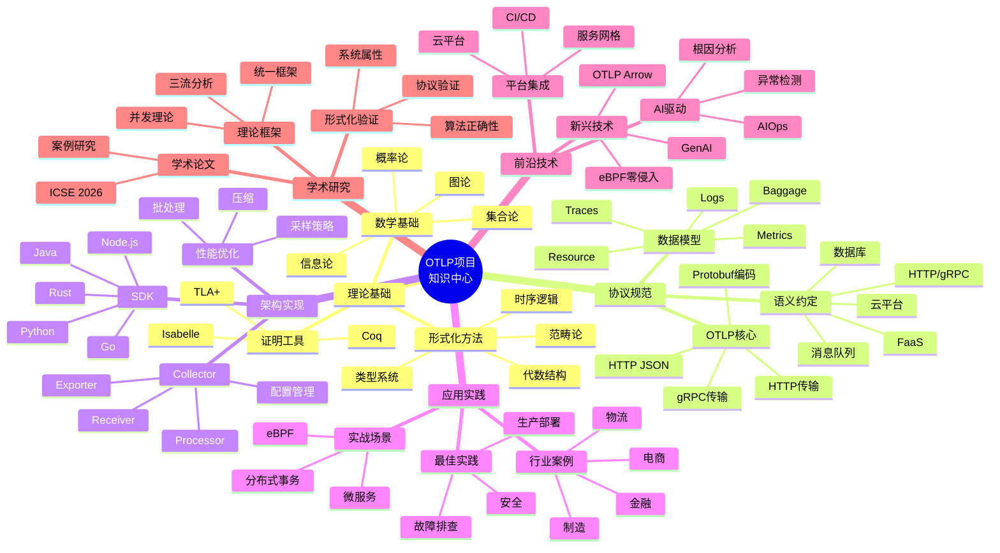

### 1.2 理论框架思维导图

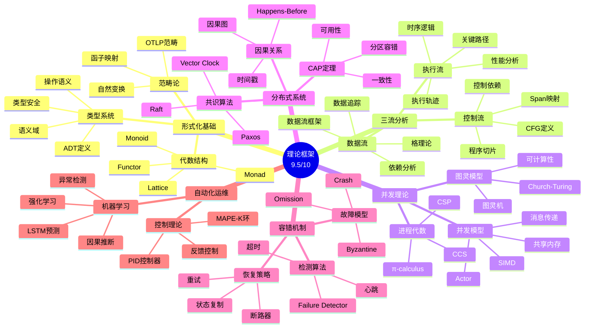

### 1.3 技术栈思维导图

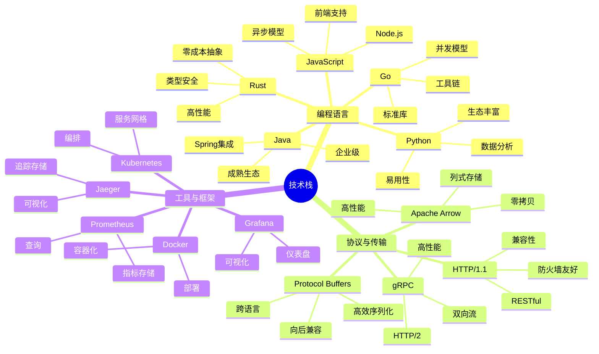

---

## 2. 概念定义关系矩阵

### 2.1 核心概念关系矩阵

| 概念 | 定义 | 关键属性 | 关系 | 应用场景 | 形式化表示 |
|------|------|---------|------|---------|-----------|
| **Trace** | 一次完整请求的执行记录 | trace_id, spans[], duration | 包含多个Span | 分布式追踪 | `Trace = {trace_id: TraceId, spans: List[Span]}` |
| **Span** | 单个操作的记录 | span_id, parent_id, start_time, end_time, attributes | 属于Trace，可能有子Span | 操作追踪 | `Span = {span_id: SpanId, parent_id: Option[SpanId], ...}` |
| **Context** | 传播的上下文信息 | trace_id, span_id, baggage | 在Span间传播 | 跨服务追踪 | `Context = {trace_id: TraceId, span_id: SpanId, baggage: Map[String, String]}` |
| **Resource** | 产生遥测数据的实体 | service.name, host.name, attributes | 关联Traces/Metrics/Logs | 资源标识 | `Resource = {attributes: Map[String, AttributeValue]}` |
| **Metric** | 数值型指标 | name, value, timestamp, attributes | 独立或关联Trace | 性能监控 | `Metric = {name: String, value: Number, timestamp: Timestamp}` |
| **Log** | 文本型日志 | timestamp, severity, message, attributes | 可关联Trace | 问题诊断 | `Log = {timestamp: Timestamp, severity: Severity, message: String}` |
| **Baggage** | 跨服务传递的键值对 | key-value pairs | 随Context传播 | 灰度/染色 | `Baggage = Map[String, String]` |
| **Sampling** | 数据采样策略 | ratio, rules, strategy | 控制数据量 | 成本优化 | `Sampling: Trace → Bool` |
| **Collector** | 数据收集处理组件 | receivers[], processors[], exporters[] | 连接SDK和后端 | 数据管道 | `Collector = {receivers: List[Receiver], processors: List[Processor], exporters: List[Exporter]}` |
| **Semantic Convention** | 语义约定标准 | 属性命名规范 | 统一语义 | 互操作性 | `SemanticConvention: AttributeName → SemanticType` |

### 2.2 概念层次关系

```text
OTLP概念体系
│
├── 数据概念层 (Data Concepts)
│   ├── Trace (追踪)
│   │   ├── trace_id: TraceId
│   │   ├── spans: List[Span]
│   │   └── duration: Duration
│   │
│   ├── Span (片段)
│   │   ├── span_id: SpanId
│   │   ├── parent_span_id: Option[SpanId]
│   │   ├── trace_id: TraceId
│   │   ├── name: String
│   │   ├── kind: SpanKind
│   │   ├── start_time: Timestamp
│   │   ├── end_time: Timestamp
│   │   ├── attributes: Map[String, AttributeValue]
│   │   ├── events: List[Event]
│   │   ├── links: List[Link]
│   │   └── status: SpanStatus
│   │
│   ├── Metric (指标)
│   │   ├── name: String
│   │   ├── description: String
│   │   ├── unit: String
│   │   ├── data: MetricData
│   │   └── attributes: Map[String, AttributeValue]
│   │
│   └── Log (日志)
│       ├── timestamp: Timestamp
│       ├── severity: LogSeverity
│       ├── body: String
│       ├── attributes: Map[String, AttributeValue]
│       ├── trace_id: Option[TraceId]
│       └── span_id: Option[SpanId]
│
├── 上下文概念层 (Context Concepts)
│   ├── Context (上下文)
│   │   ├── trace_context: TraceContext
│   │   └── baggage: Baggage
│   │
│   └── Resource (资源)
│       └── attributes: Map[String, AttributeValue]
│
├── 协议概念层 (Protocol Concepts)
│   ├── OTLP (协议)
│   │   ├── ExportTraceServiceRequest
│   │   ├── ExportMetricsServiceRequest
│   │   ├── ExportLogsServiceRequest
│   │   └── ExportServiceResponse
│   │
│   └── Semantic Convention (语义约定)
│       ├── HTTP约定
│       ├── gRPC约定
│       ├── 数据库约定
│       └── 消息队列约定
│
└── 架构概念层 (Architecture Concepts)
    ├── SDK (软件开发包)
    │   ├── Tracer (追踪器)
    │   ├── Meter (计量器)
    │   └── Logger (日志器)
    │
    ├── Collector (收集器)
    │   ├── Receiver (接收器)
    │   ├── Processor (处理器)
    │   └── Exporter (导出器)
    │
    └── Backend (后端)
        ├── Jaeger (Traces)
        ├── Prometheus (Metrics)
        └── Loki (Logs)
```

### 2.3 概念依赖关系图

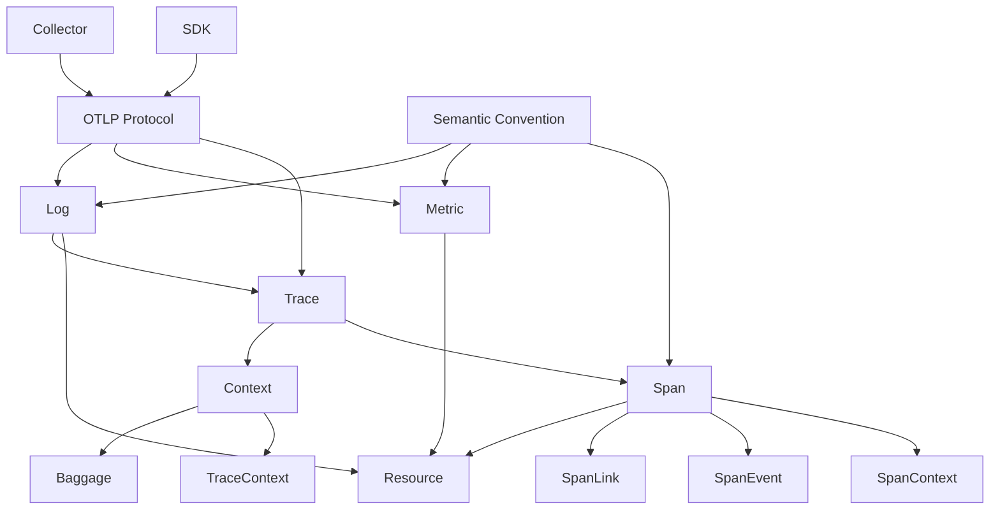

---

## 3. 决策树图

### 3.1 OTLP实施决策树

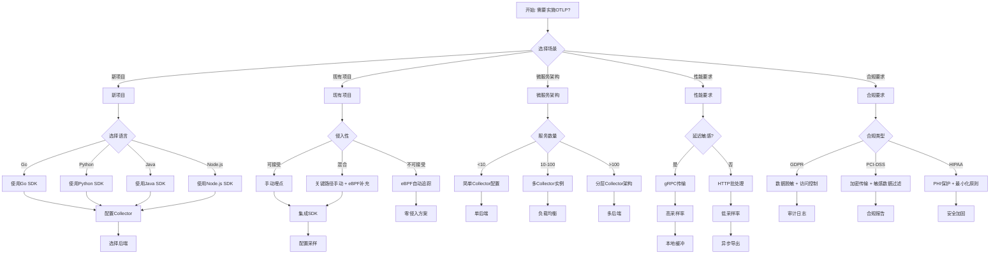

### 3.2 故障排查决策树

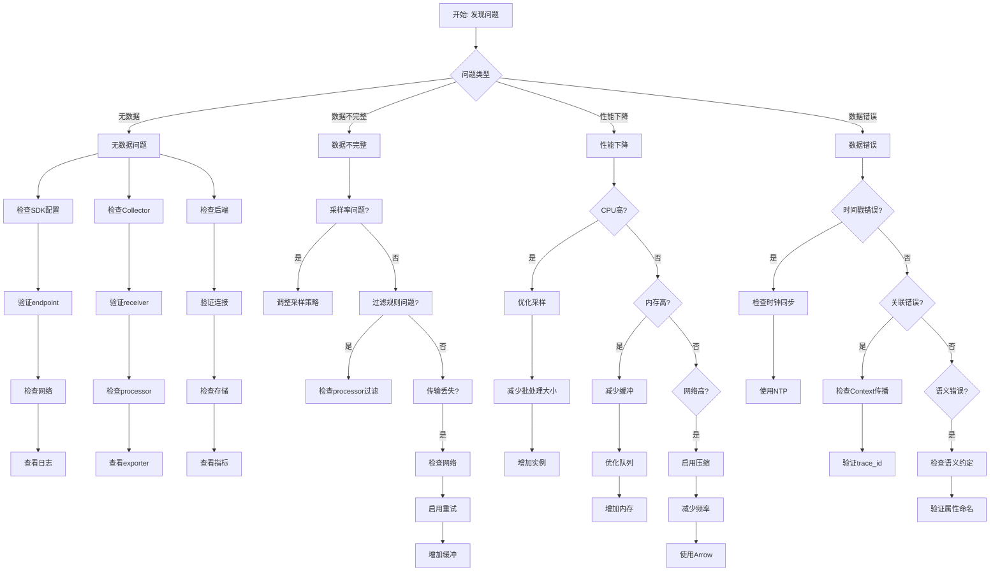

---

## 4. 证明树图

### 4.1 协议正确性证明树

```mermaid
graph TD
    Root[OTLP协议正确性] --> T1[定理1: 数据完整性]
    Root --> T2[定理2: 传输可靠性]
    Root --> T3[定理3: 语义一致性]

    T1 --> L1_1[引理1.1: Span树结构保持]
    T1 --> L1_2[引理1.2: 时间戳单调性]
    T1 --> L1_3[引理1.3: 因果关系保持]

    L1_1 --> P1_1_1[证明: parent_span_id约束]
    L1_1 --> P1_1_2[证明: trace_id一致性]

    L1_2 --> P1_2_1[证明: start_time ≤ end_time]
    L1_2 --> P1_2_2[证明: 子Span时间包含]

    L1_3 --> P1_3_1[证明: Happens-Before关系]
    L1_3 --> P1_3_2[证明: Vector Clock更新]

    T2 --> L2_1[引理2.1: 重试语义正确]
    T2 --> L2_2[引理2.2: 背压处理]
    T2 --> L2_3[引理2.3: 错误恢复]

    L2_1 --> P2_1_1[证明: 幂等性保证]
    L2_1 --> P2_1_2[证明: 指数退避收敛]

    L2_2 --> P2_2_1[证明: 队列有界性]
    L2_2 --> P2_2_2[证明: 丢弃策略正确]

    L2_3 --> P2_3_1[证明: 可重试错误分类]
    L2_3 --> P2_3_2[证明: 不可重试错误处理]

    T3 --> L3_1[引理3.1: 语义约定遵循]
    T3 --> L3_2[引理3.2: 跨语言互操作]
    T3 --> L3_3[引理3.3: 版本兼容性]

    L3_1 --> P3_1_1[证明: 属性命名规范]
    L3_1 --> P3_1_2[证明: 类型系统约束]

    L3_2 --> P3_2_1[证明: 协议格式统一]
    L3_2 --> P3_2_2[证明: 语义映射正确]

    L3_3 --> P3_3_1[证明: 向后兼容保证]
    L3_3 --> P3_3_2[证明: 未知字段处理]
```

### 4.2 采样策略正确性证明树

```mermaid
graph TD
    Root[采样策略正确性] --> T4[定理4: 采样无偏性]
    Root --> T5[定理5: 采样效率]

    T4 --> L4_1[引理4.1: 随机采样期望]
    T4 --> L4_2[引理4.2: 分层采样保持]
    T4 --> L4_3[引理4.3: 自适应采样收敛]

    L4_1 --> P4_1_1[证明: E[sample_rate] = p]
    L4_1 --> P4_1_2[证明: 方差有界]

    L4_2 --> P4_2_1[证明: 每层独立采样]
    L4_2 --> P4_2_2[证明: 总体概率乘积]

    L4_3 --> P4_3_1[证明: 目标采样率收敛]
    L4_3 --> P4_3_2[证明: 误差有界]

    T5 --> L5_1[引理5.1: 存储节省]
    T5 --> L5_2[引理5.2: 信息损失上界]
    T5 --> L5_3[引理5.3: 计算复杂度]

    L5_1 --> P5_1_1[证明: 存储量 = O(p × n)]
    L5_1 --> P5_1_2[证明: 压缩率分析]

    L5_2 --> P5_2_1[证明: 关键路径保留概率]
    L5_2 --> P5_2_2[证明: 异常检测覆盖率]

    L5_3 --> P5_3_1[证明: 采样决策O(1)]
    L5_3 --> P5_3_2[证明: 批处理优化]
```

---

## 5. 控制执行数据流图

### 5.1 OTLP端到端数据流图

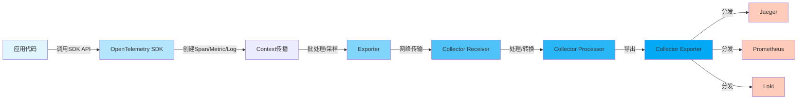

### 5.2 Context传播数据流

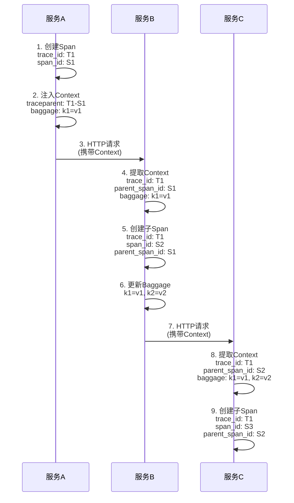

### 5.3 Collector处理流程

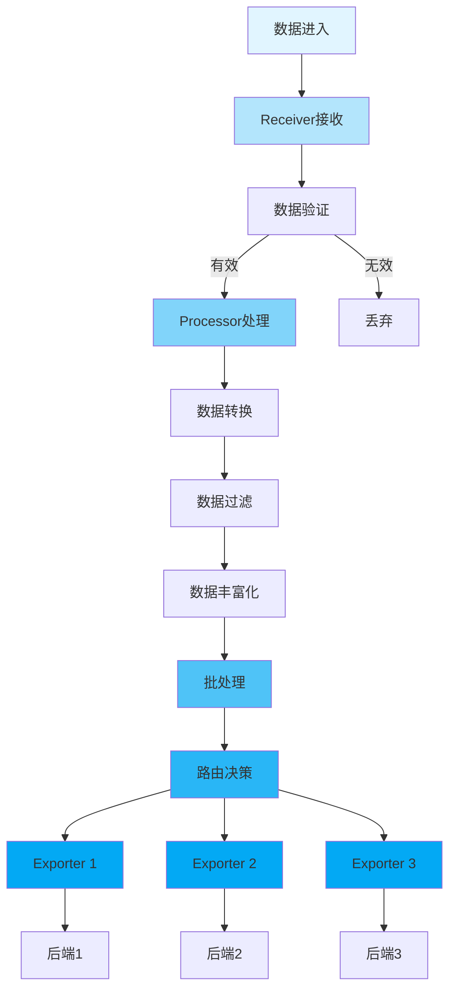

---

## 6. 论证思维图

### 6.1 OTLP价值论证图

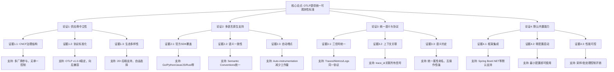

### 6.2 采样策略论证图

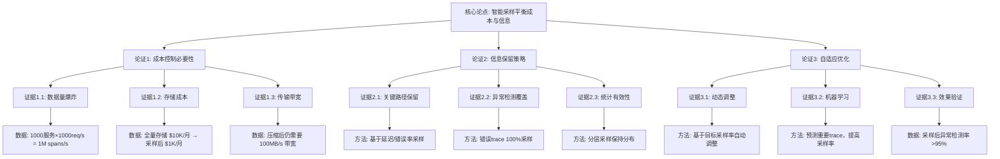

---

## 7. 主题关联网络图

### 7.1 主题依赖网络

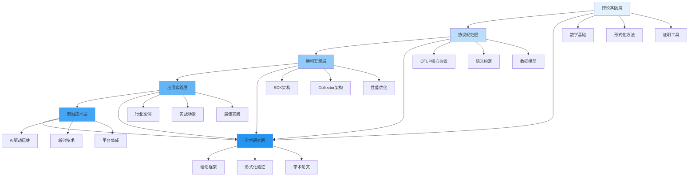

### 7.2 主题协作网络

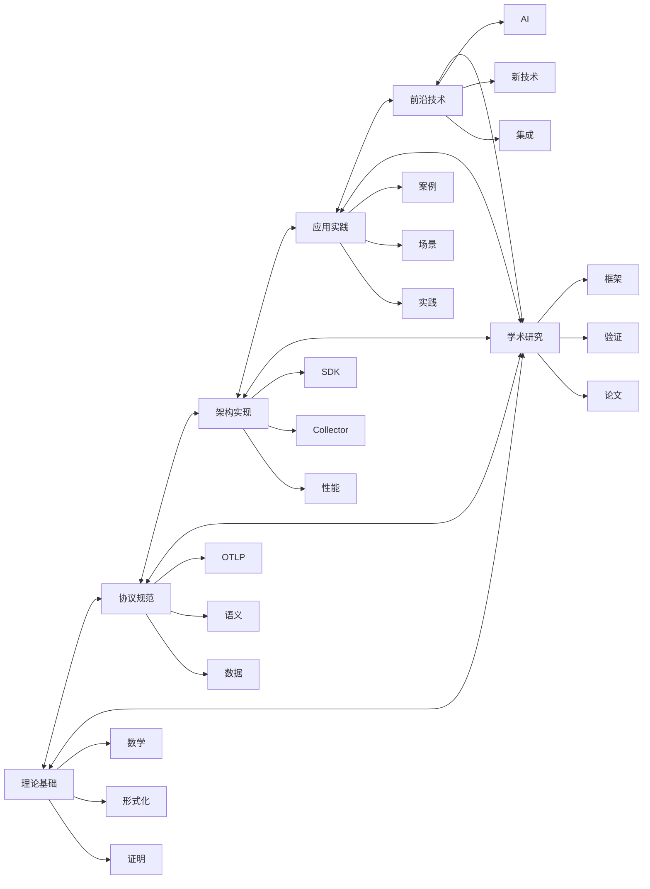

---

## 8. 时间线演进图

### 8.1 项目发展时间线

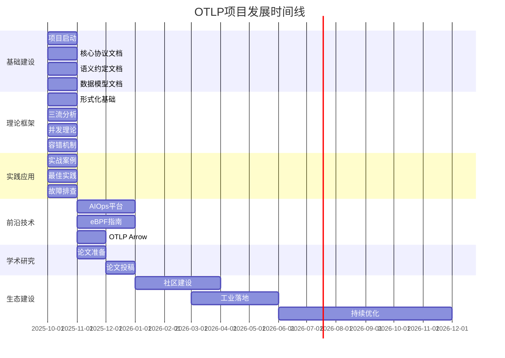

### 8.2 OpenTelemetry标准演进

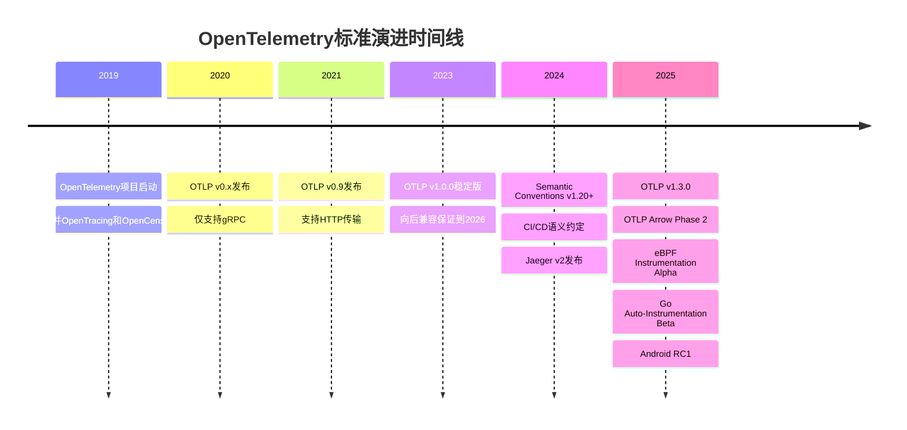

---

## 总结

本文档提供了OTLP项目的多维思维表征体系，包括：

1. ✅ **思维导图**: 项目总体、理论框架、技术栈
2. ✅ **概念矩阵**: 核心概念关系、层次结构、依赖关系
3. ✅ **决策树**: 实施决策、故障排查
4. ✅ **证明树**: 协议正确性、采样策略
5. ✅ **数据流图**: 端到端流程、Context传播、Collector处理
6. ✅ **论证图**: 价值论证、策略论证
7. ✅ **关联网络**: 主题依赖、主题协作
8. ✅ **时间线**: 项目发展、标准演进

这些思维表征方式帮助从不同角度理解项目，支持决策制定和问题解决。

---

**文档版本**: 1.0.0
**最后更新**: 2025年12月
