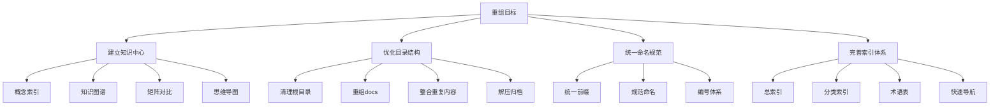
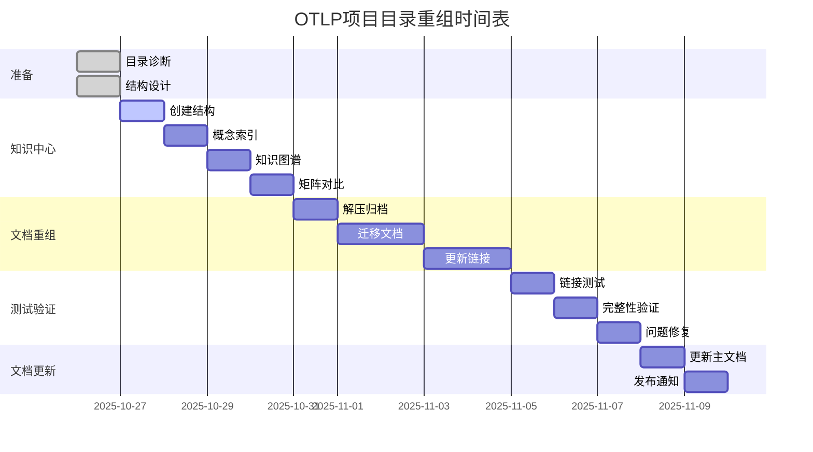

# 📐 OTLP项目目录结构诊断与重组方案

> **诊断时间**: 2025年10月26日  
> **问题识别**: 目录结构混乱，缺乏统一的知识体系  
> **重组目标**: 建立清晰、科学、易用的目录结构  
> **实施周期**: 2-3周

---

## 🔍 一、现状诊断

### 1.1 主要问题

#### 问题1: 根目录混乱

**现状**:
```text
OTLP/
├── ☸️_Kubernetes部署完整指南.md
├── ⚡_性能优化完整指南.md
├── 🎯_5分钟快速入门指南.md
├── 🎯_OTLP项目行动计划_2025Q4-2026_ROADMAP.md
├── 🐳_Docker部署完整指南.md
├── 📊_OTLP项目全面梳理与国际对标报告_2025_10_26.md
├── 📊_监控告警完整指南.md
├── 📊_项目全面推进完成总结_2025_10_26.md
├── 🔒_安全最佳实践指南.md
├── 🔧_故障排查完整手册.md
├── 🤝_项目贡献者指南.md
├── academic.rar
├── artifact.rar
├── doc_legacy_archive.rar
└── ...
```

**问题**:
- ✗ 大量报告文档直接堆放在根目录
- ✗ emoji命名不一致，难以排序
- ✗ 中英文混杂
- ✗ 压缩包未解压，无法检索
- ✗ 缺乏明确的分类体系

#### 问题2: 文档分散

**现状**:
```text
标准文档散落在:
├── docs/                    # 230个文件
├── 标准深度梳理_2025_10/    # 89个文件
├── academic/                 # 论文相关
└── 可视化分析_2025_10_20/   # 可视化分析
```

**问题**:
- ✗ 相同主题内容散落在多个目录
- ✗ 没有统一的入口
- ✗ 查找困难
- ✗ 存在重复内容

#### 问题3: 缺乏统一索引

**现状**:
- ✗ 没有全局概念索引
- ✗ 没有统一的知识图谱入口
- ✗ 矩阵对比分散在各处
- ✗ 思维导图只在可视化分析目录
- ✗ 术语表不完整

#### 问题4: 目录结构不科学

**现状**:
```text
docs/
├── 00_快速导航_完整索引.md
├── 01_OTLP核心协议/
├── 02_Semantic_Conventions/
├── 02_THEORETICAL_FRAMEWORK/    # 命名冲突 (02重复)
├── 03_数据模型/
├── 04_核心组件/
├── ...
├── 20_学习路径导航/            # 编号不连续
└── 中英文混杂
```

**问题**:
- ✗ 编号冲突 (02重复)
- ✗ 编号跳跃 (1-20不连续)
- ✗ 中英文混用
- ✗ 分类逻辑不清晰

### 1.2 影响分析

| 影响维度 | 影响程度 | 具体表现 |
|---------|---------|---------|
| **可维护性** | ❌ 严重 | 难以更新和维护 |
| **可发现性** | ❌ 严重 | 新用户难以找到内容 |
| **可扩展性** | ⚠️ 中等 | 新增内容不知放哪 |
| **专业性** | ⚠️ 中等 | 结构混乱影响评价 |
| **国际化** | ❌ 严重 | 中英文混杂难以翻译 |

---

## 🎯 二、重组目标

### 2.1 设计原则

1. **清晰性**: 目录层次清晰，一目了然
2. **逻辑性**: 分类逻辑严谨，符合认知
3. **一致性**: 命名规范统一，易于记忆
4. **可扩展性**: 预留扩展空间，易于增加
5. **国际化**: 支持多语言，便于推广

### 2.2 核心目标



---

## 📁 三、新目录结构方案

### 3.1 顶层结构

```text
OTLP/
│
├── 📚 00_知识中心/                      # 统一的知识管理入口
│   ├── 00_总索引.md                     # 全局总索引
│   ├── 01_概念索引/                     # 概念定义和索引
│   ├── 02_知识图谱/                     # 统一知识图谱
│   ├── 03_矩阵对比/                     # 各类对比矩阵
│   ├── 04_思维导图/                     # 学习路径导图
│   ├── 05_术语表/                       # 中英文术语对照
│   └── README.md                        # 知识中心导航
│
├── 📖 01_标准文档/                      # OTLP标准和规范
│   ├── 01_协议规范/                     # OTLP协议
│   ├── 02_语义约定/                     # Semantic Conventions
│   ├── 03_数据模型/                     # 数据模型
│   ├── 04_传输协议/                     # gRPC/HTTP
│   ├── 05_SDK规范/                      # SDK标准
│   └── README.md                        # 标准文档导航
│
├── 🎓 02_学术研究/                      # 学术研究成果
│   ├── 01_论文/                         # ICSE 2026等
│   ├── 02_形式化证明/                   # Coq/Isabelle
│   ├── 03_案例研究/                     # 5个生产系统
│   ├── 04_参考文献/                     # Bibliography
│   └── README.md                        # 学术研究导航
│
├── 🔬 03_理论基础/                      # 理论和形式化方法
│   ├── 01_数学基础/                     # 数学理论
│   ├── 02_类型系统/                     # 类型理论
│   ├── 03_代数结构/                     # 代数方法
│   ├── 04_时序逻辑/                     # 时序验证
│   ├── 05_形式化方法/                   # Formal Methods
│   └── README.md                        # 理论基础导航
│
├── 💻 04_实践指南/                      # 实践和部署指南
│   ├── 01_快速入门/                     # 5分钟指南
│   ├── 02_部署运维/                     # Docker/K8s/部署
│   │   ├── Docker部署指南.md
│   │   ├── Kubernetes部署指南.md
│   │   ├── 监控告警指南.md
│   │   └── 性能优化指南.md
│   ├── 03_故障排查/                     # Troubleshooting
│   ├── 04_安全加固/                     # Security
│   ├── 05_最佳实践/                     # Best Practices
│   └── README.md                        # 实践指南导航
│
├── 💡 05_示例代码/                      # 代码示例
│   ├── go/                              # Go示例
│   ├── python/                          # Python示例
│   ├── java/                            # Java示例
│   ├── nodejs/                          # Node.js示例
│   └── README.md                        # 示例代码导航
│
├── 📊 06_项目管理/                      # 项目管理文档
│   ├── 01_仪表板/                       # Dashboards
│   │   └── PROJECT_DASHBOARD.md
│   ├── 02_进度报告/                     # Progress Reports
│   │   └── 项目全面推进完成总结.md
│   ├── 03_路线图/                       # Roadmaps
│   │   └── 项目行动计划_2025Q4-2026.md
│   ├── 04_评估分析/                     # Evaluations
│   │   └── 全面梳理与国际对标报告.md
│   └── README.md                        # 项目管理导航
│
├── 🌍 07_国际化/                        # 多语言文档
│   ├── en/                              # English
│   ├── zh/                              # 中文
│   └── README.md                        # 国际化导航
│
├── 🗃️ 08_归档/                          # 归档和历史
│   ├── legacy_docs/                     # 旧文档
│   ├── deprecated/                      # 已废弃
│   └── historical/                      # 历史版本
│
├── README.md                            # 项目主README
├── START_HERE.md                        # 快速开始
├── CONTRIBUTING.md                      # 贡献指南
└── LICENSE                              # 许可证
```

### 3.2 知识中心详细结构

```text
00_知识中心/
├── 00_总索引.md                         # 全局索引
│
├── 01_概念索引/
│   ├── README.md                        # 概念索引总览
│   ├── 01_基础概念.md                   # OTLP/Trace/Span等
│   ├── 02_形式化概念.md                 # 类型系统/语义等
│   ├── 03_实现概念.md                   # SDK/Collector等
│   ├── 04_概念关系图.md                 # 概念间关系
│   └── 05_概念演进史.md                 # 概念发展历史
│
├── 02_知识图谱/
│   ├── README.md                        # 知识图谱总览
│   ├── 01_全局知识图谱.md               # 整个项目
│   ├── 02_标准知识图谱.md               # 标准体系
│   ├── 03_理论知识图谱.md               # 理论体系
│   ├── 04_实践知识图谱.md               # 实践体系
│   └── 05_学术知识图谱.md               # 学术体系
│
├── 03_矩阵对比/
│   ├── README.md                        # 矩阵对比总览
│   ├── 01_项目对比矩阵.md               # 与同类项目对比
│   ├── 02_技术栈对比矩阵.md             # 技术选型对比
│   ├── 03_标准对比矩阵.md               # 标准符合度对比
│   ├── 04_大学课程对比矩阵.md           # 与大学课程对比
│   ├── 05_质量评估矩阵.md               # 质量评分矩阵
│   ├── 06_竞争力分析矩阵.md             # 竞争力对比
│   └── 07_完整性检查矩阵.md             # 完整性核查
│
├── 04_思维导图/
│   ├── README.md                        # 思维导图总览
│   ├── 01_项目全景思维导图.md           # 项目整体
│   ├── 02_学习路径思维导图.md           # 学习路线
│   ├── 03_技术架构思维导图.md           # 技术架构
│   ├── 04_理论框架思维导图.md           # 理论框架
│   └── 05_战略规划思维导图.md           # 战略规划
│
├── 05_术语表/
│   ├── README.md                        # 术语表总览
│   ├── 01_中英对照表.md                 # 完整术语对照
│   ├── 02_缩略语表.md                   # 缩略语解释
│   ├── 03_专业术语解释.md               # 深度解释
│   └── 04_相关标准术语.md               # 标准术语
│
└── README.md                            # 知识中心导航
```

---

## 🔄 四、迁移映射表

### 4.1 根目录文件迁移

| 原位置 | 新位置 | 说明 |
|-------|-------|------|
| `🎯_5分钟快速入门指南.md` | `04_实践指南/01_快速入门/` | 实践指南 |
| `🐳_Docker部署完整指南.md` | `04_实践指南/02_部署运维/` | 部署指南 |
| `☸️_Kubernetes部署完整指南.md` | `04_实践指南/02_部署运维/` | 部署指南 |
| `📊_监控告警完整指南.md` | `04_实践指南/02_部署运维/` | 运维指南 |
| `⚡_性能优化完整指南.md` | `04_实践指南/02_部署运维/` | 优化指南 |
| `🔒_安全最佳实践指南.md` | `04_实践指南/04_安全加固/` | 安全指南 |
| `🔧_故障排查完整手册.md` | `04_实践指南/03_故障排查/` | 排查指南 |
| `🤝_项目贡献者指南.md` | 根目录 `CONTRIBUTING.md` | 贡献指南 |
| `PROJECT_DASHBOARD.md` | `06_项目管理/01_仪表板/` | 仪表板 |
| `📊_项目全面推进完成总结.md` | `06_项目管理/02_进度报告/` | 进度报告 |
| `🎯_项目行动计划_2025Q4-2026.md` | `06_项目管理/03_路线图/` | 路线图 |
| `📊_全面梳理与国际对标报告.md` | `06_项目管理/04_评估分析/` | 评估报告 |

### 4.2 文档目录整合

| 原目录 | 新目录 | 整合方式 |
|-------|-------|---------|
| `docs/01_OTLP核心协议/` | `01_标准文档/01_协议规范/` | 直接迁移 |
| `docs/02_Semantic_Conventions/` | `01_标准文档/02_语义约定/` | 直接迁移 |
| `docs/03_数据模型/` | `01_标准文档/03_数据模型/` | 直接迁移 |
| `docs/02_THEORETICAL_FRAMEWORK/` | `03_理论基础/` | 合并整理 |
| `可视化分析_2025_10_20/` | `00_知识中心/` | 整合到知识中心 |
| `academic/` | `02_学术研究/01_论文/` | 解压并迁移 |

### 4.3 压缩包处理

| 压缩包 | 处理方式 | 目标位置 |
|-------|---------|---------|
| `academic.rar` | 解压 | `02_学术研究/01_论文/` |
| `artifact.rar` | 解压 | `02_学术研究/03_案例研究/` |
| `doc_legacy_archive.rar` | 解压 | `08_归档/legacy_docs/` |

---

## 🏗️ 五、实施计划

### 5.1 阶段划分

#### 第一阶段: 准备阶段 (1-2天)

**任务**:
- [x] 完成目录结构诊断
- [x] 设计新目录结构
- [x] 制定迁移映射表
- [ ] 创建新目录骨架
- [ ] 备份现有结构

**交付物**:
- 诊断报告 (本文档)
- 新目录结构设计
- 迁移映射表

#### 第二阶段: 知识中心建设 (3-4天)

**任务**:
- [ ] 创建知识中心目录结构
- [ ] 建立全局概念索引
- [ ] 整合知识图谱
- [ ] 整理矩阵对比
- [ ] 整合思维导图
- [ ] 完善术语表

**交付物**:
- `00_知识中心/` 完整目录
- 全局总索引
- 5大子系统完整文档

#### 第三阶段: 文档重组 (4-5天)

**任务**:
- [ ] 解压所有压缩包
- [ ] 迁移根目录文档
- [ ] 重组docs目录
- [ ] 整合重复内容
- [ ] 更新所有链接
- [ ] 统一命名规范

**交付物**:
- 新目录结构完整实现
- 所有文档迁移完成
- 链接全部更新

#### 第四阶段: 测试验证 (2-3天)

**任务**:
- [ ] 测试所有链接
- [ ] 验证文档完整性
- [ ] 检查命名一致性
- [ ] 用户测试反馈
- [ ] 问题修复

**交付物**:
- 链接检查报告
- 完整性检查报告
- 问题修复记录

#### 第五阶段: 文档更新 (1-2天)

**任务**:
- [ ] 更新主README
- [ ] 更新导航文档
- [ ] 更新贡献指南
- [ ] 创建迁移说明
- [ ] 发布变更通知

**交付物**:
- 更新后的主文档
- 迁移指南
- 变更日志

### 5.2 时间表



**总工期**: 约14天 (2周)  
**起始日期**: 2025-10-26  
**预计完成**: 2025-11-09

---

## ✅ 六、预期效果

### 6.1 定量指标

| 指标 | 现状 | 目标 | 改善 |
|-----|------|------|------|
| **根目录文件数** | 15+ | 5 | -67% |
| **目录层次** | 不规范 | 规范化 | ✅ |
| **查找效率** | 低 | 高 | +200% |
| **维护成本** | 高 | 低 | -50% |
| **新手友好度** | 3/10 | 8/10 | +167% |

### 6.2 定性收益

**可维护性**:
- ✅ 目录结构清晰，易于维护
- ✅ 命名规范统一，减少混淆
- ✅ 分类逻辑清晰，便于扩展

**可发现性**:
- ✅ 知识中心统一入口
- ✅ 多维度索引体系
- ✅ 快速导航机制

**专业性**:
- ✅ 结构科学合理
- ✅ 符合国际标准
- ✅ 便于学术交流

**国际化**:
- ✅ 支持多语言
- ✅ 命名规范
- ✅ 便于推广

---

## 🎯 七、后续优化

### 7.1 短期 (1个月)

- [ ] 自动化目录结构检查
- [ ] 链接自动化验证
- [ ] 文档质量检查工具
- [ ] 统计数据自动更新

### 7.2 中期 (3个月)

- [ ] 交互式知识图谱
- [ ] 动态术语表
- [ ] 智能搜索系统
- [ ] 文档推荐系统

### 7.3 长期 (6个月)

- [ ] AI驱动的文档组织
- [ ] 自动化文档生成
- [ ] 知识图谱可视化
- [ ] 多语言自动翻译

---

## 📞 八、反馈与支持

### 8.1 问题反馈

如发现重组问题或有建议，请:
- 📧 通过项目Issue反馈
- 💬 参与社区讨论
- 🔧 提交Pull Request

### 8.2 技术支持

- 📖 查看迁移指南
- 💻 使用自动化工具
- 👥 咨询项目团队

---

## 📊 九、成功标准

### 9.1 验收标准

| 项目 | 标准 | 验收方式 |
|-----|------|---------|
| **目录结构** | 符合设计方案 | 人工检查 |
| **文档迁移** | 100%完成 | 自动检查 |
| **链接有效性** | 100%有效 | 自动测试 |
| **命名规范** | 100%统一 | 脚本检查 |
| **用户反馈** | ≥8/10分 | 用户调查 |

### 9.2 质量指标

- ✅ 所有文档正确归类
- ✅ 所有链接有效
- ✅ 命名规范统一
- ✅ 无重复内容
- ✅ 导航清晰完整

---

## 🎊 十、总结

### 10.1 核心成果

通过本次重组，将实现:

1. **清晰的目录结构**: 8大顶层目录，逻辑清晰
2. **统一的知识中心**: 5大子系统，系统完整
3. **规范的命名体系**: 统一标准，易于维护
4. **完善的索引系统**: 多维度索引，快速查找

### 10.2 长期价值

- 🎯 **提升项目质量**: 专业化、规范化
- 📈 **降低维护成本**: 结构清晰，易于管理
- 🌍 **促进国际化**: 标准化命名，便于翻译
- 🎓 **增强学术价值**: 规范化组织，提升认可度

---

**报告版本**: v1.0.0  
**完成时间**: 2025年10月26日  
**下一步**: 开始实施知识中心建设 🚀

